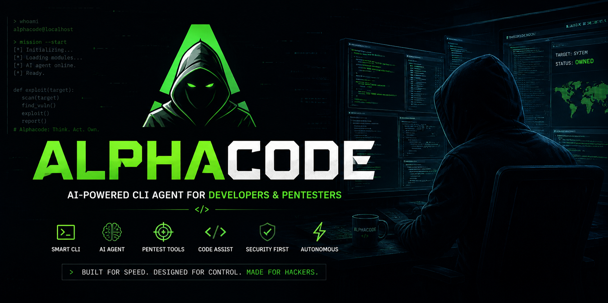

# Alphacode

<p align="center">
  
</p>

<h1 align="center">Alphacode</h1>

<p align="center">
  <strong>The terminal-native AI coding agent built for serious engineering.</strong><br>
  Multi-model orchestration · Parallel agent swarms · 40+ tools · Persistent sessions · Safety controls
</p>

<p align="center">
  <a href="#install">Install</a> ·
  <a href="#quick-start">Quick Start</a> ·
  <a href="#why-alphacode">Why Alphacode</a> ·
  <a href="#capabilities">Capabilities</a> ·
  <a href="#performance">Performance</a> ·
  <a href="#commands">Commands</a> ·
  <a href="docs/">Docs</a>
</p>

<p align="center">
  <a href="https://github.com/dragonked2/alphacode/releases"></a>
  <a href="https://github.com/dragonked2/alphacode/actions"></a>
  <a href="https://github.com/dragonked2/alphacode/blob/main/LICENSE"></a>
  <a href="https://github.com/dragonked2/alphacode"></a>
  <a href="https://github.com/dragonked2/alphacode"></a>
</p>

<p align="center">
  <strong>v1.0.0 · Stable</strong> · Linux · macOS · Windows · MIT
</p>

---

## What is Alphacode?

Alphacode is an **AI coding agent that lives in your terminal**.

Give it an objective in natural language. Alphacode can inspect the repository, reason about the task, edit files, run commands, execute tests, use the web, coordinate parallel agents, review its own work, and keep the session alive until the objective is complete.

It is designed around a simple engineering principle:

> **Make the smallest change that actually solves the problem — then verify it.**

```text
You
 │
 ▼
Alphacode
 ├── Understand the repository
 ├── Plan the work
 ├── Select the right model / provider
 ├── Use tools
 ├── Edit + execute + test
 ├── Review the result
 └── Report what changed, what was verified, and what remains
```

## Why Alphacode?

| | Built for |
|---|---|
| **Multi-model** | Use Claude, GPT, Gemini, Copilot, Cursor, OpenRouter, Bedrock, Azure, or any OpenAI-compatible endpoint. |
| **Agent swarms** | Split large objectives into parallel sub-tasks and coordinate the results. |
| **Terminal-native UX** | A rich TUI with syntax highlighting, image previews, Mermaid rendering, multi-pane views, and agent visibility. |
| **40+ tools** | Files, shell, search, web, browser automation, memory, skills, sessions, scheduling, rendering, and autonomous modules. |
| **Persistent execution** | Resume sessions, survive crashes, preserve transcripts, and inspect changes through checkpoints. |
| **Safety-first execution** | Destructive commands, risky actions, network access, and credential-sensitive operations receive dedicated controls. |
| **Rust core** | A native implementation focused on predictable runtime behavior and efficient resource usage. |

---

## Install

### Linux / macOS

```bash
curl -fsSL https://raw.githubusercontent.com/dragonked2/alphacode/main/scripts/install.sh | bash
```

The installer downloads the latest release, verifies its checksum, installs the `alphacode` binary, and reports PATH instructions when necessary.

### Windows PowerShell

```powershell
iwr -useb https://raw.githubusercontent.com/dragonked2/alphacode/main/scripts/install.ps1 | iex
```

The Windows installer places Alphacode under:

```text
%LOCALAPPDATA%\Programs\alphacode\bin\
```

and can add it to the user PATH.

### Build from source

```bash
git clone https://github.com/dragonked2/alphacode.git
cd alphacode
cargo build --release
./target/release/alphacode --version
```

Requirements:

- Rust **1.91+**
- Edition **2024**
- A platform-compatible C toolchain

The default build avoids heavy optional stacks so normal builds stay lean. Optional components can be enabled when required:

```bash
cargo build --release --features bedrock,embeddings,pdf,renderer
```

### Verify

```bash
alphacode --version
alphacode doctor
alphacode login
alphacode
```

---

## Quick Start

Alphacode does not require an account just to launch. Configure at least one model provider before asking it to perform work.

```bash
# Diagnose your environment
alphacode doctor

# Connect a provider
alphacode login

# Or select one explicitly
alphacode login --provider openai

# Or authenticate through an environment variable
ALPHACODE_OPENAI_API_KEY=sk-... alphacode

# Launch the TUI
alphacode
```

On first launch, the onboarding flow handles telemetry preferences, model defaults, and key bindings. Every onboarding step can be skipped with **Esc**.

### First tasks

```text
> refactor src/cli/startup.rs to use a builder pattern

> walk me through src/alphacode_swarm_core

> add unit tests for the new helper

> look up the latest ratatui release notes

> /swarm "split this feature into 4 parallel tasks"
```

Useful controls:

| Key | Action |
|---|---|
| `F1` | Full keymap |
| `Ctrl+T` | Model picker |
| `Ctrl+Y` | Agent panel |
| `Ctrl+C` | Interrupt the current turn while preserving the session |

---

# Capabilities

## Models & Providers

Alphacode is provider-agnostic. Use the model that fits the task instead of locking the entire workflow to one vendor.

| Provider | Authentication | Notes |
|---|---|---|
| Anthropic / Claude | OAuth or API key | First-class provider |
| OpenAI / GPT | OAuth, API key, ChatGPT browser | Reasoning, vision, tools |
| Google Gemini | OAuth or API key | Gemini lineup |
| GitHub Copilot | OAuth | Existing Copilot subscription |
| Cursor | OAuth | Reuses Cursor session |
| AWS Bedrock | AWS credentials | Optional `bedrock` feature |
| Azure | Azure AD / API key | Optional authentication feature |
| OpenRouter | API key | Aggregated model access |
| OpenAI-compatible | API key | Add custom endpoints |
| GMI Cloud | Built-in default key | Works out of the box |

## Tooling

The agent can combine multiple classes of tools inside one workflow:

- **Editing:** read, write, patch, multi-edit
- **Search:** regex, fuzzy, AST-aware search
- **Execution:** shell and command execution with risk controls
- **Web:** fetch and search
- **Browser:** Chrome DevTools Protocol automation
- **Memory:** persistent project and conversation context
- **Skills:** reusable agent capabilities
- **Sessions:** persistence, recovery, and resumption
- **Scheduling:** scheduled and ambient tasks
- **Rendering:** images and Mermaid diagrams
- **Documents:** PDF text extraction
- **Authentication:** OAuth flows
- **Autonomous modules:** planner, project analyzer, self-review, quality gate, resource monitor, and related subsystems

## Swarm Mode

Large engineering tasks do not always need a single agent working sequentially.

```text
                         ┌─ Agent A ──┐
                         │            │
Goal ──► Planner ────────┼─ Agent B ──┼──► Merge ──► Review ──► Result
                         │            │
                         ├─ Agent C ──┤
                         │            │
                         └─ Agent D ──┘
```

Run:

```text
/swarm "split this feature into 4 parallel tasks"
```

The orchestrator builds a task DAG, dispatches independent work in parallel, monitors branches, and merges the results. The execution plan is visible directly in the TUI.

## Safety

AI agents can execute real commands. Alphacode treats that as an engineering and security problem rather than assuming every generated command is safe.

- Catastrophic targets such as `rm -rf /`, home-directory wipes, and device-node writes are blocked.
- Ambiguous destructive commands are held for explicit justification.
- Risky actions pass through the TUI permission layer.
- Network operations use SSRF and credential-leak heuristics.
- Interrupted or crashed sessions are marked instead of silently corrupting state.

## Resilience

Long-running agents need durable state.

- `alphacode --resume` reopens previous conversations.
- Session history is searchable.
- Panics, signals, and dropped SSH connections mark sessions as `Crashed`.
- Transcripts are persisted to disk.
- Health monitoring records runtime signals such as RSS, slow operations, error rates, and subsystem liveness.

---

# Performance

Alphacode is engineered for low overhead, fast startup, and sustained workloads on developer machines where the agent is sharing resources with an IDE, browser, containers, and other services.

### Runtime design

- `opt-level = 3`
- Thin LTO
- Targeted code-generation settings
- Efficient HTTP connection pooling
- Disk-backed session transcripts
- Optional heavy feature stacks
- Native Rust runtime
- Resource monitoring for long-lived sessions

### Benchmark snapshots

> **Important:** The numbers below are **legacy benchmark snapshots**, retained for historical comparison. Alphacode has since received performance and efficiency improvements, so these values should **not** be presented as current measurements or used as a claim about the latest build.

#### RAM — 1 active session

| Tool | PSS | Relative to Alphacode baseline |
|:--|--:|--:|
| **Alphacode — local embedding off** | **27.8 MB** | **1.0×** |
| Alphacode | 167.1 MB | 6.0× |
| pi | 144.4 MB | 5.2× |
| Codex CLI | 140.0 MB | 5.0× |
| OpenCode | 371.5 MB | 13.4× |
| GitHub Copilot CLI | 333.3 MB | 12.0× |
| Cursor Agent | 214.9 MB | 7.7× |
| Claude Code | 386.6 MB | 13.9× |
| Antigravity CLI | 243.7 MB | 8.8× |

#### RAM — 10 active sessions

| Tool | PSS | Relative to Alphacode baseline |
|:--|--:|--:|
| **Alphacode — local embedding off** | **117.0 MB** | **1.0×** |
| Alphacode | 260.8 MB | 2.2× |
| pi | 833.0 MB | 7.1× |
| Codex CLI | 334.8 MB | 2.9× |
| OpenCode | 3237.2 MB | 27.7× |
| GitHub Copilot CLI | 1756.5 MB | 15.0× |
| Cursor Agent | 1632.4 MB | 14.0× |
| Claude Code | 2300.6 MB | 19.7× |
| Antigravity CLI | 1021.2 MB | 8.7× |

### How to interpret these numbers

The most useful property in the historical snapshot is **scaling behavior**.

A single lightweight process can be acceptable. Ten concurrent sessions expose the cost of process architecture, duplicated runtime state, embedded services, and per-session memory overhead.

Alphacode was designed with multi-session workflows in mind, and subsequent optimization work has continued to target startup latency, steady-state memory, and runtime efficiency.

### Benchmark policy

Alphacode does not treat one README number as proof of universal performance.

Future benchmark reports should identify:

1. Alphacode commit/version
2. OS and hardware
3. Build profile
4. Enabled features
5. Number of active sessions
6. Measurement method
7. Warm/cold state
8. Exact workload

That makes performance claims reproducible instead of promotional.

---

# Coding Quality Contract

Alphacode's agent behavior is built around four guardrails for code-changing turns.

### 1. Smallest change

Do not bundle unrelated edits into the same operation. Deeper issues are reported separately instead of being silently changed.

### 2. Anti-regression

Previously passing tests should remain passing. New warnings are treated as failures where the workflow requires it.

### 3. Self-review

Before a task is reported complete, the agent evaluates:

- Objective coverage
- Evidence and verification
- Regression risk
- Diff scope
- Edge cases

### 4. Structured completion

State-changing turns end with:

```text
What changed
What was verified
What remains
```

The source of truth is:

```text
src/alphacode_base/prompt/system_prompt.md
```

Tool implementations under:

```text
src/alphacode_app_core/tool/
```

reinforce the same contract.

---

# Commands

## CLI

```bash
alphacode                          # Launch the TUI
alphacode login                    # Authenticate a provider
alphacode doctor                   # Check providers, terminal, and paths
alphacode provider list            # List configured providers
alphacode provider add <name>      # Add an OpenAI-compatible endpoint
alphacode provider current         # Show active provider + model
alphacode model list               # List models
alphacode run "fix the failing test"
alphacode repl                     # Simple REPL without the TUI
alphacode sessions list            # List previous sessions
alphacode --resume                 # Search and resume a session
alphacode --resume <id>            # Resume a specific session
alphacode update                   # Self-update
alphacode --version                # Print version
alphacode --help                   # Full help
```

## TUI

```text
/help       Full command list
/agents     Spawn parallel sub-agents
/compact    Condense long context
/memory     Browse long-term memory
/skills     Browse and edit skills
/diff       Open the change viewer
/exit       Leave the TUI while preserving the session
```

---

# Configuration

Alphacode stores configuration, sessions, and logs in platform-standard locations.

| Platform | Configuration | Sessions | Logs |
|---|---|---|---|
| Linux | `~/.config/alphacode/` | `~/.local/share/alphacode/sessions/` | `~/.local/share/alphacode/logs/` |
| macOS | `~/Library/Application Support/alphacode/` | Same | Same |
| Windows | `%APPDATA%\alphacode\` | `%LOCALAPPDATA%\alphacode\sessions\` | `%LOCALAPPDATA%\alphacode\logs\` |

More configuration details live in `docs/configuration.md`.

---

# Uninstall

### Linux / macOS

```bash
curl -fsSL https://raw.githubusercontent.com/dragonked2/alphacode/main/scripts/uninstall.sh | bash
```

To purge configuration and sessions:

```bash
curl -fsSL https://raw.githubusercontent.com/dragonked2/alphacode/main/scripts/uninstall.sh | bash -s -- --purge
```

Or:

```bash
ALPHACODE_PURGE=1 curl -fsSL https://raw.githubusercontent.com/dragonked2/alphacode/main/scripts/uninstall.sh | bash
```

### Windows

```powershell
iwr -useb https://raw.githubusercontent.com/dragonked2/alphacode/main/scripts/uninstall.ps1 | iex
```

---

# Project Structure

The repository is intentionally divided into focused subsystems.

```text
alphacode/
├── src/
│   ├── alphacode_base/             # Core types, prompts, shared foundations
│   ├── alphacode_app_core/         # Application + tool runtime
│   └── alphacode_swarm_core/       # Multi-agent orchestration
├── docs/                           # Documentation
├── scripts/                        # Install / uninstall tooling
├── CONTRIBUTING.md
├── SECURITY.md
└── Cargo.toml
```

---

# Contributing

Contributions are welcome.

Read:

- `CONTRIBUTING.md` for development workflow
- `SECURITY.md` for vulnerability reporting

The architecture keeps providers, tools, autonomous modules, and TUI components in isolated boundaries so new capabilities can be added without turning the entire codebase into one dependency surface.

---

# Acknowledgements

Alphacode is built on outstanding open-source projects including:

- [Ratatui](https://ratatui.rs)
- [Crossterm](https://github.com/crossterm-rs/crossterm)
- [Tokio](https://tokio.rs)
- [Reqwest](https://github.com/seanmonstar/reqwest)
- [Rustls](https://github.com/rustls/rustls)
- Clap
- Pulldown-CMark
- Syntect
- Resvg
- and many others

See `Cargo.lock` for the complete dependency graph.

---

# License

Alphacode is released under the **MIT License**.

---

<p align="center">
  <strong>Alphacode</strong><br>
  <sub>Terminal-native AI engineering · Built with Rust</sub><br><br>
  <a href="https://github.com/dragonked2/alphacode">GitHub</a> ·
  <a href="https://github.com/dragonked2/alphacode/issues">Issues</a> ·
  <a href="docs/">Documentation</a>
</p>

<p align="center">
  <sub>Made with care by <a href="https://github.com/dragonked2">Ali Essam</a> · MIT licensed</sub>
</p>
