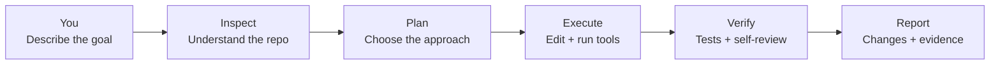
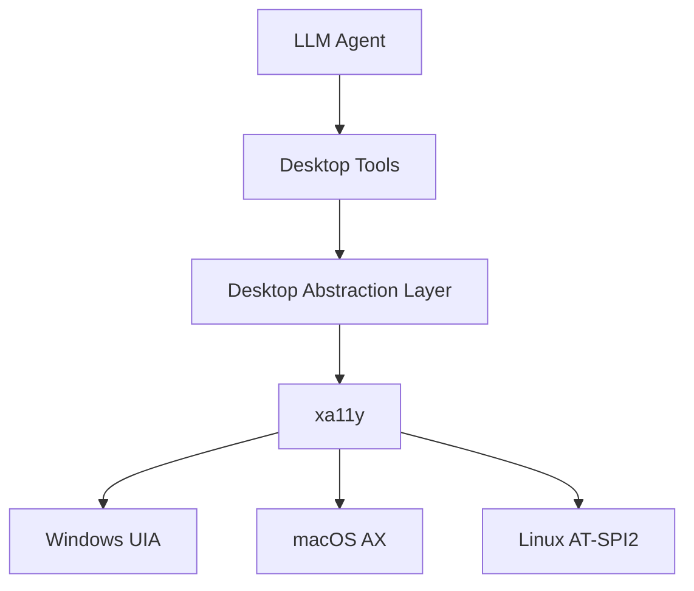
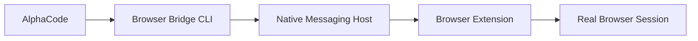
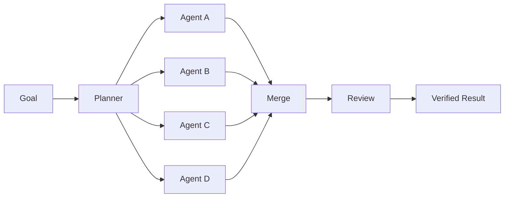

<div align="center">


<h3>The free, open-source AI coding agent that runs in your terminal.</h3>

<p>
  <strong>No API key. No credit card. No signup.</strong><br>
  AlphaCode ships with a <strong>free, built-in AI model lane</strong> — install it and start coding with AI in under 60 seconds.
</p>

<p>
  <a href="https://github.com/dragonked2/alphacode/releases"></a>
  <a href="https://github.com/dragonked2/alphacode/blob/main/LICENSE"></a>
  <a href="https://github.com/dragonked2/alphacode"></a>
  <a href="https://github.com/dragonked2/alphacode/network/members"></a>
  <a href="https://github.com/dragonked2/alphacode/issues"></a>
</p>

<p>
  
  
  
  
  
</p>

<p>
  <a href="#-why-alphacode">Why AlphaCode</a> ·
  <a href="#-free-ai-included--zero-setup">Free AI</a> ·
  <a href="#-install">Install</a> ·
  <a href="#-quick-start">Quick Start</a> ·
  <a href="#-desktop-control">Desktop Control</a> ·
  <a href="#-browser-bridge">Browser Bridge</a> ·
  <a href="#-features">Features</a> ·
  <a href="#️-configuration">Configuration</a> ·
  <a href="#-troubleshooting">Troubleshooting</a> ·
  <a href="docs/">Docs</a>
</p>

</div>

---

## What is AlphaCode?

**AlphaCode is a free, open-source, terminal-native AI coding agent.** Give it a goal in plain English and it inspects your project, plans the work, edits files, runs commands, executes tests, drives a real browser, controls your desktop, coordinates multiple agents in parallel, and reviews its own output — all from the command line.

Unlike most AI coding assistants, **AlphaCode doesn't require you to bring your own API key to get started.** It comes with a free built-in AI model provider already integrated, so you can go from `install` to "fix this bug" in one command, then upgrade to Claude, GPT, Gemini, or any other provider whenever you want.

It's built around one operating principle:

> **Make the smallest change that solves the problem — then verify it.**

Think of AlphaCode as the execution layer between you and your AI models: instead of only *discussing* code, the agent works directly against the repository you opened.



<br>

## ✨ Free AI Included — Zero Setup

Most AI coding agents make you paste in an API key before they'll do anything. **AlphaCode doesn't.**

| | |
|---|---|
| 🆓 **Free model provider built in** | AlphaCode integrates a free AI lane out of the box — no OpenAI, Anthropic, or Google account required to try it. |
| 🔑 **No API key required to start** | Install, launch, and give it a task. That's it. |
| 💳 **No credit card, no signup wall** | You are never asked to pay or register before your first real task. |
| ⬆️ **Upgrade anytime** | Bring your own Claude, GPT, Gemini, Copilot, Cursor, OpenRouter, Bedrock, Azure, or any OpenAI-compatible key whenever you want more power — switch providers mid-session with `Ctrl+T`. |

```bash
# Install, then just run it. The free provider is already configured.
alphacode
```

This makes AlphaCode the fastest way for a new developer — or a curious first-time user — to try an autonomous AI coding agent with **zero friction and zero cost.**

<br>

## 🏆 Why AlphaCode?

| Capability | What it means |
|---|---|
| 🆓 **Free AI, no API key needed** | A built-in free model lane lets you start immediately — bring your own provider only if and when you want to. |
| 🧠 **Model-agnostic** | Connect Claude, GPT, Gemini, GitHub Copilot, Cursor, OpenRouter, Bedrock, Azure, or any OpenAI-compatible service. |
| 🐝 **Swarm Mode** | Break large tasks into parallel sub-tasks, execute them concurrently, then review the combined result. |
| 🛠 **40+ built-in tools** | Editing, search, shell execution, web access, browser control, desktop control, memory, sessions, scheduling, rendering, and more. |
| 🖥 **Desktop Control** | Cross-platform native desktop automation via accessibility APIs (Windows UIA, macOS AX, Linux AT-SPI2). |
| 🔌 **MCP support** | Model Context Protocol integration for extending tools via external servers. |
| ⚡ **Rust-native** | Small runtime footprint, fast startup, and efficient long-running sessions. |
| 💾 **Persistent sessions** | Resume work after interruptions, crashes, dropped connections, or terminal restarts. |
| 🛡 **Safety controls** | Destructive operations are blocked and risky actions pass through the permission layer. |
| 🎨 **Terminal-first UX** | Rich TUI, syntax highlighting, Mermaid diagrams, LaTeX math, image previews, progress, and live agent activity. |

<br>

## 📊 Performance

AlphaCode is written in Rust and built to stay lightweight even when running many sessions at once — a real advantage over Node/Electron-based agents.

> The figures below are historical benchmark snapshots retained for reproducibility and comparison. Treat them as directional rather than as current, universal measurements — see [Reproducing these benchmarks](#reproducing-these-benchmarks) for the full methodology.

**Memory usage — one active session**

| Tool | RAM | Relative to AlphaCode |
|---|---:|---:|
| 🥇 **AlphaCode** | **27.8 MB** | **1.0×** |
| Codex CLI | 140.0 MB | 5.0× |
| pi | 144.4 MB | 5.2× |
| Cursor Agent | 214.9 MB | 7.7× |
| Antigravity CLI | 243.7 MB | 8.8× |
| GitHub Copilot CLI | 333.3 MB | 12.0× |
| OpenCode | 371.5 MB | 13.4× |
| Claude Code | 386.6 MB | 13.9× |

**Memory usage — ten concurrent sessions**

| Tool | RAM | Relative to AlphaCode |
|---|---:|---:|
| 🥇 **AlphaCode** | **117.0 MB** | **1.0×** |
| Codex CLI | 334.8 MB | 2.9× |
| pi | 833.0 MB | 7.1× |
| Antigravity CLI | 1,021.2 MB | 8.7× |
| Cursor Agent | 1,632.4 MB | 14.0× |
| GitHub Copilot CLI | 1,756.5 MB | 15.0× |
| Claude Code | 2,300.6 MB | 19.7× |
| OpenCode | 3,237.2 MB | 27.7× |

<details>
<summary><strong id="reproducing-these-benchmarks">Reproducing these benchmarks</strong></summary>
<br>

For a meaningful benchmark, record:

1. AlphaCode version or commit
2. OS and hardware
3. Release/debug build profile
4. Enabled optional features
5. Number of active sessions
6. Measurement method
7. Warm vs. cold state
8. Exact workload

See the benchmark methodology in the repository documentation for the full reproducibility process.

</details>

---

## 🚀 Install

AlphaCode ships installers for Windows, macOS, and Linux, or you can build it from source. **The free AI provider is available immediately after install — no extra configuration required.**

### Windows

Run in PowerShell:

```powershell
iwr -useb https://raw.githubusercontent.com/dragonked2/alphacode/main/scripts/install.ps1 | iex
```

The installer:

- Detects your CPU architecture
- Downloads the latest release
- Verifies the SHA-256 checksum
- Installs `alphacode.exe`
- Can add AlphaCode to your user `PATH`
- Requires **no** administrator privileges

**Pin a version**

```powershell
iwr -useb https://raw.githubusercontent.com/dragonked2/alphacode/main/scripts/install.ps1 | iex -Version vX.Y.Z
```

**Build from source**

```powershell
iwr -useb https://raw.githubusercontent.com/dragonked2/alphacode/main/scripts/install.ps1 | iex -FromSource
```

### macOS / Linux

```bash
curl -fsSL https://raw.githubusercontent.com/dragonked2/alphacode/main/scripts/install.sh | bash
```

The installer downloads the platform archive, verifies its SHA-256 checksum, and installs the binary under `~/.local/bin/` by default.

**Pin a version**

```bash
curl -fsSL https://raw.githubusercontent.com/dragonked2/alphacode/main/scripts/install.sh \
  | bash -s -- --version vX.Y.Z
```

**Custom install location**

```bash
export ALPHACODE_PREFIX="$HOME/.local"
curl -fsSL https://raw.githubusercontent.com/dragonked2/alphacode/main/scripts/install.sh | bash
```

**Environment variables**

| Variable | Default | Purpose |
|---|---|---|
| `ALPHACODE_PREFIX` | `~/.local` | Installation prefix |
| `ALPHACODE_BIN_DIR` | `$PREFIX/bin` | Binary directory |
| `ALPHACODE_VERSION` | `latest` | Pin a release |
| `ALPHACODE_REPO` | `dragonked2/alphacode` | Use a fork or mirror |
| `ALPHACODE_FROM_SOURCE=1` | off | Build instead of downloading |
| `ALPHACODE_SOURCE_ONLY=1` | off | Never fall back to source build |
| `ALPHACODE_SOURCE_REF` | `HEAD` | Branch, tag, or commit to build |

### Build from source

```bash
git clone https://github.com/dragonked2/alphacode.git
cd alphacode
cargo build --release
./target/release/alphacode --version
```

**Requirements**

- Rust 1.94.1 / edition 2024 (pinned in `rust-toolchain.toml`)
- `git`
- A platform C toolchain:
  - **Linux** — `build-essential`, `pkg-config`, `libssl-dev`, `libxkbcommon-dev`
    *(the Linux accessibility backend links `libxkbcommon`; without the `-dev` package the link step fails with `unable to find library -lxkbcommon`)*
  - **macOS** — Xcode Command Line Tools
  - **Windows** — MSVC Build Tools + Windows SDK

**Optional features**

```bash
cargo build --release --features bedrock
cargo build --release --features embeddings
cargo build --release --features pdf
cargo build --release --features mermaid-renderer
```

Enable multiple features together:

```bash
cargo build --release --features bedrock,embeddings,pdf,mermaid-renderer
```

### Verify the installation

**macOS / Linux**

```bash
which alphacode
alphacode --version
```

**Windows (PowerShell)**

```powershell
Get-Command alphacode
alphacode --version
```

`alphacode --version` reports the version of AlphaCode itself, along with your terminal, providers, browser integration, and optional dependencies.

---

## ⚡ Quick Start

**No API key needed.** AlphaCode's free, built-in AI provider is ready the moment installation finishes.

**1. Launch**

```bash
alphacode
```

**2. Give it a real task**

```text
explain this project and identify the main entry points
```

```text
find the failing test and fix the root cause
```

```text
add authentication to this API and write tests for it
```

```text
review this code for security issues and explain the findings
```

**3. Useful keyboard shortcuts**

| Key | Action |
|---|---|
| `F1` | Open the keyboard shortcut reference |
| `Ctrl+T` | Switch models / providers |
| `Ctrl+Y` | Inspect agent activity |
| `Ctrl+C` | Pause the active response while preserving the session |
| `Esc` | Close the current dialog / go back |

Want more power later? Run `alphacode login` or `alphacode provider add <name>` to connect Claude, GPT, Gemini, or any other provider — no reinstall required.

---

## 🖥 Desktop Control

Cross-platform native desktop automation through accessibility APIs. AlphaCode can observe and interact with native desktop applications on Windows, macOS, and Linux.



**How it works**

The agent uses semantic accessibility APIs to understand and interact with desktop applications — not coordinates. It discovers applications, reads the UI tree, locates elements by role/name, and performs actions like clicking, typing, and pressing keys.

**Key actions**

| Action | What it does |
|---|---|
| `list_windows` | Discover running applications and their windows |
| `snapshot` | See the UI hierarchy of an application |
| `find` | Locate elements by role, name, or value |
| `click` | Click an element by ID (or coordinates as fallback) |
| `type` | Type text into a focused element |
| `press` | Press keyboard shortcuts (e.g. `ctrl+c`, `enter`) |
| `scroll` | Scroll an element or region |
| `focus` | Bring an application or element to focus |
| `screenshot` | Capture a screenshot of an application or full screen |
| `toggle` | Toggle a checkbox or switch |
| `expand` / `collapse` | Expand or collapse tree items, menus, disclosures |

**Safety features**

- Action timeouts (configurable, max 60s)
- Emergency stop (kills all desktop operations instantly)
- Input state cleanup (releases held keys/buttons on failure)
- Stale element detection (detects when UI changes mid-operation)
- Ambiguity handling (reports all matches when multiple elements match)
- Permission detection (clear errors when accessibility permissions are missing)
- Untrusted input sanitization (UI text is treated as untrusted data)

**Platform support**

| Platform | Backend | Status |
|---|---|---|
| Windows | UI Automation (UIA) | ✅ Supported |
| macOS | Accessibility API (AX) | ✅ Supported |
| Linux | AT-SPI2 | ✅ Supported |

**Example workflow**

```text
User: "Open Calculator and calculate 123 * 456"

Agent (one `desktop` tool, dispatched by `action`):
  1. desktop action="list_windows"                  → finds Calculator
  2. desktop action="snapshot"                       → sees the calculator UI tree
  3. desktop action="find" role="button" name="1"    → gets element_id
  4. desktop action="click" element_id=desk_42f91    → clicks "1"
  5. desktop action="click" element_id=desk_42f92    → clicks "2"
  6. desktop action="click" element_id=desk_42f93    → clicks "3"
  7. desktop action="click" element_id=desk_42f94    → clicks "*"
  8. desktop action="click" element_id=desk_42f95    → clicks "4"
  9. desktop action="click" element_id=desk_42f96    → clicks "5"
 10. desktop action="click" element_id=desk_42f97    → clicks "6"
 11. desktop action="click" element_id=desk_42f98    → clicks "="
 12. desktop action="snapshot"                       → reads result: 56088
```

**When to use Desktop Control vs. Browser**

| Use case | Tool |
|---|---|
| Web page content, DOM interaction | `browser` |
| Browser chrome, devtools, extensions | `desktop` |
| Native OS dialogs, file pickers | `desktop` |
| Desktop applications (Calculator, Notepad, etc.) | `desktop` |
| Certificate/permission prompts | `desktop` |
| Login forms in browser | `browser` |

---

## 🌐 Browser Bridge

AlphaCode includes browser automation through a local **Browser Agent Bridge**.

The bridge lets AlphaCode interact with a real browser session instead of relying only on HTTP requests — useful for pages that require JavaScript execution, authenticated sessions, DOM interaction, scrolling, frames, file uploads, and other browser-native operations.

The repository ships the bridge extension package here: **[`AlphaCode-Browser-Agent-1.6.0.xpi`](./AlphaCode-Browser-Agent-1.6.0.xpi)**

> **Important —** AlphaCode's current native browser backend is wired to the Firefox Agent Bridge. The bundled `.xpi` is the primary supported path for AlphaCode browser automation. Chromium extension loading is documented below, but installing the package alone does **not** add Chromium backend support.

**How the integration works**



AlphaCode can also manage its local browser bridge assets under its application data directory. For first-time setup:

```bash
alphacode browser setup
```

Check readiness:

```bash
alphacode browser status
```

### Firefox — install the bundled `.xpi`

**Method A — let AlphaCode handle setup**

```bash
alphacode browser setup
```

Then start Firefox and make sure the Browser Agent Bridge extension is enabled. Verify with:

```bash
alphacode browser status
```

**Method B — install the `.xpi` manually**

1. Download [`AlphaCode-Browser-Agent-1.6.0.xpi`](./AlphaCode-Browser-Agent-1.6.0.xpi) from this repository.
2. Open Firefox and navigate to `about:addons`.
3. Click the gear icon.
4. Choose **Install Add-on From File…**
5. Select `AlphaCode-Browser-Agent-1.6.0.xpi`.
6. Enable the extension if Firefox asks.
7. Run `alphacode browser status` to confirm.

For development/unsigned-extension workflows, Firefox may restrict direct installation of unsigned add-ons depending on the Firefox channel and configuration. In that case, use a development-compatible Firefox build/profile or a properly signed extension package.

### Chrome — load the bridge as an unpacked extension

Chrome does **not** install `.xpi` files directly. An `.xpi` is a ZIP-based WebExtension package, so a Chromium browser requires an extracted extension directory.

**Windows**

1. Download [`AlphaCode-Browser-Agent-1.6.0.xpi`](./AlphaCode-Browser-Agent-1.6.0.xpi).
2. Copy and rename it from `AlphaCode-Browser-Agent-1.6.0.xpi` to `browser-agent-bridge.zip`.
3. Extract the ZIP to a normal directory.
4. Open `chrome://extensions`.
5. Enable **Developer mode**.
6. Click **Load unpacked**.
7. Select the extracted extension directory.

**Linux / macOS**

```bash
cp AlphaCode-Browser-Agent-1.6.0.xpi browser-agent-bridge.zip
unzip browser-agent-bridge.zip -d browser-agent-bridge
```

Then open `chrome://extensions`, enable **Developer mode** → **Load unpacked** → select the extracted directory.

> **Compatibility note —** loading the package successfully does **not** automatically mean the current AlphaCode browser backend supports Chrome. The current implementation uses Firefox-specific Browser Agent Bridge identifiers and native messaging paths. Chrome support therefore requires a Chromium-compatible bridge build and corresponding AlphaCode backend support. If Chrome reports manifest/API incompatibilities, the bundled Firefox package should not be treated as a supported Chrome backend.

### Brave — load the bridge as an unpacked extension

Brave is Chromium-based, so the extension loading flow is the same as Chrome:

1. Download [`AlphaCode-Browser-Agent-1.6.0.xpi`](./AlphaCode-Browser-Agent-1.6.0.xpi).
2. Rename it from `.xpi` to `.zip`, then extract it.
3. Open `brave://extensions`.
4. Enable **Developer mode**.
5. Click **Load unpacked**.
6. Select the extracted extension directory.

As with Chrome, installing the extension package is separate from AlphaCode backend compatibility — AlphaCode's current native browser integration is Firefox-oriented.

### Browser setup and diagnostics

```bash
alphacode browser setup
alphacode browser status
```

A healthy setup reports that the bridge is installed, responding, and compatible with the current AlphaCode build.

If AlphaCode reports an extension mismatch, update the browser extension package and rerun both commands above.

---

## 🧩 Features

### 🆓 AI providers — free by default, flexible by design

AlphaCode works out of the box with a **free, built-in AI model lane** — genuinely no API key, sign-up, or payment required to start using it. When you're ready for more, connect any of the following providers without reinstalling anything:

| Provider | Authentication | Notes |
|---|---|---|
| **Built-in free lane (AlphaCode)** | **None — works immediately** | **Free, pre-integrated. No API key required.** |
| Experiential Labs | Platform-funded lane | Additional hosted models where available, no key required |
| Anthropic / Claude | Sign-in or API key | First-class support |
| OpenAI / GPT | Sign-in, API key, or browser | Reasoning, vision, tool use |
| Google Gemini | Sign-in or API key | Gemini models |
| GitHub Copilot | Sign-in | Reuses your Copilot session |
| Cursor | Sign-in | Reuses your Cursor session |
| AWS Bedrock | AWS credentials | Optional build feature |
| Azure | Azure AD or API key | Optional auth feature |
| OpenRouter | API key | Many models behind one endpoint |
| OpenAI-compatible APIs | API key | Custom / self-hosted providers |

**Provider commands**

```bash
alphacode provider list
alphacode provider current
alphacode provider use openai

alphacode model list
alphacode model use <model>
```

Inside the TUI, press `Ctrl+T` for the visual model picker — switch between the free lane and any connected provider instantly.

### 🐝 Swarm Mode

Swarm Mode splits large objectives into parallel tasks and coordinates multiple AI agents.



Example:

```text
/swarm "split this feature into 4 independent implementation tasks"
```

The goal isn't parallelism for its own sake — tasks should be decomposable, independently actionable, and reviewable.

### 🛠 Built-in toolbox

AlphaCode includes **40+ built-in tools**, organized by capability area:

<details open>
<summary><strong>📁 File Operations</strong></summary>
<br>

| Tool | Description |
|---|---|
| `read` | Read file contents with line ranges |
| `write` | Create or overwrite files |
| `edit` | Make targeted edits to existing files |
| `multiedit` | Apply multiple edits across files |
| `patch` | Create and apply patches |
| `apply_patch` | Apply unified diff patches |
| `ls` | List directory contents |

</details>

<details open>
<summary><strong>🔍 Search &amp; Analysis</strong></summary>
<br>

| Tool | Description |
|---|---|
| `agentgrep` | Code-aware regex search across the project |
| `session_search` | Search conversation history |
| `conversation_search` | Search within session transcripts |

</details>

<details open>
<summary><strong>⚙️ Execution</strong></summary>
<br>

| Tool | Description |
|---|---|
| `bash` | Execute shell commands with safety controls |
| `batch` | Execute multiple tool calls in sequence |
| `bg` | Run commands in the background |

</details>

<details open>
<summary><strong>🌐 Web &amp; Browser</strong></summary>
<br>

| Tool | Description |
|---|---|
| `browser` | Real-browser automation via Firefox bridge |
| `webfetch` | Fetch and extract web page content |
| `websearch` | Search the web (DuckDuckGo, Bing, SearXNG) |
| `scrapling` | Advanced web scraping |
| `httpflow` | HTTP request/response analysis |
| `open` | Open files and URLs |

</details>

<details open>
<summary><strong>🖥 Desktop Control</strong></summary>
<br>

| Tool | Description |
|---|---|
| `desktop` | Cross-platform desktop automation via accessibility APIs |
| `macos_computer_use` | macOS-specific desktop control (macOS only) |

</details>

<details open>
<summary><strong>🧠 Intelligence &amp; Memory</strong></summary>
<br>

| Tool | Description |
|---|---|
| `memory` | Project memory and context retrieval |
| `initiative` | Goal and initiative tracking |
| `todo` | Task and todo list management |
| `plan` | Plan mode for complex tasks |

</details>

<details open>
<summary><strong>💬 Communication &amp; Integration</strong></summary>
<br>

| Tool | Description |
|---|---|
| `swarm` | Multi-agent coordination and communication |
| `gmail` | Email reading and sending |
| `clipboard` | Clipboard access |
| `skill_manage` | Browse and manage skills |
| `discover_tools` | Discover third-party tool integrations |

</details>

<details open>
<summary><strong>🔧 System &amp; Utilities</strong></summary>
<br>

| Tool | Description |
|---|---|
| `doctor` | System diagnostics and health checks |
| `self_improve` | Agent self-improvement capabilities |
| `selfdev` | Self-development mode |
| `cron` | Cron-style scheduled tasks |
| `schedule` | Ambient mode scheduling |
| `jwt` | JWT token parsing and validation |
| `side_panel` | Display content in the side panel |
| `invalid` | Handle invalid tool calls gracefully |

</details>

### 🎓 Built-in skills

Included examples:

```text
/bugbounty
/meme-coin-audit
/frontend-design
```

Browse available skills inside AlphaCode:

```text
/skills
```

---

## 🛡 Safety and Reliability

AlphaCode is designed to execute real operations while putting destructive actions behind explicit safeguards.

**Safety controls**

- Catastrophic filesystem/device targets are blocked.
- Risky actions pass through the TUI permission layer.
- Authorized security tooling can run through the normal execution path.
- Network operations apply SSRF and credential-leak heuristics where relevant.
- Interrupted or crashed sessions are marked rather than silently discarded.
- Desktop control includes emergency stop, input state cleanup, and action timeouts.

**Session reliability**

```bash
alphacode --resume
alphacode sessions list
```

Sessions are persisted to disk, so work can continue after connection loss, terminal restarts, or interrupted runs.

Review changes before shipping:

```text
/diff
```

Report security vulnerabilities privately through [`SECURITY.md`](./SECURITY.md).

---

## 🎯 Code Quality Model

AlphaCode's agent behavior is centered around four guarantees:

| Principle | Behavior |
|---|---|
| **Smallest change** | Avoid unrelated edits and unnecessary refactors. |
| **No regressions** | Preserve passing behavior and validate changes. |
| **Self-review** | Check coverage, evidence, edge cases, and risk before completion. |
| **Clear reporting** | Explain what changed, what was verified, and what remains. |

The system prompt and tool implementations enforce these behaviors inside the codebase.

---

## ⌨️ Command Reference

### CLI commands

```bash
alphacode                             # Launch the TUI (free AI ready immediately)
alphacode login                       # Authenticate with a provider
alphacode login --provider openai     # Authenticate with a specific provider

alphacode provider list               # List configured providers
alphacode provider add <name>         # Add an OpenAI-compatible provider
alphacode provider use <name>         # Select the default provider
alphacode provider current            # Show current provider/model

alphacode model list                  # List models
alphacode model use <name>            # Select the default model

alphacode run "fix the failing test"  # Execute one task directly
alphacode repl                        # Text-only mode

alphacode sessions list               # List stored sessions
alphacode --resume                    # Search and resume a session
alphacode --resume <id>               # Resume a specific session

alphacode browser setup               # Install/repair browser bridge
alphacode browser status              # Check browser bridge readiness

alphacode update                      # Update AlphaCode
alphacode --version                   # Show version
alphacode --help                      # Show help
```

### In-app slash commands

| Command | Purpose |
|---|---|
| `/help` | Show available commands |
| `/agents` | Work with multiple agents |
| `/compact` | Compress a long session |
| `/memory` | Inspect project memory |
| `/skills` | Browse skills |
| `/diff` | Review file changes |
| `/poke` | Auto-follow-up toggle |
| `/screenshot-mode` | Toggle screenshot capture |
| `/exit` | Exit while preserving the session |

---

## 🔄 Updating AlphaCode

```bash
alphacode update
```

You can also run `/reload` inside the TUI to reload the current application state, when supported by the active session.

For release history, see [`CHANGELOG.md`](./CHANGELOG.md).

---

## ⚙️ Configuration

AlphaCode keeps configuration and session data outside your project directory.

| Platform | Settings | Sessions | Logs |
|---|---|---|---|
| Linux | `~/.config/alphacode/` | `~/.local/share/alphacode/sessions/` | `~/.local/share/alphacode/logs/` |
| macOS | `~/Library/Application Support/alphacode/` | platform app-data location | platform app-data location |
| Windows | `%APPDATA%\alphacode\` | `%LOCALAPPDATA%\alphacode\sessions\` | `%LOCALAPPDATA%\alphacode\logs\` |

The initial configuration file is created automatically after provider setup — including the free built-in lane, with no manual editing required.

Full reference: [`docs/configuration.md`](./docs/configuration.md)

**Key configuration sections**

| Section | Purpose |
|---|---|
| `[provider]` | Default model, reasoning effort, failover |
| `[features]` | Memory, swarm, mermaid, auto-poke |
| `[display]` | Theme, reasoning display, diff mode |
| `[websearch]` | Search engine selection |
| `[agents]` | Swarm model, memory embedding backend |
| `[hooks]` | Lifecycle hooks (turn start/end, pre/post tool) |
| `[safety]` | Notifications (ntfy, email, Telegram, Discord) |
| `[compaction]` | Context management (reactive, proactive, semantic) |
| `[power]` | Prevent sleep while streaming |
| `[gateway]` | WebSocket gateway for remote access |

---

## 🗑 Uninstall

**macOS / Linux**

```bash
curl -fsSL https://raw.githubusercontent.com/dragonked2/alphacode/main/scripts/uninstall.sh | bash
```

To also remove configuration, sessions, and logs:

```bash
curl -fsSL https://raw.githubusercontent.com/dragonked2/alphacode/main/scripts/uninstall.sh \
  | bash -s -- --purge
```

**Windows**

```powershell
iwr -useb https://raw.githubusercontent.com/dragonked2/alphacode/main/scripts/uninstall.ps1 | iex
```

Use the script's purge option when you also want local settings, sessions, and logs removed.

---

## 🏗 Project Structure

```text
alphacode/
├── src/
│   ├── alphacode_core/              # Shared/provider-agnostic types
│   ├── alphacode_base/              # Prompt/config/capability foundations
│   ├── alphacode_app_core/          # Agent loop, tools, autonomous layers
│   ├── alphacode_tui*/              # Terminal UI and workspace components
│   ├── alphacode_tool_core/         # Tool abstractions and shared types
│   ├── alphacode_provider_*/        # Provider runtimes
│   ├── alphacode_auth_*/            # Provider authentication
│   ├── alphacode_swarm_core/        # Multi-agent coordination
│   │   └── tool/
│   │       ├── desktop/             # Cross-platform desktop control (xa11y)
│   │       ├── computer/            # macOS-specific desktop control
│   │       ├── browser.rs           # Browser automation bridge
│   │       ├── bash.rs              # Shell execution
│   │       ├── edit.rs              # File editing
│   │       └── ...                  # 40+ tools
│   ├── alphacode_compaction_core/   # Context compaction
│   ├── alphacode_memory_types/      # Memory system
│   ├── alphacode_embedding/         # Local ONNX embeddings (optional)
│   ├── alphacode_mcp/               # Model Context Protocol
│   └── cli/                         # CLI entrypoint
├── AlphaCode-Browser-Agent-1.6.0.xpi         # Bundled Browser Agent Bridge package
├── docs/                            # Architecture and configuration docs
├── scripts/                         # Installer/uninstaller scripts
├── CONTRIBUTING.md
├── SECURITY.md
├── CHANGELOG.md
└── Cargo.toml
```

Architecture reference: [`docs/architecture.md`](./docs/architecture.md)

---

## 🧪 Contributing

```bash
git clone https://github.com/dragonked2/alphacode.git
cd alphacode

cargo build --release
cargo test --lib
cargo clippy --lib -- -D warnings
```

Before opening a pull request:

- [ ] Release build passes.
- [ ] Relevant tests pass and new behavior has tests where appropriate.
- [ ] Clippy is clean.
- [ ] Public APIs have documentation.
- [ ] New dependencies are justified.
- [ ] User-visible changes are documented in `CHANGELOG.md`.

Read [`CONTRIBUTING.md`](./CONTRIBUTING.md) for the full workflow.

---

## 🩺 Troubleshooting

<details>
<summary><strong><code>alphacode</code> is not found</strong></summary>
<br>

**macOS / Linux (bash)**

```bash
echo 'export PATH="$HOME/.local/bin:$PATH"' >> ~/.bashrc
source ~/.bashrc
```

**macOS / Linux (zsh)**

```bash
echo 'export PATH="$HOME/.local/bin:$PATH"' >> ~/.zshrc
source ~/.zshrc
```

**Windows**

Add the AlphaCode installation directory to your user `PATH`, then open a new PowerShell session.

</details>

<details>
<summary><strong>Browser bridge is not ready</strong></summary>
<br>

Run:

```bash
alphacode browser status
```

For first-time setup or repair:

```bash
alphacode browser setup
```

For Firefox, confirm the Browser Agent Bridge extension is installed, enabled, and running.

</details>

<details>
<summary><strong>Desktop control permissions</strong></summary>
<br>

- **macOS** — Grant Accessibility and Screen Recording permissions in System Preferences → Privacy & Security.
- **Windows** — No special permissions needed for most applications. Some elevated applications may require running AlphaCode as administrator.
- **Linux** — Ensure AT-SPI2 is available (`at-spi2-core` package). Some applications may need `--force-renderer-accessibility` for Electron/Chromium apps.

Run the `desktop` tool with `action='list_windows'` to check if accessibility APIs are working.

</details>

<details>
<summary><strong><code>rustc</code> is too old</strong></summary>
<br>

Only relevant for source builds:

```bash
rustup update stable
```

Then rebuild.

</details>

<details>
<summary><strong>Checksum verification failed</strong></summary>
<br>

The installer intentionally refuses a corrupted or tampered archive. Retry the download first. If it repeatedly fails, preserve the exact error output and open an issue.

</details>

<details>
<summary><strong>Broken terminal symbols or rendering</strong></summary>
<br>

Use a modern terminal such as Windows Terminal, iTerm2, GNOME Terminal, Kitty, or WezTerm.

A Nerd Font such as JetBrains Mono Nerd Font or Cascadia Code Nerd Font can improve icon rendering.

</details>

<details>
<summary><strong>Browser login opens but does not complete</strong></summary>
<br>

Authentication callbacks can be affected by VPNs, firewall rules, browser policies, or local networking configuration. The OpenAI (Codex) login listens for its callback at `http://localhost:1455/auth/callback` — if port `1455` is busy, free it and retry. See [OAUTH.md](./OAUTH.md) for all callback URLs.

</details>

---

## ❓ FAQ

<details>
<summary><strong>Is AlphaCode really free? Do I need an API key?</strong></summary>
<br>

Yes — AlphaCode is free and open source under the MIT License, and it includes a **free, built-in AI model lane that works immediately after installation with no API key, signup, or payment.** You can start real coding tasks right away. If you later want to use a specific provider like Claude, GPT, or Gemini at scale, you can connect your own API key or account — but it is never required to get started.

</details>

<details>
<summary><strong>Do I need to know how to code?</strong></summary>
<br>

AlphaCode is primarily a developer tool. You can describe tasks in plain language, but understanding the project and reviewing the resulting changes remains important.

</details>

<details>
<summary><strong>Which model should I use?</strong></summary>
<br>

Start with the free built-in lane — no setup needed. Once you want to compare quality, cost, or speed, switch providers and models freely with `Ctrl+T` or `alphacode model use <model>` without changing your project workflow.

</details>

<details>
<summary><strong>Can AlphaCode use my existing provider account?</strong></summary>
<br>

Yes, where supported by the provider integration. You can authenticate through `alphacode login` or configure the corresponding API credentials — this is optional, not required.

</details>

<details>
<summary><strong>Can AlphaCode automate a real browser?</strong></summary>
<br>

Yes. AlphaCode includes Browser Agent Bridge integration. The currently supported native path is Firefox-based, with the bundled `AlphaCode-Browser-Agent-1.6.0.xpi` package available in the repository.

</details>

<details>
<summary><strong>Can AlphaCode control native desktop applications?</strong></summary>
<br>

Yes. AlphaCode includes cross-platform desktop control via accessibility APIs (Windows UIA, macOS AX, Linux AT-SPI2). Use the `desktop` tool to discover applications, read UI trees, and interact with native elements.

</details>

<details>
<summary><strong>Can I load the <code>.xpi</code> in Chrome or Brave?</strong></summary>
<br>

Chromium browsers don't install `.xpi` files directly. You can rename the package to `.zip`, extract it, and use **Load unpacked** from the browser's extensions page. However, extension installation and AlphaCode backend support are separate; the current native AlphaCode browser backend is Firefox-oriented.

</details>

<details>
<summary><strong>How do I update AlphaCode?</strong></summary>
<br>

Run `alphacode update`.

</details>

<details>
<summary><strong>How do I report a security issue?</strong></summary>
<br>

Use [`SECURITY.md`](./SECURITY.md) for private vulnerability reporting.

</details>

---

## 📚 Documentation

- [`docs/`](./docs/) — documentation index
- [`docs/configuration.md`](./docs/configuration.md) — configuration reference
- [`docs/architecture.md`](./docs/architecture.md) — architecture overview
- [`CHANGELOG.md`](./CHANGELOG.md) — release history
- [`CONTRIBUTING.md`](./CONTRIBUTING.md) — contribution guide
- [`SECURITY.md`](./SECURITY.md) — security policy

---

## ❤️ Support the Project

If AlphaCode is useful to you, the highest-value ways to help are:

**⭐ Star the repository · 🐛 Report bugs · 📝 Improve documentation · 💻 Contribute code · 📣 Share the project**

<div align="center">

<br>

<a href="https://github.com/dragonked2/alphacode">
  
</a>

<br><br>

<a href="https://www.buymeacoffee.com/dragonked2">
  
</a>

<br><br>

<sub>Built with 🦀 Rust by <a href="https://github.com/dragonked2">Ali Essam</a> · MIT Licensed · Free AI coding agent for everyone</sub>

</div>