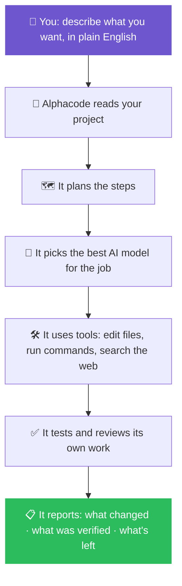
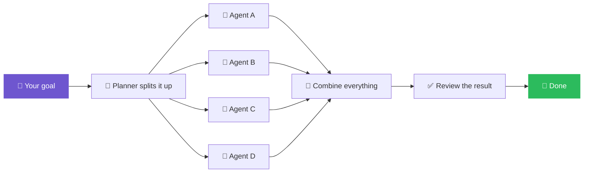

<div align="center">


<br>

<a href="https://github.com/dragonked2/alphacode">
  
</a>

<br>

### The AI coding agent that turns plain English into working code — right in your terminal.

**No coding background? Start here → [What is a terminal, and do I need to know one?](#-new-here-start-with-this)**

<br>

<a href="https://github.com/dragonked2/alphacode/releases"></a>
<a href="https://github.com/dragonked2/alphacode/actions"></a>
<a href="https://github.com/dragonked2/alphacode/blob/main/LICENSE"></a>

<a href="https://github.com/dragonked2/alphacode"></a>
<a href="https://github.com/dragonked2/alphacode/network/members"></a>
<a href="https://github.com/dragonked2/alphacode/issues"></a>


<br><br>

<a href="#-im-brand-new-to-this-start-here"><b>🆕 I'm New</b></a> ·
<a href="#-install-alphacode"><b>📥 Install</b></a> ·
<a href="#-quick-start-your-first-5-minutes"><b>⚡ Quick Start</b></a> ·
<a href="#-troubleshooting--fixing-common-errors"><b>🩺 Fix a Problem</b></a> ·
<a href="#-what-can-alphacode-actually-do"><b>🧩 Features</b></a> ·
<a href="#-frequently-asked-questions"><b>❓ FAQ</b></a> ·
<a href="#-commands-reference"><b>⌨️ Commands</b></a> ·
<a href="docs/"><b>📚 Full Docs</b></a>

<br>


</div>

---

## 🪄 In one sentence

> **Alphacode is a free, open-source AI assistant that lives on your computer and writes, fixes, tests, and explains code for you — you just tell it what you want in plain English.**

Think of it like ChatGPT, except instead of only *talking* about code, it actually **opens your files, makes the changes, runs the tests, and tells you what it did** — safely, and with your permission at every risky step.

It works with all the major AI models — **Claude, GPT-4/GPT-5, Gemini, GitHub Copilot, Cursor**, and others — so you're never locked into one company's AI.

---

## 🆕 I'm brand new to this. Start here.

<details open>
<summary><b>👉 Click to expand: "What even is Alphacode, in normal words?"</b></summary>
<br>

**You don't need to be a programmer to use Alphacode's core idea** — you tell it a goal, and it does the technical work. But Alphacode *itself* is a tool for working with code, so it does require one thing: a **terminal** (also called a "command line" or "console").

| If you are... | What that means for you |
| :-- | :-- |
| 🧑‍💻 **A developer / student learning to code** | You'll feel at home immediately — skip to [Quick Start](#-quick-start-your-first-5-minutes) |
| 🧑‍🎨 **A designer, PM, founder, or hobbyist with zero coding background** | You *can* absolutely use this. Read [What is a terminal?](#-what-is-a-terminal-and-do-i-need-to-learn-one) below first — it's a 3-minute read |
| 🏢 **Evaluating this for a team or company** | See [Why Alphacode](#-why-people-choose-alphacode) and [Safety](#-safety--how-alphacode-protects-your-computer) |

</details>

### 💡 What is a "terminal," and do I need to learn one?

A terminal is just a text window where you type commands instead of clicking buttons — like a chat box, but for talking to your computer directly. It looks intimidating the first time, but you really only need to know **three things** to use Alphacode:

1. **How to open it** — every operating system has one built in (see below).
2. **How to copy-paste a command** — you copy a line of text from this page and paste it in. That's most of what "using the terminal" means here.
3. **How to press Enter** — that's it.

<table>
<tr>
<th width="33%">💻 Windows</th>
<th width="33%">🍎 macOS</th>
<th width="33%">🐧 Linux</th>
</tr>
<tr>
<td>

Press `Win` key → type **"PowerShell"** → press Enter

</td>
<td>

Press `Cmd + Space` → type **"Terminal"** → press Enter

</td>
<td>

Press `Ctrl + Alt + T` (most distros)

</td>
</tr>
</table>

Once it's open, everything below just works by copy-pasting one line at a time. If something looks like an error, jump straight to [Troubleshooting](#-troubleshooting--fixing-common-errors) — every common issue has a copy-paste fix.

---

## 🧭 What is Alphacode, really? (The technical explanation)

For readers who want the precise version: Alphacode is a **terminal-native AI coding agent**. Give it an objective in natural language, and it:

- reads and understands your codebase,
- plans the work,
- picks the best available AI model for the job,
- edits files, runs shell commands, and executes tests,
- searches the web when it needs current information,
- coordinates multiple AI agents in parallel for large tasks,
- reviews its own work before calling anything "done,"
- and keeps the session alive — resumable, crash-safe — until the objective is genuinely complete.

Every version of that list — plain or technical — points at the same underlying rule:

> ### 🎯 *Make the smallest change that actually solves the problem — then verify it.*

<div align="center">



</div>

---

## ⭐ Why people choose Alphacode

<table>
<tr>
<td width="26%">🧠 <b>Works with any AI</b></td>
<td>Claude, GPT, Gemini, Copilot, Cursor, OpenRouter, Bedrock, Azure, or any OpenAI-compatible service — plus a <b>free built-in AI (GMI Cloud)</b> so it works immediately with zero setup and zero cost to try.</td>
</tr>
<tr>
<td>🐝 <b>Splits big jobs into a team of AI agents</b></td>
<td>Large tasks get broken into smaller pieces that run <i>at the same time</i> instead of one at a time, then get merged back together automatically.</td>
</tr>
<tr>
<td>💻 <b>A genuinely pleasant interface</b></td>
<td>Full color, syntax highlighting, image previews, diagrams — this is not a plain black-and-white command line from the 1990s.</td>
</tr>
<tr>
<td>🧰 <b>40+ built-in tools</b></td>
<td>File editing, web search, browser control, memory, scheduling, diagram rendering, and more — all available without installing anything extra.</td>
</tr>
<tr>
<td>💾 <b>Never lose your work</b></td>
<td>Close your laptop, lose your connection, or crash your terminal — your session picks up right where it left off.</td>
</tr>
<tr>
<td>🛡️ <b>Safety built in, not bolted on</b></td>
<td>Alphacode asks before doing anything risky and refuses to run commands that could destroy your files or system.</td>
</tr>
<tr>
<td>⚡ <b>Fast and lightweight</b></td>
<td>Built in Rust — starts instantly and uses a fraction of the memory of comparable tools. See real numbers in <a href="#-performance-numbers">Performance</a>.</td>
</tr>
</table>

---

## 📑 Table of Contents

<table>
<tr>
<td valign="top" width="33%">

**🚀 Getting Started**
- [I'm brand new — start here](#-im-brand-new-to-this-start-here)
- [Install Alphacode](#-install-alphacode)
  - [Windows](#windows)
  - [macOS / Linux](#macos--linux)
  - [Build from source](#build-from-source-advanced)
  - [Verify it worked](#-verify-your-install)
- [Quick Start](#-quick-start-your-first-5-minutes)
- [Troubleshooting](#-troubleshooting--fixing-common-errors)

</td>
<td valign="top" width="33%">

**🧩 What It Can Do**
- [Full feature list](#-what-can-alphacode-actually-do)
- [Supported AI models](#-supported-ai-models--providers)
- [Multi-agent "Swarm Mode"](#-swarm-mode-multiple-ai-agents-working-together)
- [Built-in skills](#-built-in-skills)
- [Safety features](#-safety--how-alphacode-protects-your-computer)
- [Reliability](#-reliability--never-lose-your-work)
- [Performance numbers](#-performance-numbers)

</td>
<td valign="top" width="33%">

**📚 Reference**
- [Quality guarantees](#-code-quality-guarantees)
- [Full command list](#-commands-reference)
- [Settings & config files](#-configuration)
- [Updating](#-updating-alphacode)
- [Uninstalling](#-uninstalling-alphacode)
- [How the code is organized](#-project-structure)
- [Contributing](#-contributing)
- [FAQ](#-frequently-asked-questions)
- [License](#-license)

</td>
</tr>
</table>

---

## 📥 Install Alphacode

Pick your operating system below. Each installer downloads Alphacode, checks that the download is safe and untampered (a security step called checksum verification), and sets it up automatically.

### Windows

1. Open **PowerShell** (see [how to open a terminal](#-what-is-a-terminal-and-do-i-need-to-learn-one) if you're not sure how).
2. Copy this line, paste it in, and press Enter:

```powershell
iwr -useb https://raw.githubusercontent.com/dragonked2/alphacode/main/scripts/install.ps1 | iex
```

<details>
<summary><b>🔍 What does this actually do to my computer?</b></summary>
<br>

In plain English: it detects your computer's type, downloads the correct Alphacode program from GitHub's official servers, double-checks the download isn't corrupted or tampered with, and puts it in a folder on your computer where it can be launched by typing `alphacode`. It does **not** touch your other files, install background services, or need administrator access.

Technical detail: detects architecture (`x86_64`/`arm64`) → resolves the latest release tag → downloads `alphacode-windows-{arch}.zip` and `SHA256SUMS` → verifies the SHA-256 checksum → extracts `alphacode.exe` into `%LOCALAPPDATA%\Programs\alphacode\bin\` → prompts you to add that folder to your `PATH` (one-time, guided).

</details>

**Optional: pin a specific version or install location**

```powershell
# Pin a version
iwr -useb ... | iex -Version v1.0.7

# Install into a custom folder
iwr -useb ... | iex -Prefix "$env:LOCALAPPDATA\Programs\alphacode"

# Build from source instead of downloading
iwr -useb ... | iex -FromSource
```

### macOS / Linux

1. Open **Terminal**.
2. Copy this line, paste it in, and press Enter:

```bash
curl -fsSL https://raw.githubusercontent.com/dragonked2/alphacode/main/scripts/install.sh | bash
```

<details>
<summary><b>🔍 What does this actually do to my computer?</b></summary>
<br>

Same idea as above, in plain English: downloads the right version for your Mac or Linux machine, verifies it's authentic, and puts the `alphacode` command somewhere your terminal can find it.

Technical detail: detects OS (`linux`/`macos`) and architecture → resolves the latest release tag from the GitHub API → downloads `alphacode-{os}-{arch}.tar.gz` and `SHA256SUMS` → verifies SHA-256 → extracts the binary into `~/.local/bin/` (or `$ALPHACODE_PREFIX/bin`) → prints a `PATH` hint if needed.

</details>

**Optional settings (environment variables):**

| Variable | Default | What it changes |
| :-- | :-- | :-- |
| `ALPHACODE_PREFIX` | `~/.local` | Where it gets installed |
| `ALPHACODE_BIN_DIR` | `$PREFIX/bin` | Exact folder for the program file |
| `ALPHACODE_VERSION` | `latest` | Lock to one version, e.g. `v1.0.7` |
| `ALPHACODE_REPO` | `dragonked2/alphacode` | Install from a fork/mirror |
| `ALPHACODE_FROM_SOURCE=1` | off | Build it yourself instead of downloading |
| `ALPHACODE_SOURCE_ONLY=1` | off | Never fall back to a source build |
| `ALPHACODE_SOURCE_REF=<ref>` | HEAD | Which branch/tag/commit to build |

```bash
curl -fsSL https://raw.githubusercontent.com/dragonked2/alphacode/main/scripts/install.sh | bash -s -- --version v1.0.7 --prefix ~/.local
```

### Build from source (advanced)

Only needed if you want to compile it yourself or there's no ready-made download for your exact machine type.

```bash
git clone https://github.com/dragonked2/alphacode.git
cd alphacode
cargo build --release
./target/release/alphacode --version
```

<details>
<summary><b>Requirements</b></summary>
<br>

- **Rust 1.91+** (edition 2024). The repo pins this in `rust-toolchain.toml`, so `rustup` installs the right version automatically.
- A C toolchain:
  - **Linux:** `build-essential` + `pkg-config` + `libssl-dev` (Ubuntu/Debian) or equivalent
  - **macOS:** Xcode Command Line Tools (`xcode-select --install`)
  - **Windows:** MSVC Build Tools + Windows SDK
- `git`

A clean build takes 5–30 minutes. Rebuilds after that take seconds.

</details>

<details>
<summary><b>Optional feature stacks (only if you need them)</b></summary>
<br>

```bash
cargo build --release --features bedrock            # AWS Bedrock support
cargo build --release --features embeddings          # Local ONNX embeddings
cargo build --release --features pdf                 # PDF text extraction
cargo build --release --features mermaid-renderer     # Mermaid diagram rendering
cargo build --release --features bedrock,embeddings,pdf,mermaid-renderer  # all of the above
```

</details>

### ✅ Verify your install

Run these three, in order, to confirm everything worked:

```bash
# 1 — Can your computer find it?
which alphacode          # macOS / Linux
Get-Command alphacode    # PowerShell

# 2 — Is it the version you expect?
alphacode --version      # → v1.0.7 (964e49e, …)

# 3 — Is everything healthy?
alphacode doctor         # checks PATH, terminal, providers, optional dependencies
```

`alphacode doctor` prints `OK`, `WARN`, or `FAIL` for each check, with a fix for anything not green. **If something fails, jump to [Troubleshooting](#-troubleshooting--fixing-common-errors).**

<details>
<summary>🔐 Paranoid mode: manually verify the download's checksum</summary>
<br>

```bash
# macOS / Linux
curl -fsSL https://github.com/dragonked2/alphacode/releases/download/v1.0.7/SHA256SUMS -o SHA256SUMS
curl -fsSL https://github.com/dragonked2/alphacode/releases/download/v1.0.7/alphacode-linux-x86_64.tar.gz -o alphacode.tar.gz
sha256sum --ignore-missing -c SHA256SUMS
```

```powershell
# Windows (PowerShell)
Invoke-WebRequest https://github.com/dragonked2/alphacode/releases/download/v1.0.7/SHA256SUMS -OutFile SHA256SUMS
$expected = (Get-Content SHA256SUMS | Where-Object { $_ -like '*windows-x86_64*' })[0].Split(' ')[0]
$actual   = (Get-FileHash .\alphacode-windows-x86_64.zip -Algorithm SHA256).Hash.ToLower()
"$expected  expected"
"$actual    actual"
```

</details>

---

## ⚡ Quick Start: your first 5 minutes

You don't need an account to launch Alphacode — but you need at least one AI "brain" connected so it can actually think. Pick the easiest option:

<table>
<tr><th width="30%">Option</th><th>Best for</th><th>How</th></tr>
<tr>
<td>🆓 <b>C · Just launch it</b></td>
<td>Trying it out right now, zero setup</td>
<td>

```bash
alphacode
```
Uses the free built-in **GMI Cloud** AI automatically.
</td>
</tr>
<tr>
<td>🔑 <b>A · Sign in</b></td>
<td>Using your existing Claude/OpenAI/Gemini account</td>
<td>

```bash
alphacode login
alphacode login --provider openai
```
</td>
</tr>
<tr>
<td>⚙️ <b>B · API key</b></td>
<td>Developers, CI pipelines, scripts</td>
<td>

```bash
export ALPHACODE_OPENAI_API_KEY=sk-...
alphacode
```
</td>
</tr>
</table>

> **💡 Beginner tip:** if you're not sure which to pick, just run `alphacode` with no arguments. It works immediately using the free built-in AI — you can always switch providers later with `alphacode login`.

### Launch it

```bash
alphacode
```

The first time, it'll ask a few quick setup questions (telemetry, default model, keyboard shortcuts). **You can press `Esc` to skip any of them** — nothing is required upfront.

### Try your first task

Just describe what you want in plain sentences — no special syntax needed:

```text
> explain what this project does in simple terms

> add a login button to my homepage

> find and fix the bug that's crashing the app

> write tests for my utils.js file

> look up the latest React release notes and summarize them

> /swarm "split this feature into 4 parallel tasks"
```

**Handy keyboard shortcuts:**

| Key | What it does |
| :-- | :-- |
| `F1` | Show every keyboard shortcut |
| `Ctrl+T` | Switch AI models |
| `Ctrl+Y` | See what each AI agent is doing |
| `Ctrl+C` | Pause the current response (your session is kept) |
| `Esc` | Go back / close the current dialog |

---

## 🩺 Troubleshooting — fixing common errors

Every issue below has a copy-paste fix. Find the message closest to what you're seeing.

<details>
<summary><b>❌ "command not found: alphacode" (macOS / Linux)</b></summary>
<br>

**What this means in plain English:** Alphacode installed correctly, but your terminal doesn't know where to find it yet. This is normal and takes 10 seconds to fix.

```bash
# Bash — append to ~/.bashrc
echo 'export PATH="$HOME/.local/bin:$PATH"' >> ~/.bashrc
source ~/.bashrc

# Zsh — append to ~/.zshrc
echo 'export PATH="$HOME/.local/bin:$PATH"' >> ~/.zshrc
source ~/.zshrc

# Fish
fish_add_path ~/.local/bin
```

Then close and reopen your terminal.

</details>

<details>
<summary><b>❌ PowerShell can't find "alphacode.exe" (Windows)</b></summary>
<br>

**What this means:** same idea as above — Windows needs to be told where the program lives.

1. Press `Win`, type **"Edit the system environment variables"**, press Enter.
2. Click **Environment Variables…** → under **User variables**, select `Path` → **Edit…** → **New**.
3. Paste: `%LOCALAPPDATA%\Programs\alphacode\bin` → OK → OK.
4. **Open a brand new PowerShell window** (old windows won't pick up the change).

</details>

<details>
<summary><b>⏳ It's stuck on "Compiling alphacode (this can take 5-30 minutes)"</b></summary>
<br>

**What this means:** there's no ready-made download for your exact computer type, so it's building Alphacode from scratch on your machine. This is normal, just slow. To avoid it next time:

```bash
curl -fsSL ... | ALPHACODE_VERSION=v1.0.7 bash
```

</details>

<details>
<summary><b>🦀 "rustc … is too old; need >= 1.91"</b></summary>
<br>

Only relevant if you're building from source.

```bash
rustup update stable         # macOS / Linux
# Windows: re-run rustup-init from https://rustup.rs and choose "stable"
```

</details>

<details>
<summary><b>🔐 "Checksum verification failed"</b></summary>
<br>

**What this means:** the safety check caught a corrupted or tampered download and refused to install it — this is the security system working as intended, not a bug. Just try the install command again. If it keeps happening, [file an issue](https://github.com/dragonked2/alphacode/issues) with the exact error text.

</details>

<details>
<summary><b>🌐 "alphacode login" opens a browser and then nothing happens</b></summary>
<br>

**What this means:** your firewall or VPN is blocking the sign-in page from talking back to Alphacode.

- Temporarily turn off your VPN or firewall.
- On Linux: `sudo ufw allow from 127.0.0.1`
- Or skip sign-in entirely and use an API key: `export ALPHACODE_OPENAI_API_KEY=sk-…`

</details>

<details>
<summary><b>🎨 "alphacode doctor" says the terminal isn't 256-color</b></summary>
<br>

**What this means:** your terminal app is too old to show colors and icons properly.

- ✅ **Use instead:** Windows Terminal, iTerm2, gnome-terminal, kitty, or WezTerm.
- ❌ **Avoid:** `cmd.exe` or the old Windows Console Host.
- Connecting over SSH? Add `-o RequestTTY=force` to your SSH command.

</details>

<details>
<summary><b>🔤 The screen flickers or shows broken symbols/squares</b></summary>
<br>

**What this means:** your terminal's font doesn't include the icon characters Alphacode uses. Install a "Nerd Font" — **JetBrains Mono Nerd Font** or **Cascadia Code Nerd Font** are good picks — and set it as your terminal's font.

</details>

<details>
<summary><b>🐢 The very first response feels slow</b></summary>
<br>

**What this means:** the first message of a session does some one-time setup work behind the scenes. Every message after that is fast. If it stays slow, run `alphacode doctor` to pinpoint why.

</details>

**Still stuck?** Run `alphacode doctor --verbose` and paste the output when you [file an issue](https://github.com/dragonked2/alphacode/issues). Found a security problem instead? Please report it privately via [`SECURITY.md`](./SECURITY.md) rather than a public issue.

---

## 🧩 What can Alphacode actually do?

### 🤖 Supported AI models & providers

Alphacode doesn't lock you into one AI company. Use whichever model is best (or cheapest, or fastest) for the task at hand — and switch anytime.

| Provider | How you sign in | Good to know |
| :-- | :-- | :-- |
| 🟣 **Anthropic / Claude** | Sign-in or API key | First-class support |
| 🟢 **OpenAI / GPT** | Sign-in, API key, or browser | Strong reasoning, vision, tool use |
| 🔵 **Google Gemini** | Sign-in or API key | Full Gemini lineup |
| ⚫ **GitHub Copilot** | Sign-in | Reuses your existing Copilot subscription |
| ⚪ **Cursor** | Sign-in | Reuses your existing Cursor session |
| 🟠 **AWS Bedrock** | AWS credentials | Optional `bedrock` build feature |
| 🔷 **Azure** | Azure AD or API key | Optional `azure-auth` build feature |
| 🟡 **OpenRouter** | API key | Access to many models via one key |
| ⚙️ **Any OpenAI-compatible service** | API key | Add it with `alphacode provider add` |
| 🆓 **GMI Cloud** | *Nothing — it's built in* | Free, works out of the box, zero setup |

**Switch providers anytime, mid-conversation:**

```bash
alphacode provider list              # see everything you've connected
alphacode provider current           # what's active right now
alphacode provider use openai        # make OpenAI your default
alphacode model list                 # list models for the current provider
alphacode model use gpt-4o           # pin a specific model
```

Or press `Ctrl+T` inside the app for a visual picker.

### 🛠 The full toolbox

<table>
<tr><td width="50%">

- 📝 **Editing** — read, write, patch, multi-file edits
- 🔍 **Search** — regex, fuzzy, and AST-aware code search
- ⚙️ **Execution** — runs shell commands, with safety controls
- 🌐 **Web** — fetches pages and searches the internet
- 🖥️ **Browser control** — automates a real Chrome browser

</td><td width="50%">

- 🧠 **Memory** — remembers project and conversation context
- 🎓 **Skills** — reusable, pluggable capabilities
- 💾 **Sessions** — save, recover, and resume anytime
- ⏰ **Scheduling** — set up recurring or background tasks
- 🎨 **Rendering** — generates images and diagrams

</td></tr>
</table>

Also included: **PDF text extraction** (optional), **secure sign-in flows** for every supported AI provider, and **autonomous modules** — a planner, project analyzer, self-review system, quality gate, and resource monitor working behind the scenes.

### 🎓 Built-in skills

"Skills" are ready-made expert playbooks Alphacode can follow. These ship inside the program itself, so they work everywhere, instantly:

| Skill | What it's for |
| :-- | :-- |
| `/bugbounty` | A complete security-testing methodology — recon, common vulnerability classes, reporting |
| `/meme-coin-audit` | Checks crypto tokens for rug-pull and scam risk patterns |
| `/frontend-design` | Helps make UI work look distinctive and intentional, not generic |

Type `/skills` inside the app to browse everything available, including any custom skills you've added yourself.

### 🐝 Swarm Mode: multiple AI agents working together

**In plain English:** instead of one AI doing everything step-by-step, Swarm Mode splits a big task into smaller independent pieces, hands each piece to its own AI agent, and has them all work **at the same time** — like assigning different parts of a group project to different teammates, then combining everyone's work at the end.



Try it:

```text
/swarm "split this feature into 4 parallel tasks"
```

You can watch the whole plan and progress live inside the app.

### 🛡 Safety — how Alphacode protects your computer

AI agents that can run real commands are powerful — and that power needs real guardrails. Alphacode treats safety as a first-class engineering problem, not an afterthought:

- Catastrophic targets such as `rm -rf /`, home-directory wipes, and device-node writes are blocked.
- Routine authorized security tooling (nmap, subfinder, nuclei, httpx, ffuf, gobuster, curl against an in-scope target) runs without a reflection prompt.
- Risky actions pass through the TUI permission layer.
- Network operations use SSRF and credential-leak heuristics only where they would actually prevent abuse; authorized testing against a target that requires your own Authorization header is supported.
- Interrupted or crashed sessions are marked instead of silently corrupting state.

Found a security vulnerability? Please report it responsibly via [`SECURITY.md`](./SECURITY.md).

### 🔁 Reliability — never lose your work

- `alphacode --resume` reopens exactly where you left off.
- `alphacode sessions list` shows and searches every past session.
- Crashes, dropped connections, and interruptions are clearly marked, never silently swallowed.
- Everything is saved to disk in your operating system's standard, expected location.
- Built-in health monitoring watches memory use, slow operations, and error rates during long sessions.

---

## 📊 Performance numbers

Built in Rust for a reason: **speed and a small memory footprint**, especially when you're running several AI sessions at once.

### What makes it fast

- Compiler optimizations (`opt-level = 3`, thin LTO) tuned specifically for the release build.
- The performance-critical networking and interface code gets extra-focused compilation (`codegen-units = 1`).
- Efficient reuse of network connections instead of opening new ones repeatedly.
- Session history is stored on disk, not held entirely in memory.
- Heavy optional features are off by default, so you only pay for what you use.
- No embedded scripting language slowing things down — it's native, compiled Rust throughout.

### Memory usage — historical snapshots

> ⚠️ **Important:** These are **legacy benchmark snapshots**, kept for historical comparison. Alphacode has improved further since these were measured — treat these as a directional illustration of architecture, not a live, current benchmark.

<details open>
<summary><b>📈 RAM usage — 1 active session</b></summary>
<br>

| Tool | Memory used | vs. Alphacode's most efficient mode |
| :-- | --: | --: |
| 🥇 **Alphacode — local embedding off** | **27.8 MB** | **1.0×** |
| Alphacode (default) | 167.1 MB | 6.0× |
| pi | 144.4 MB | 5.2× |
| Codex CLI | 140.0 MB | 5.0× |
| Cursor Agent | 214.9 MB | 7.7× |
| Antigravity CLI | 243.7 MB | 8.8× |
| GitHub Copilot CLI | 333.3 MB | 12.0× |
| Claude Code | 386.6 MB | 13.9× |
| OpenCode | 371.5 MB | 13.4× |

</details>

<details open>
<summary><b>📈 RAM usage — 10 active sessions at once</b></summary>
<br>

This is where architecture really matters — running several AI sessions in parallel is common for real engineering work.

| Tool | Memory used | vs. Alphacode's most efficient mode |
| :-- | --: | --: |
| 🥇 **Alphacode — local embedding off** | **117.0 MB** | **1.0×** |
| Alphacode (default) | 260.8 MB | 2.2× |
| Codex CLI | 334.8 MB | 2.9× |
| pi | 833.0 MB | 7.1× |
| Antigravity CLI | 1021.2 MB | 8.7× |
| Cursor Agent | 1632.4 MB | 14.0× |
| GitHub Copilot CLI | 1756.5 MB | 15.0× |
| Claude Code | 2300.6 MB | 19.7× |
| OpenCode | 3237.2 MB | 27.7× |

</details>

**In plain English:** a tool can look fine using one session, but memory costs multiply fast with real usage. Alphacode was designed from the start to stay lean even with many sessions running side by side.

<details>
<summary><b>📐 Benchmark methodology (for anyone who wants to reproduce or challenge these numbers)</b></summary>
<br>

Alphacode doesn't treat a single README number as proof of universal performance. Any future benchmark report should state:

1. Alphacode commit/version tested
2. OS and hardware
3. Build profile used
4. Which optional features were enabled
5. Number of active sessions
6. Exact measurement method
7. Warm vs. cold state
8. The exact workload/task used

That's what makes a performance claim reproducible instead of just promotional.

</details>

---

## 📜 Code quality guarantees

Every code-changing action Alphacode takes follows four rules:

<table>
<tr>
<td width="25%" align="center">

**1️⃣ Smallest change**

Only touches what's needed for the task. Unrelated issues get reported separately, never silently bundled in.

</td>
<td width="25%" align="center">

**2️⃣ No regressions**

Tests that were passing stay passing. New warnings count as failures where it matters.

</td>
<td width="25%" align="center">

**3️⃣ Self-review**

Before calling anything "done," it checks its own coverage, evidence, risk, and edge cases.

</td>
<td width="25%" align="center">

**4️⃣ Clear reporting**

Every finished task ends with: *what changed · what was verified · what's left.*

</td>
</tr>
</table>

The source of truth lives in `src/alphacode_base/prompt/system_prompt.md`, enforced by the tool implementations under `src/alphacode_app_core/tool/`.

---

## ⌨️ Commands reference

### CLI commands

```bash
alphacode                          # Launch the app
alphacode login                    # Sign in to an AI provider
alphacode login --provider openai  # Sign in to a specific provider
alphacode doctor                   # Check that everything's set up correctly
alphacode doctor --verbose         # Same, with extra detail for bug reports
alphacode provider list            # List every provider you've connected
alphacode provider add <name>      # Add a custom OpenAI-compatible endpoint
alphacode provider use <name>      # Set your default provider
alphacode provider current         # Show the active provider + model
alphacode model list               # List available models
alphacode model use <name>         # Set your default model
alphacode run "fix the failing test"   # Run one task without opening the full app
alphacode repl                     # A simple text-only mode
alphacode sessions list            # See your past sessions
alphacode --resume                 # Search for and reopen a session
alphacode --resume <id>            # Reopen one specific session
alphacode update                   # Update to the latest version
alphacode --version                # Check your current version
alphacode --help                   # See every available command
```

### In-app slash commands

| Command | What it does |
| :-- | :-- |
| `/help` | Show every command |
| `/agents` | Start multiple AI agents working in parallel |
| `/compact` | Shrink a long conversation to save space |
| `/memory` | View what Alphacode remembers about your project |
| `/skills` | Browse and manage available skills |
| `/diff` | See exactly what changed, file by file |
| `/exit` | Close the app (your session is saved automatically) |

---

## ⚙️ Configuration

Alphacode keeps its settings, sessions, and logs in your operating system's standard location — never scattered inside your project folder.

| Platform | Settings | Sessions | Logs |
| :-- | :-- | :-- | :-- |
| 🐧 Linux | `~/.config/alphacode/` | `~/.local/share/alphacode/sessions/` | `~/.local/share/alphacode/logs/` |
| 🍎 macOS | `~/Library/Application Support/alphacode/` | *same* | *same* |
| 🪟 Windows | `%APPDATA%\alphacode\` | `%LOCALAPPDATA%\alphacode\sessions\` | `%LOCALAPPDATA%\alphacode\logs\` |

The main settings file, `config.toml`, is created automatically the first time you run `alphacode login`. Full reference: [`docs/configuration.md`](./docs/configuration.md).

---

## 🔄 Updating Alphacode

```bash
alphacode update
```

This grabs the newest version, verifies it's safe, and swaps it in — without interrupting anything you have running. You can also just re-run the original install command any time; it's safe to run repeatedly.

---

## 🗑 Uninstalling Alphacode

### macOS / Linux

```bash
curl -fsSL https://raw.githubusercontent.com/dragonked2/alphacode/main/scripts/uninstall.sh | bash
```

Want to remove your settings, sessions, and logs too?

```bash
curl -fsSL https://raw.githubusercontent.com/dragonked2/alphacode/main/scripts/uninstall.sh | bash -s -- --purge
```

### Windows

```powershell
iwr -useb https://raw.githubusercontent.com/dragonked2/alphacode/main/scripts/uninstall.ps1 | iex
```

Add `-Purge` to also remove settings, sessions, and logs.

---

## 🏗 Project structure

For contributors and the technically curious — here's how the codebase is organized:

```text
alphacode/
├── src/
│   ├── alphacode_core/             # Provider-agnostic trait types and shared state
│   ├── alphacode_base/             # System prompt, prompt builder, capability enum
│   ├── alphacode_app_core/         # Agent loop, tools, autonomous layer, server
│   ├── alphacode_tui*/             # Terminal UI: rendering, widgets, style, animations
│   ├── alphacode_tool_core/        # The `Tool` trait and shared tool types
│   ├── alphacode_provider_*/       # Per-provider runtimes (Anthropic, OpenAI, …)
│   ├── alphacode_auth_*/           # Per-provider OAuth flows
│   ├── alphacode_swarm_core/       # Multi-agent coordination (task DAG, deep/light modes)
│   ├── alphacode_modules/          # High-level autonomous modules
│   └── alphacode_cli/              # The `alphacode` binary entrypoint
├── docs/                           # Architecture + configuration reference
├── scripts/                        # install / uninstall tooling
├── CONTRIBUTING.md
├── SECURITY.md
└── Cargo.toml
```

Deeper tour: [`docs/architecture.md`](./docs/architecture.md).

---

## 🤝 Contributing

Contributions are genuinely welcome, from typo fixes to new features. Full guide: [`CONTRIBUTING.md`](./CONTRIBUTING.md). Short version:

```bash
git clone https://github.com/dragonked2/alphacode.git
cd alphacode
cargo build --release
cargo test --lib
cargo clippy --lib -- -D warnings
```

Requirements: **Rust 1.91+** (edition 2024) and a matching C toolchain.

**Before opening a pull request:**

- [ ] `cargo build --release` passes locally
- [ ] `cargo test --lib` passes locally (add tests for behavior changes)
- [ ] `cargo clippy --lib -- -D warnings` is clean
- [ ] Public APIs have rustdoc comments
- [ ] No new dependencies unless justified in the PR description
- [ ] User-visible changes are documented in `CHANGELOG.md`

Security vulnerabilities: [`SECURITY.md`](./SECURITY.md). Community standards: [`CODE_OF_CONDUCT.md`](./CODE_OF_CONDUCT.md).

---

## ❓ Frequently Asked Questions

<details>
<summary><b>Do I need to know how to code to use Alphacode?</b></summary>
<br>

No. You need to be comfortable copy-pasting a command into a terminal and describing what you want in plain English. Alphacode handles the actual coding. See [I'm brand new — start here](#-im-brand-new-to-this-start-here).

</details>

<details>
<summary><b>Is Alphacode free?</b></summary>
<br>

Yes — Alphacode itself is free and open source under the MIT License. It includes a free built-in AI (GMI Cloud) so you can use it with zero cost and zero setup. If you connect a paid AI provider (like a Claude or OpenAI account) instead, that provider's own usage costs apply — Alphacode doesn't add any fee on top.

</details>

<details>
<summary><b>Which AI model does Alphacode use — Claude, GPT, or Gemini?</b></summary>
<br>

Whichever you choose. Alphacode isn't tied to one AI company — see [Supported AI models & providers](#-supported-ai-models--providers) for the full list, and switch anytime with `Ctrl+T`.

</details>

<details>
<summary><b>Is it safe to let an AI run commands on my computer?</b></summary>
<br>

Alphacode is built with safety as a core design principle, not an add-on: it blocks catastrophic commands outright, asks for confirmation before anything risky, and never sends your code anywhere by default. See [Safety](#-safety--how-alphacode-protects-your-computer) for the full picture. As with any tool that can modify files, it's good practice to review changes (`/diff`) and use version control (git).

</details>

<details>
<summary><b>How is this different from GitHub Copilot, Cursor, or Claude Code?</b></summary>
<br>

The biggest differences: Alphacode works with **any** AI provider instead of locking you to one, runs natively in the terminal instead of requiring an IDE, supports running multiple AI agents in parallel ("Swarm Mode"), and is built in Rust for a notably smaller memory footprint — see [Performance numbers](#-performance-numbers) for a direct comparison.

</details>

<details>
<summary><b>Does it work on Windows?</b></summary>
<br>

Yes — Windows, macOS, and Linux are all fully supported. See [Install Alphacode](#-install-alphacode).

</details>

<details>
<summary><b>What if the install command doesn't work?</b></summary>
<br>

Check [Troubleshooting](#-troubleshooting--fixing-common-errors) — it covers every common install and first-run issue with a copy-paste fix.

</details>

<details>
<summary><b>Can I use my own OpenAI or Claude subscription instead of the free built-in AI?</b></summary>
<br>

Yes. Run `alphacode login` and pick your provider, or set an API key as an environment variable. Full steps in [Quick Start](#-quick-start-your-first-5-minutes).

</details>

---

## 🙏 Acknowledgements

Alphacode is built on outstanding open-source projects, including:

<div align="center">

[](https://ratatui.rs)
[](https://github.com/crossterm-rs/crossterm)
[](https://tokio.rs)
[](https://github.com/seanmonstar/reqwest)
[](https://github.com/rustls/rustls)
[](https://github.com/clap-rs/clap)
[](https://github.com/raphlinus/pulldown-cmark)
[](https://github.com/trishume/syntect)
[](https://github.com/RazrFalcon/resvg)

</div>

...and many others — see `Cargo.lock` for the complete dependency graph.

---

## 📄 License

Alphacode is released under the **MIT License** — free to use, modify, and distribute. Full text: [`LICENSE`](./LICENSE).

---

<div align="center">


**Alphacode**
<br>
<sub>The AI coding agent for your terminal · Built with Rust 🦀 · Free & open source</sub>

<br><br>

<a href="https://github.com/dragonked2/alphacode">GitHub</a> ·
<a href="https://github.com/dragonked2/alphacode/issues">Issues</a> ·
<a href="https://github.com/dragonked2/alphacode/releases">Releases</a> ·
<a href="docs/">Documentation</a>

<br><br>

<sub>Made with care by <a href="https://github.com/dragonked2">Ali Essam</a> · MIT licensed</sub>

</div>
