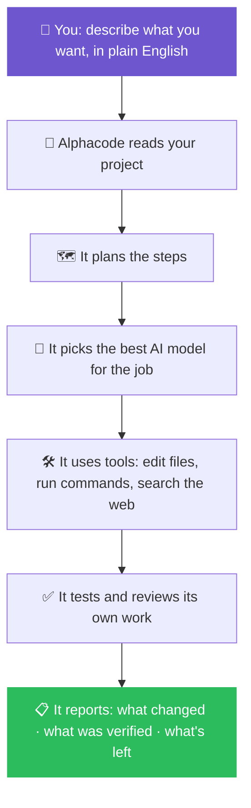
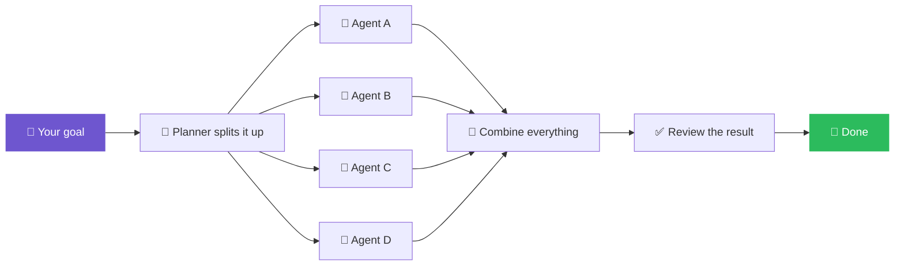

<div align="center">


<br>

### The free, open-source AI coding agent that turns plain English into working code — right in your terminal.

**Point it at Claude, GPT, or Gemini, describe what you want, and it plans, edits, tests, and ships it — using a fraction of the memory of Claude Code, Cursor, or Copilot CLI.**

**New to terminals? Start here → [What is a terminal, and do I need to know one?](#-im-brand-new-to-this-start-here)**

<br>

<a href="https://github.com/dragonked2/alphacode/releases"></a>
<a href="https://github.com/dragonked2/alphacode/actions"></a>
<a href="https://github.com/dragonked2/alphacode/blob/main/LICENSE"></a>
<a href="https://github.com/dragonked2/alphacode"></a>
<a href="https://github.com/dragonked2/alphacode/network/members"></a>
<a href="https://github.com/dragonked2/alphacode/issues"></a>


<br><br>

<a href="#-benchmarks-alphacode-vs-claude-code-vs-cursor-vs-copilot-cli"><b>📊 Benchmarks</b></a> ·
<a href="#-install-alphacode"><b>📥 Install</b></a> ·
<a href="#-quick-start-your-first-5-minutes"><b>⚡ Quick Start</b></a> ·
<a href="#-what-can-alphacode-actually-do"><b>🧩 Features</b></a> ·
<a href="#-troubleshooting--fixing-common-errors"><b>🩺 Fix a Problem</b></a> ·
<a href="#-frequently-asked-questions"><b>❓ FAQ</b></a> ·
<a href="docs/"><b>📚 Full Docs</b></a>

<br>

<sub>⭐ **If Alphacode saves you memory or money, a star helps other developers find it — it's the #1 way this project grows.**</sub>

</div>

---

> ### ⚠️ Known issue: `alphacode update` may fail on the current release
>
> Until this is fixed in the next release, **don't rely on `alphacode update`**. Instead, uninstall then reinstall to get the latest version cleanly:
>
> ```bash
> # macOS / Linux
> curl -fsSL https://raw.githubusercontent.com/dragonked2/alphacode/main/scripts/uninstall.sh | bash
> curl -fsSL https://raw.githubusercontent.com/dragonked2/alphacode/main/scripts/install.sh | bash
> ```
> ```powershell
> # Windows (PowerShell)
> iwr -useb https://raw.githubusercontent.com/dragonked2/alphacode/main/scripts/uninstall.ps1 | iex
> iwr -useb https://raw.githubusercontent.com/dragonked2/alphacode/main/scripts/install.ps1 | iex
> ```
>
> Your settings, sessions, and logs are untouched by a plain (non-`--purge`) uninstall, so this is safe to do. See [Updating Alphacode](#-updating-alphacode) for details.

---

## 📊 Benchmarks: Alphacode vs. Claude Code vs. Cursor vs. Copilot CLI

**The headline number:** running 10 AI coding sessions in parallel, Alphacode uses **117 MB** of RAM. Claude Code uses **2,300 MB** for the same workload — almost **20× more**.

<table>
<tr>
<td width="50%" valign="top">

**1 active session**

| Tool | RAM | vs. Alphacode |
| :-- | --: | --: |
| 🥇 **Alphacode** (lean mode) | **27.8 MB** | **1.0×** |
| Codex CLI | 140.0 MB | 5.0× |
| pi | 144.4 MB | 5.2× |
| Alphacode (default) | 167.1 MB | 6.0× |
| Cursor Agent | 214.9 MB | 7.7× |
| Antigravity CLI | 243.7 MB | 8.8× |
| GitHub Copilot CLI | 333.3 MB | 12.0× |
| OpenCode | 371.5 MB | 13.4× |
| Claude Code | 386.6 MB | 13.9× |

</td>
<td width="50%" valign="top">

**10 sessions running at once**

| Tool | RAM | vs. Alphacode |
| :-- | --: | --: |
| 🥇 **Alphacode** (lean mode) | **117.0 MB** | **1.0×** |
| Alphacode (default) | 260.8 MB | 2.2× |
| Codex CLI | 334.8 MB | 2.9× |
| pi | 833.0 MB | 7.1× |
| Antigravity CLI | 1,021.2 MB | 8.7× |
| Cursor Agent | 1,632.4 MB | 14.0× |
| GitHub Copilot CLI | 1,756.5 MB | 15.0× |
| Claude Code | 2,300.6 MB | 19.7× |
| OpenCode | 3,237.2 MB | 27.7× |

</td>
</tr>
</table>

**Why this matters:** most engineers run more than one AI session at a time — one per repo, one per feature branch, one for a quick question on the side. Memory overhead multiplies with every session, so the tool with the smallest footprint is the one that stays usable as your workflow scales up. Alphacode was built in Rust from day one specifically to stay lean under that kind of real, parallel usage.

> ⚠️ These are **legacy benchmark snapshots** kept for historical comparison — Alphacode has improved further since. Treat them as directional evidence of the architecture, not a live number. Full methodology and how to reproduce these yourself: [Benchmark methodology](#-benchmark-methodology).

---

## 🪄 In one sentence

> **Alphacode is a free, open-source AI assistant that lives on your computer and writes, fixes, tests, and explains code for you — you just tell it what you want in plain English.**

Think of it like ChatGPT, except instead of only *talking* about code, it actually **opens your files, makes the changes, runs the tests, and tells you what it did** — safely, and with your permission at every risky step.

It works with all the major AI models — **Claude, GPT-4/GPT-5, Gemini, GitHub Copilot, Cursor**, and others — so you're never locked into one company's AI.

---

## 🆕 I'm brand new to this. Start here.

You don't need to be a programmer to use Alphacode's core idea — you tell it a goal, and it does the technical work. But Alphacode *itself* is a tool for working with code, so it does require one thing: a **terminal** (also called a "command line" or "console").

| If you are... | What that means for you |
| :-- | :-- |
| 🧑‍💻 **A developer / student learning to code** | You'll feel at home immediately — skip to [Quick Start](#-quick-start-your-first-5-minutes) |
| 🧑‍🎨 **A designer, PM, founder, or hobbyist with zero coding background** | You *can* absolutely use this — read on below |
| 🏢 **Evaluating this for a team or company** | See [Why Alphacode](#-why-people-choose-alphacode) and [Safety](#-safety--how-alphacode-protects-your-computer) |

### 💡 What is a "terminal," and do I need to learn one?

A terminal is just a text window where you type commands instead of clicking buttons — like a chat box, but for talking to your computer directly. You only need to know **three things**:

1. **How to open it** (see below).
2. **How to copy-paste a command** — you copy a line from this page and paste it in.
3. **How to press Enter.**

<table>
<tr>
<th width="33%">💻 Windows</th>
<th width="33%">🍎 macOS</th>
<th width="33%">🐧 Linux</th>
</tr>
<tr>
<td>Press <code>Win</code> → type <b>"PowerShell"</b> → Enter</td>
<td>Press <code>Cmd + Space</code> → type <b>"Terminal"</b> → Enter</td>
<td>Press <code>Ctrl + Alt + T</code> (most distros)</td>
</tr>
</table>

Once it's open, everything below just works by copy-pasting one line at a time. If something looks like an error, jump straight to [Troubleshooting](#-troubleshooting--fixing-common-errors).

---

## 🧭 What is Alphacode, really?

Alphacode is a **terminal-native AI coding agent**. Give it an objective in natural language, and it:

- reads and understands your codebase, then plans the work
- picks the best available AI model for the job
- edits files, runs shell commands, and executes tests
- searches the web when it needs current information
- coordinates multiple AI agents in parallel for large tasks
- reviews its own work before calling anything "done"
- keeps the session alive — resumable, crash-safe — until the objective is genuinely complete

Every version of that list points at the same rule:

> ### 🎯 *Make the smallest change that actually solves the problem — then verify it.*



---

## ⭐ Why people choose Alphacode

| | |
| :-- | :-- |
| 🧠 **Works with any AI** | Claude, GPT, Gemini, Copilot, Cursor, OpenRouter, Bedrock, Azure, or any OpenAI-compatible service — plus a **free built-in AI (GMI Cloud)**, zero setup, zero cost to try. |
| 🐝 **Splits big jobs across agents** | Large tasks are broken into pieces that run *at the same time*, then merged back automatically. |
| 💻 **A genuinely pleasant interface** | Full color, syntax highlighting, image previews, diagrams — not a plain 1990s black-and-white CLI. |
| 🧰 **40+ built-in tools** | File editing, web search, browser control, memory, scheduling, diagram rendering — no extra installs. |
| 💾 **Never lose your work** | Close your laptop, drop your connection, or crash your terminal — your session picks up where it left off. |
| 🛡️ **Safety built in** | Alphacode asks before anything risky and refuses commands that could destroy your files or system. |
| ⚡ **Fast and lightweight** | Built in Rust — starts instantly, uses a fraction of the memory of comparable tools. See [Performance](#-performance-numbers). |

---

## 📑 Table of Contents

<table>
<tr>
<td valign="top" width="33%">

**🚀 Getting Started**
- [I'm brand new — start here](#-im-brand-new-to-this-start-here)
- [Install Alphacode](#-install-alphacode)
- [Quick Start](#-quick-start-your-first-5-minutes)
- [Troubleshooting](#-troubleshooting--fixing-common-errors)

</td>
<td valign="top" width="33%">

**🧩 What It Can Do**
- [Full feature list](#-what-can-alphacode-actually-do)
- [Supported AI models](#-supported-ai-models--providers)
- [Swarm Mode](#-swarm-mode-multiple-ai-agents-working-together)
- [Built-in skills](#-built-in-skills)
- [Safety](#-safety--how-alphacode-protects-your-computer)
- [Performance numbers](#-performance-numbers)

</td>
<td valign="top" width="33%">

**📚 Reference**
- [Quality guarantees](#-code-quality-guarantees)
- [Commands reference](#-commands-reference)
- [Configuration](#-configuration)
- [Updating](#-updating-alphacode)
- [Uninstalling](#-uninstalling-alphacode)
- [Contributing](#-contributing)
- [FAQ](#-frequently-asked-questions)

</td>
</tr>
</table>

---

## 📥 Install Alphacode

Each installer downloads Alphacode, verifies the download's checksum, and sets it up automatically.

### Windows

```powershell
iwr -useb https://raw.githubusercontent.com/dragonked2/alphacode/main/scripts/install.ps1 | iex
```

<details>
<summary>What does this do, and how do I pin a version or custom install path?</summary>
<br>

Detects your CPU architecture → resolves the latest release tag → downloads `alphacode-windows-{arch}.zip` and `SHA256SUMS` → verifies the SHA-256 checksum → extracts `alphacode.exe` into `%LOCALAPPDATA%\Programs\alphacode\bin\` → prompts to add that folder to `PATH`. It does **not** touch your other files, install background services, or need admin access.

```powershell
iwr -useb ... | iex -Version v1.0.7                                     # pin a version
iwr -useb ... | iex -Prefix "$env:LOCALAPPDATA\Programs\alphacode"       # custom install location
iwr -useb ... | iex -FromSource                                         # build from source instead
```

</details>

### macOS / Linux

```bash
curl -fsSL https://raw.githubusercontent.com/dragonked2/alphacode/main/scripts/install.sh | bash
```

<details>
<summary>What does this do, and how do I configure it?</summary>
<br>

Detects OS/architecture → resolves the latest release tag → downloads `alphacode-{os}-{arch}.tar.gz` and `SHA256SUMS` → verifies SHA-256 → extracts into `~/.local/bin/` (or `$ALPHACODE_PREFIX/bin`) → prints a `PATH` hint if needed.

| Variable | Default | What it changes |
| :-- | :-- | :-- |
| `ALPHACODE_PREFIX` | `~/.local` | Where it gets installed |
| `ALPHACODE_BIN_DIR` | `$PREFIX/bin` | Exact folder for the binary |
| `ALPHACODE_VERSION` | `latest` | Lock to one version, e.g. `v1.0.7` |
| `ALPHACODE_REPO` | `dragonked2/alphacode` | Install from a fork/mirror |
| `ALPHACODE_FROM_SOURCE=1` | off | Build it yourself instead of downloading |
| `ALPHACODE_SOURCE_ONLY=1` | off | Never fall back to a source build |
| `ALPHACODE_SOURCE_REF=<ref>` | HEAD | Which branch/tag/commit to build |

```bash
curl -fsSL https://raw.githubusercontent.com/dragonked2/alphacode/main/scripts/install.sh | bash -s -- --version v1.0.7 --prefix ~/.local
```

</details>

### Build from source (advanced)

```bash
git clone https://github.com/dragonked2/alphacode.git
cd alphacode
cargo build --release
./target/release/alphacode --version
```

<details>
<summary>Requirements & optional feature flags</summary>
<br>

- **Rust 1.91+** (edition 2024) — `rustup` picks the pinned version from `rust-toolchain.toml` automatically
- A C toolchain: `build-essential` + `pkg-config` + `libssl-dev` (Linux), Xcode Command Line Tools (macOS), or MSVC Build Tools + Windows SDK (Windows)
- `git`

A clean build takes 5–30 minutes; rebuilds after that take seconds.

```bash
cargo build --release --features bedrock             # AWS Bedrock support
cargo build --release --features embeddings           # Local ONNX embeddings
cargo build --release --features pdf                  # PDF text extraction
cargo build --release --features mermaid-renderer      # Mermaid diagram rendering
cargo build --release --features bedrock,embeddings,pdf,mermaid-renderer  # all of the above
```

</details>

### ✅ Verify your install

```bash
which alphacode          # macOS / Linux — can your computer find it?
Get-Command alphacode    # PowerShell equivalent

alphacode --version      # → v1.0.7 (964e49e, …)
alphacode doctor         # checks PATH, terminal, providers, optional dependencies
```

`alphacode doctor` prints `OK`, `WARN`, or `FAIL` for each check, with a fix for anything not green. If something fails, jump to [Troubleshooting](#-troubleshooting--fixing-common-errors).

<details>
<summary>🔐 Paranoid mode: manually verify the download's checksum</summary>
<br>

```bash
# macOS / Linux
curl -fsSL https://github.com/dragonked2/alphacode/releases/download/v1.0.7/SHA256SUMS -o SHA256SUMS
curl -fsSL https://github.com/dragonked2/alphacode/releases/download/v1.0.7/alphacode-linux-x86_64.tar.gz -o alphacode.tar.gz
sha256sum --ignore-missing -c SHA256SUMS
```

```powershell
# Windows (PowerShell)
Invoke-WebRequest https://github.com/dragonked2/alphacode/releases/download/v1.0.7/SHA256SUMS -OutFile SHA256SUMS
$expected = (Get-Content SHA256SUMS | Where-Object { $_ -like '*windows-x86_64*' })[0].Split(' ')[0]
$actual   = (Get-FileHash .\alphacode-windows-x86_64.zip -Algorithm SHA256).Hash.ToLower()
"$expected  expected"
"$actual    actual"
```

</details>

---

## ⚡ Quick Start: your first 5 minutes

You don't need an account to launch Alphacode — but you need at least one AI "brain" connected. Pick the easiest option:

| Option | Best for | How |
| :-- | :-- | :-- |
| 🆓 **Just launch it** | Trying it right now, zero setup | `alphacode` — uses the free built-in **GMI Cloud** AI automatically |
| 🔑 **Sign in** | Using your existing Claude/OpenAI/Gemini account | `alphacode login` or `alphacode login --provider openai` |
| ⚙️ **API key** | Developers, CI pipelines, scripts | `export ALPHACODE_OPENAI_API_KEY=sk-...` then `alphacode` |

> **💡 Beginner tip:** not sure which to pick? Just run `alphacode` with no arguments. It works immediately on the free built-in AI — switch providers later with `alphacode login`.

The first time it runs, it'll ask a few quick setup questions (telemetry, default model, keyboard shortcuts). **Press `Esc` to skip any of them.**

### Try your first task

Just describe what you want in plain sentences — no special syntax needed:

```text
> explain what this project does in simple terms
> add a login button to my homepage
> find and fix the bug that's crashing the app
> write tests for my utils.js file
> look up the latest React release notes and summarize them
> /swarm "split this feature into 4 parallel tasks"
```

**Handy keyboard shortcuts:**

| Key | What it does |
| :-- | :-- |
| `F1` | Show every keyboard shortcut |
| `Ctrl+T` | Switch AI models |
| `Ctrl+Y` | See what each AI agent is doing |
| `Ctrl+C` | Pause the current response (session is kept) |
| `Esc` | Go back / close the current dialog |

---

## 🩺 Troubleshooting — fixing common errors

<details>
<summary><b>❌ "command not found: alphacode" (macOS / Linux)</b></summary>
<br>

Alphacode installed correctly, but your terminal doesn't know where to find it yet.

```bash
# Bash
echo 'export PATH="$HOME/.local/bin:$PATH"' >> ~/.bashrc && source ~/.bashrc
# Zsh
echo 'export PATH="$HOME/.local/bin:$PATH"' >> ~/.zshrc && source ~/.zshrc
# Fish
fish_add_path ~/.local/bin
```

Then close and reopen your terminal.

</details>

<details>
<summary><b>❌ PowerShell can't find "alphacode.exe" (Windows)</b></summary>
<br>

1. Press `Win`, type **"Edit the system environment variables"**, press Enter.
2. **Environment Variables…** → under **User variables**, select `Path` → **Edit…** → **New**.
3. Paste: `%LOCALAPPDATA%\Programs\alphacode\bin` → OK → OK.
4. Open a **brand new** PowerShell window (old windows won't pick up the change).

</details>

<details>
<summary><b>⏳ Stuck on "Compiling alphacode (this can take 5-30 minutes)"</b></summary>
<br>

There's no ready-made download for your exact machine type, so it's building from scratch — normal, just slow. To avoid it next time, pin a version:

```bash
curl -fsSL ... | ALPHACODE_VERSION=v1.0.7 bash
```

</details>

<details>
<summary><b>🦀 "rustc … is too old; need >= 1.91"</b></summary>
<br>

Only relevant if building from source.

```bash
rustup update stable         # macOS / Linux
# Windows: re-run rustup-init from https://rustup.rs and choose "stable"
```

</details>

<details>
<summary><b>🔐 "Checksum verification failed"</b></summary>
<br>

The safety check caught a corrupted or tampered download and refused to install it — this is the security system working as intended. Just try the install command again. If it keeps happening, [file an issue](https://github.com/dragonked2/alphacode/issues) with the exact error text.

</details>

<details>
<summary><b>🔄 "alphacode update" fails or doesn't take effect</b></summary>
<br>

This is a known issue on the current release (see the banner at the top of this README). Skip `alphacode update` for now and instead uninstall, then reinstall — see [Updating Alphacode](#-updating-alphacode). Your settings, sessions, and logs are preserved unless you pass `--purge`.

</details>

<details>
<summary><b>🌐 "alphacode login" opens a browser and then nothing happens</b></summary>
<br>

Your firewall or VPN is likely blocking the sign-in page from talking back to Alphacode.

- Temporarily disable your VPN or firewall.
- On Linux: `sudo ufw allow from 127.0.0.1`
- Or skip sign-in and use an API key instead: `export ALPHACODE_OPENAI_API_KEY=sk-…`

</details>

<details>
<summary><b>🎨 "alphacode doctor" says the terminal isn't 256-color, or the screen shows broken symbols</b></summary>
<br>

- ✅ Use: Windows Terminal, iTerm2, gnome-terminal, kitty, or WezTerm.
- ❌ Avoid: `cmd.exe` or the old Windows Console Host.
- Over SSH? Add `-o RequestTTY=force` to your SSH command.
- Broken symbols/squares usually mean your terminal font is missing icon glyphs — install a Nerd Font (**JetBrains Mono Nerd Font** or **Cascadia Code Nerd Font** work well) and set it as your terminal's font.

</details>

<details>
<summary><b>🐢 The very first response feels slow</b></summary>
<br>

The first message of a session does one-time setup work; every message after that is fast. If it stays slow, run `alphacode doctor` to pinpoint why.

</details>

**Still stuck?** Run `alphacode doctor --verbose` and paste the output when you [file an issue](https://github.com/dragonked2/alphacode/issues). Found a security problem instead? Report it privately via [`SECURITY.md`](./SECURITY.md) rather than a public issue.

---

## 🧩 What can Alphacode actually do?

### 🤖 Supported AI models & providers

| Provider | How you sign in | Good to know |
| :-- | :-- | :-- |
| 🟣 **Anthropic / Claude** | Sign-in or API key | First-class support |
| 🟢 **OpenAI / GPT** | Sign-in, API key, or browser | Strong reasoning, vision, tool use |
| 🔵 **Google Gemini** | Sign-in or API key | Full Gemini lineup |
| ⚫ **GitHub Copilot** | Sign-in | Reuses your existing Copilot subscription |
| ⚪ **Cursor** | Sign-in | Reuses your existing Cursor session |
| 🟠 **AWS Bedrock** | AWS credentials | Optional `bedrock` build feature |
| 🔷 **Azure** | Azure AD or API key | Optional `azure-auth` build feature |
| 🟡 **OpenRouter** | API key | Access to many models via one key |
| ⚙️ **Any OpenAI-compatible service** | API key | Add with `alphacode provider add` |
| 🎁 **Experiential Labs** | *Bundled, no setup* | Free platform-funded lane (GPT6 Astra, Claude Fable 5.1, GPT-5.6 Luna, Qwen3.8 27B, DeepSeek V4 Flash). Set `EXPLABS_API_KEY` to use your own `xpl_...` key. |
| 🆓 **GMI Cloud** | *Nothing — built in* | Free, works out of the box, zero setup |

```bash
alphacode provider list              # see everything you've connected
alphacode provider current           # what's active right now
alphacode provider use openai        # make OpenAI your default
alphacode model list                 # list models for the current provider
alphacode model use gpt-4o           # pin a specific model
```

Or press `Ctrl+T` inside the app for a visual picker.

### 🛠 The full toolbox

- 📝 **Editing** — read, write, patch, multi-file edits
- 🔍 **Search** — regex, fuzzy, and AST-aware code search
- ⚙️ **Execution** — shell commands with safety controls
- 🌐 **Web** — fetches pages and searches the internet
- 🖥️ **Browser control** — automates a real Chrome browser
- 🧠 **Memory** — remembers project and conversation context
- 🎓 **Skills** — reusable, pluggable capabilities
- 💾 **Sessions** — save, recover, and resume anytime
- ⏰ **Scheduling** — recurring or background tasks
- 🎨 **Rendering** — generates images and diagrams

Also included: optional **PDF text extraction**, secure sign-in flows for every provider, and autonomous modules — planner, project analyzer, self-review system, quality gate, and resource monitor.

### 🎓 Built-in skills

| Skill | What it's for |
| :-- | :-- |
| `/bugbounty` | A complete security-testing methodology — recon, common vulnerability classes, reporting |
| `/meme-coin-audit` | Checks crypto tokens for rug-pull and scam risk patterns |
| `/frontend-design` | Helps make UI work look distinctive and intentional, not generic |

Type `/skills` inside the app to browse everything available, including custom skills you've added.

### 🐝 Swarm Mode: multiple AI agents working together

Instead of one AI doing everything step-by-step, Swarm Mode splits a big task into independent pieces, hands each to its own AI agent, and runs them **at the same time** — like assigning parts of a group project to different teammates, then merging everyone's work at the end.



```text
/swarm "split this feature into 4 parallel tasks"
```

Watch the whole plan and progress live inside the app.

### 🛡 Safety — how Alphacode protects your computer

- Catastrophic targets such as `rm -rf /`, home-directory wipes, and device-node writes are blocked.
- Routine authorized security tooling (nmap, subfinder, nuclei, httpx, ffuf, gobuster, curl against an in-scope target) runs without a reflection prompt.
- Risky actions pass through the TUI permission layer.
- Network operations use SSRF and credential-leak heuristics only where they'd actually prevent abuse; authorized testing against a target that requires your own Authorization header is supported.
- Interrupted or crashed sessions are marked, never silently corrupted.

Found a security vulnerability? Report it responsibly via [`SECURITY.md`](./SECURITY.md).

### 🔁 Reliability

- `alphacode --resume` reopens exactly where you left off.
- `alphacode sessions list` shows and searches every past session.
- Crashes, dropped connections, and interruptions are clearly marked, never silently swallowed.
- Everything saves to disk in your OS's standard location.
- Built-in health monitoring watches memory use, slow operations, and error rates during long sessions.

---

## 📊 Performance numbers

The full RAM comparison across 9 tools lives at the top of this page: [Benchmarks: Alphacode vs. Claude Code vs. Cursor vs. Copilot CLI](#-benchmarks-alphacode-vs-claude-code-vs-cursor-vs-copilot-cli).

### What makes it fast

- Compiler optimizations (`opt-level = 3`, thin LTO) tuned for the release build, with extra-focused compilation (`codegen-units = 1`) on the performance-critical networking and interface code.
- Efficient reuse of network connections instead of opening new ones repeatedly.
- Session history is stored on disk, not held entirely in memory.
- Heavy optional features are off by default, so you only pay for what you use.
- No embedded scripting language slowing things down — it's native, compiled Rust throughout.

### 📐 Benchmark methodology

Alphacode doesn't treat a single README number as proof of universal performance. Any benchmark report should state:

1. Alphacode commit/version tested
2. OS and hardware
3. Build profile used
4. Which optional features were enabled
5. Number of active sessions
6. Exact measurement method
7. Warm vs. cold state
8. The exact workload/task used

That's what makes a performance claim reproducible instead of just promotional — feel free to reproduce or challenge the numbers above and open an issue with your results.

---

## 📜 Code quality guarantees

| | |
| :-- | :-- |
| **1️⃣ Smallest change** | Only touches what's needed. Unrelated issues get reported separately, never silently bundled in. |
| **2️⃣ No regressions** | Tests that were passing stay passing. New warnings count as failures where it matters. |
| **3️⃣ Self-review** | Before calling anything "done," it checks its own coverage, evidence, risk, and edge cases. |
| **4️⃣ Clear reporting** | Every finished task ends with: *what changed · what was verified · what's left.* |

Source of truth: `src/alphacode_base/prompt/system_prompt.md`, enforced by tool implementations under `src/alphacode_app_core/tool/`.

---

## ⌨️ Commands reference

### CLI commands

```bash
alphacode                          # Launch the app
alphacode login                    # Sign in to an AI provider
alphacode login --provider openai  # Sign in to a specific provider
alphacode doctor                   # Check that everything's set up correctly
alphacode doctor --verbose         # Same, with extra detail for bug reports
alphacode provider list            # List every provider you've connected
alphacode provider add <name>      # Add a custom OpenAI-compatible endpoint
alphacode provider use <name>      # Set your default provider
alphacode provider current         # Show the active provider + model
alphacode model list               # List available models
alphacode model use <name>         # Set your default model
alphacode run "fix the failing test"   # Run one task without opening the full app
alphacode repl                     # A simple text-only mode
alphacode sessions list            # See your past sessions
alphacode --resume                 # Search for and reopen a session
alphacode --resume <id>            # Reopen one specific session
alphacode --version                # Check your current version
alphacode --help                   # See every available command
```

### In-app slash commands

| Command | What it does |
| :-- | :-- |
| `/help` | Show every command |
| `/agents` | Start multiple AI agents working in parallel |
| `/compact` | Shrink a long conversation to save space |
| `/memory` | View what Alphacode remembers about your project |
| `/skills` | Browse and manage available skills |
| `/diff` | See exactly what changed, file by file |
| `/exit` | Close the app (session saves automatically) |

---

## ⚙️ Configuration

Settings, sessions, and logs live in your OS's standard location — never scattered inside your project folder.

| Platform | Settings | Sessions | Logs |
| :-- | :-- | :-- | :-- |
| 🐧 Linux | `~/.config/alphacode/` | `~/.local/share/alphacode/sessions/` | `~/.local/share/alphacode/logs/` |
| 🍎 macOS | `~/Library/Application Support/alphacode/` | *same* | *same* |
| 🪟 Windows | `%APPDATA%\alphacode\` | `%LOCALAPPDATA%\alphacode\sessions\` | `%LOCALAPPDATA%\alphacode\logs\` |

`config.toml` is created automatically the first time you run `alphacode login`. Full reference: [`docs/configuration.md`](./docs/configuration.md).

---

## 🔄 Updating Alphacode

> ⚠️ **`alphacode update` is currently unreliable on this release.** Until it's fixed, use the uninstall-then-reinstall method below — it's the supported way to get the latest version right now.

**macOS / Linux:**

```bash
curl -fsSL https://raw.githubusercontent.com/dragonked2/alphacode/main/scripts/uninstall.sh | bash
curl -fsSL https://raw.githubusercontent.com/dragonked2/alphacode/main/scripts/install.sh | bash
```

**Windows (PowerShell):**

```powershell
iwr -useb https://raw.githubusercontent.com/dragonked2/alphacode/main/scripts/uninstall.ps1 | iex
iwr -useb https://raw.githubusercontent.com/dragonked2/alphacode/main/scripts/install.ps1 | iex
```

A plain uninstall (no `--purge`) leaves your settings, sessions, and logs in place, so this is safe and won't lose your work. Once `alphacode update` is fixed in an upcoming release, this section will be updated and `alphacode update` will become the recommended path again.

---

## 🗑 Uninstalling Alphacode

**macOS / Linux:**

```bash
curl -fsSL https://raw.githubusercontent.com/dragonked2/alphacode/main/scripts/uninstall.sh | bash
```

Add `-s -- --purge` to also remove settings, sessions, and logs.

**Windows:**

```powershell
iwr -useb https://raw.githubusercontent.com/dragonked2/alphacode/main/scripts/uninstall.ps1 | iex
```

Add `-Purge` to also remove settings, sessions, and logs.

---

## 🏗 Project structure

```text
alphacode/
├── src/
│   ├── alphacode_core/             # Provider-agnostic trait types and shared state
│   ├── alphacode_base/             # System prompt, prompt builder, capability enum
│   ├── alphacode_app_core/         # Agent loop, tools, autonomous layer, server
│   ├── alphacode_tui*/             # Terminal UI: rendering, widgets, style, animations
│   ├── alphacode_tool_core/        # The `Tool` trait and shared tool types
│   ├── alphacode_provider_*/       # Per-provider runtimes (Anthropic, OpenAI, …)
│   ├── alphacode_auth_*/           # Per-provider OAuth flows
│   ├── alphacode_swarm_core/       # Multi-agent coordination (task DAG, deep/light modes)
│   ├── alphacode_modules/          # High-level autonomous modules
│   └── alphacode_cli/              # The `alphacode` binary entrypoint
├── docs/                           # Architecture + configuration reference
├── scripts/                        # install / uninstall tooling
├── CONTRIBUTING.md
├── SECURITY.md
└── Cargo.toml
```

Deeper tour: [`docs/architecture.md`](./docs/architecture.md).

---

## 🤝 Contributing

Full guide: [`CONTRIBUTING.md`](./CONTRIBUTING.md). Short version:

```bash
git clone https://github.com/dragonked2/alphacode.git
cd alphacode
cargo build --release
cargo test --lib
cargo clippy --lib -- -D warnings
```

Requirements: **Rust 1.91+** (edition 2024) and a matching C toolchain.

**Before opening a pull request:**

- [ ] `cargo build --release` passes locally
- [ ] `cargo test --lib` passes locally (add tests for behavior changes)
- [ ] `cargo clippy --lib -- -D warnings` is clean
- [ ] Public APIs have rustdoc comments
- [ ] No new dependencies unless justified in the PR description
- [ ] User-visible changes are documented in `CHANGELOG.md`

Security vulnerabilities: [`SECURITY.md`](./SECURITY.md). Community standards: [`CODE_OF_CONDUCT.md`](./CODE_OF_CONDUCT.md).

---

## ❓ Frequently Asked Questions

<details>
<summary><b>Do I need to know how to code to use Alphacode?</b></summary>
<br>

No. You need to be comfortable copy-pasting a command into a terminal and describing what you want in plain English. Alphacode handles the actual coding.

</details>

<details>
<summary><b>Is Alphacode free?</b></summary>
<br>

Yes — free and open source under the MIT License, with a free built-in AI (GMI Cloud) so you can use it at zero cost. If you connect a paid provider (Claude, OpenAI, etc.) instead, that provider's own usage costs apply — Alphacode doesn't add a fee on top.

</details>

<details>
<summary><b>Which AI model does Alphacode use — Claude, GPT, or Gemini?</b></summary>
<br>

Whichever you choose. See [Supported AI models & providers](#-supported-ai-models--providers), and switch anytime with `Ctrl+T`.

</details>

<details>
<summary><b>Is it safe to let an AI run commands on my computer?</b></summary>
<br>

Alphacode blocks catastrophic commands outright, asks for confirmation before anything risky, and never sends your code anywhere by default. See [Safety](#-safety--how-alphacode-protects-your-computer). As with any tool that can modify files, it's good practice to review changes (`/diff`) and use version control.

</details>

<details>
<summary><b>How is this different from GitHub Copilot, Cursor, or Claude Code?</b></summary>
<br>

Alphacode works with **any** AI provider instead of locking you to one, runs natively in the terminal instead of requiring an IDE, supports parallel AI agents ("Swarm Mode"), and is built in Rust for a notably smaller memory footprint — see [Performance numbers](#-performance-numbers).

</details>

<details>
<summary><b>Does "alphacode update" work?</b></summary>
<br>

Not reliably on the current release — see the banner at the top of this README. Uninstall then reinstall instead; see [Updating Alphacode](#-updating-alphacode).

</details>

<details>
<summary><b>Can I use my own OpenAI or Claude subscription instead of the free built-in AI?</b></summary>
<br>

Yes. Run `alphacode login` and pick your provider, or set an API key as an environment variable.

</details>

---

## 🙏 Acknowledgements

Built on outstanding open-source projects, including:

<div align="center">

[](https://ratatui.rs)
[](https://github.com/crossterm-rs/crossterm)
[](https://tokio.rs)
[](https://github.com/seanmonstar/reqwest)
[](https://github.com/rustls/rustls)
[](https://github.com/clap-rs/clap)
[](https://github.com/raphlinus/pulldown-cmark)
[](https://github.com/trishume/syntect)
[](https://github.com/RazrFalcon/resvg)

</div>

...and many others — see `Cargo.lock` for the complete dependency graph.

---

## 📄 License

Released under the **MIT License** — free to use, modify, and distribute. Full text: [`LICENSE`](./LICENSE).

---

<div align="center">


**Alphacode**
<br>
<sub>The AI coding agent for your terminal · Built with Rust 🦀 · Free & open source</sub>

<br><br>

<a href="https://github.com/dragonked2/alphacode">GitHub</a> ·
<a href="https://github.com/dragonked2/alphacode/issues">Issues</a> ·
<a href="https://github.com/dragonked2/alphacode/releases">Releases</a> ·
<a href="docs/">Documentation</a>

<br><br>

<sub>Made with care by <a href="https://github.com/dragonked2">Ali Essam</a> · MIT licensed</sub>

</div>

[](https://www.buymeacoffee.com/dragonked2)
