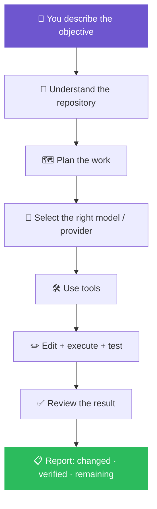
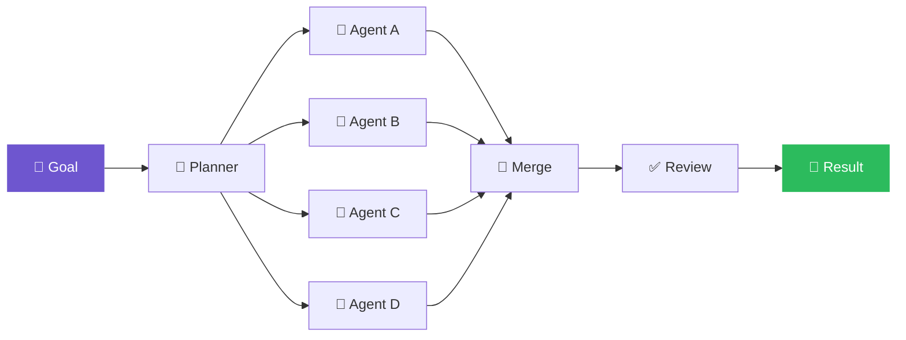

<div align="center">


<br>

<a href="https://github.com/dragonked2/alphacode">
  
</a>

<br>

**Built for serious engineering — not toy demos.**

<br>

<!-- Badge row 1 : release / build / license -->
<a href="https://github.com/dragonked2/alphacode/releases"></a>
<a href="https://github.com/dragonked2/alphacode/actions"></a>
<a href="https://github.com/dragonked2/alphacode/blob/main/LICENSE"></a>

<!-- Badge row 2 : community -->
<a href="https://github.com/dragonked2/alphacode"></a>
<a href="https://github.com/dragonked2/alphacode/network/members"></a>
<a href="https://github.com/dragonked2/alphacode"></a>

<!-- Badge row 3 : platform support -->


<br><br>

<a href="#-install"><b>Install</b></a> ·
<a href="#-quick-start"><b>Quick Start</b></a> ·
<a href="#-verify-your-install"><b>Verify</b></a> ·
<a href="#-troubleshooting"><b>Troubleshooting</b></a> ·
<a href="#-why-alphacode"><b>Why Alphacode</b></a> ·
<a href="#-capabilities"><b>Capabilities</b></a> ·
<a href="#-commands"><b>Commands</b></a> ·
<a href="docs/"><b>Docs</b></a>

<br>


</div>

---

## 📖 What is Alphacode?

Alphacode is an **AI coding agent that lives in your terminal**.

Give it an objective in natural language. Alphacode inspects the repository, plans the work, picks the right model, edits files, runs commands, executes tests, uses the web, coordinates parallel agents, reviews its own work, and keeps the session alive until the objective is actually complete.

It is built around one engineering principle:

> ### 🎯 *Make the smallest change that actually solves the problem — then verify it.*

<div align="center">



</div>

---

## ✨ Why Alphacode?

<table>
<tr>
<td width="26%"><b>🧠 Multi-model</b></td>
<td>Claude, GPT, Gemini, Copilot, Cursor, OpenRouter, Bedrock, Azure, or any OpenAI-compatible endpoint — including a built-in <b>GMI Cloud</b> default so it works with zero setup.</td>
</tr>
<tr>
<td><b>🐝 Agent swarms</b></td>
<td>Split large objectives into a task DAG, run independent work in parallel, merge the results, review.</td>
</tr>
<tr>
<td><b>💻 Terminal-native UX</b></td>
<td>Rich TUI: syntax highlighting, image previews, Mermaid rendering, multi-pane views, agent visibility.</td>
</tr>
<tr>
<td><b>🧰 40+ tools</b></td>
<td>Files, shell, search, web, browser automation, memory, skills, sessions, scheduling, rendering, autonomous modules.</td>
</tr>
<tr>
<td><b>💾 Persistent execution</b></td>
<td>Resume sessions, survive crashes, preserve transcripts, inspect changes via checkpoints.</td>
</tr>
<tr>
<td><b>🛡️ Safety-first</b></td>
<td>Destructive commands, risky actions, network access, and credential-sensitive operations get dedicated controls.</td>
</tr>
<tr>
<td><b>⚡ Rust core</b></td>
<td>Native binary, fast startup, predictable runtime, low memory footprint.</td>
</tr>
</table>

See [Performance](#-performance) for measurement methodology and historical benchmarks.

---

## 📑 Table of Contents

<table>
<tr>
<td valign="top" width="33%">

**Getting started**
- [Install](#-install)
  - [Linux / macOS](#linux--macos)
  - [Windows](#windows)
  - [Build from source](#build-from-source)
  - [Verify your install](#-verify-your-install)
- [Quick Start](#-quick-start)
- [Troubleshooting](#-troubleshooting)

</td>
<td valign="top" width="33%">

**Capabilities**
- [Models & Providers](#models--providers)
- [Tooling](#-tooling)
- [Swarm Mode](#-swarm-mode)
- [Bundled Skills](#-bundled-skills)
- [Safety](#-safety)
- [Resilience](#-resilience)
- [Performance](#-performance)

</td>
<td valign="top" width="33%">

**Reference**
- [Coding Quality Contract](#-coding-quality-contract)
- [Commands](#-commands)
- [Configuration](#-configuration)
- [Update](#-update)
- [Uninstall](#-uninstall)
- [Project Structure](#-project-structure)
- [Contributing](#-contributing)
- [License](#-license)

</td>
</tr>
</table>

---

## 🚀 Install

Pick the platform you're on. The installer is a one-liner that downloads the matching prebuilt binary, verifies its SHA-256 checksum, and drops `alphacode` on your `PATH`. If no prebuilt exists for your platform, it **automatically falls back to building from source**.

### Linux / macOS

```bash
curl -fsSL https://raw.githubusercontent.com/dragonked2/alphacode/main/scripts/install.sh | bash
```

<details>
<summary><b>What the installer does, step by step</b></summary>
<br>

1. Detects your OS (`linux` / `macos`) and architecture (`x86_64` / `arm64`).
2. Resolves the latest release tag from the GitHub API.
3. Downloads `alphacode-{linux,macos}-{x86_64,arm64}.tar.gz` and `SHA256SUMS`.
4. Verifies the archive's SHA-256 against the published checksums.
5. Extracts the `alphacode` binary into `~/.local/bin/` (or `$ALPHACODE_PREFIX/bin`).
6. Prints a `PATH` hint if `~/.local/bin` isn't already on your `PATH`.

</details>

**Common knobs** (environment variables, all optional):

| Variable | Default | Purpose |
| :-- | :-- | :-- |
| `ALPHACODE_PREFIX` | `~/.local` | Install prefix |
| `ALPHACODE_BIN_DIR` | `$PREFIX/bin` | Override the binary directory |
| `ALPHACODE_VERSION` | `latest` | Pin a specific tag, e.g. `v1.0.7` |
| `ALPHACODE_REPO` | `dragonked2/alphacode` | Install from a fork/mirror |
| `ALPHACODE_FROM_SOURCE=1` | *off* | Skip the release download, build from source |
| `ALPHACODE_SOURCE_ONLY=1` | *off* | Never fall back to source — fail if the asset is missing |
| `ALPHACODE_SOURCE_REF=<ref>` | *(HEAD)* | When building from source, check out this branch/tag/sha |

Or pass the same flags on the command line:

```bash
curl -fsSL https://raw.githubusercontent.com/dragonked2/alphacode/main/scripts/install.sh | bash -s -- --version v1.0.7 --prefix ~/.local
```

### Windows

Open **PowerShell** (no admin needed) and run:

```powershell
iwr -useb https://raw.githubusercontent.com/dragonked2/alphacode/main/scripts/install.ps1 | iex
```

<details>
<summary><b>What the installer does, step by step</b></summary>
<br>

1. Detects your architecture (`x86_64` / `arm64`).
2. Resolves the latest release tag.
3. Downloads `alphacode-windows-{x86_64,arm64}.zip` and `SHA256SUMS`.
4. Verifies the archive's SHA-256.
5. Extracts `alphacode.exe` into `%LOCALAPPDATA%\Programs\alphacode\bin\`.
6. Reminds you to add that folder to your user `PATH` (one-time GUI wizard on Windows 10/11).

</details>

**Common flags** (also available as parameters):

```powershell
# Pin a version
iwr -useb ... | iex -Version v1.0.7

# Install into a custom folder
iwr -useb ... | iex -Prefix "$env:LOCALAPPDATA\Programs\alphacode"

# Force a from-source build instead of downloading
iwr -useb ... | iex -FromSource
```

### Build from source

If you prefer to build it yourself, or a prebuilt asset doesn't exist yet for your platform:

```bash
git clone https://github.com/dragonked2/alphacode.git
cd alphacode
cargo build --release
./target/release/alphacode --version
```

<details>
<summary><b>Requirements</b></summary>
<br>

- **Rust 1.91+** (edition 2024, matching the current dependency tree's MSRV). The repo pins this in `rust-toolchain.toml`, so `rustup` installs the right toolchain automatically.
- A platform-compatible **C toolchain**:
  - **Linux:** `build-essential` + `pkg-config` + `libssl-dev` (Ubuntu/Debian) or equivalent.
  - **macOS:** Xcode Command Line Tools (`xcode-select --install`).
  - **Windows:** MSVC Build Tools + the Windows SDK.
- A `git` client (already needed if you cloned the repo).

A clean build takes 5–30 minutes depending on your machine. Incremental rebuilds after that are seconds.

</details>

<details>
<summary><b>Optional feature stacks</b></summary>
<br>

The default build is intentionally lean. Heavy optional stacks are opt-in:

```bash
# AWS Bedrock support (~25 heavy codegen crates)
cargo build --release --features bedrock

# Local ONNX embeddings (~40 heavy crates)
cargo build --release --features embeddings

# PDF text extraction
cargo build --release --features pdf

# Mermaid diagram rendering
cargo build --release --features mermaid-renderer

# All of the above
cargo build --release --features bedrock,embeddings,pdf,mermaid-renderer
```

</details>

### ✅ Verify your install

Three checks, in order:

```bash
# 1. The binary is reachable
which alphacode          # macOS / Linux
Get-Command alphacode    # PowerShell

# 2. The version is what you expect
alphacode --version      # → v1.0.7 (964e49e, …)

# 3. The environment is healthy
alphacode doctor         # checks PATH, terminal, providers, optional deps
```

`alphacode doctor` reports `OK` / `WARN` / `FAIL` for each check, with remediation steps for anything not green. **If `doctor` reports a failure, see [Troubleshooting](#-troubleshooting) below.**

<details>
<summary><b>Verify a downloaded release archive by hand (paranoid mode)</b></summary>
<br>

```bash
# macOS / Linux
curl -fsSL https://github.com/dragonked2/alphacode/releases/download/v1.0.7/SHA256SUMS -o SHA256SUMS
curl -fsSL https://github.com/dragonked2/alphacode/releases/download/v1.0.7/alphacode-linux-x86_64.tar.gz -o alphacode.tar.gz
sha256sum --ignore-missing -c SHA256SUMS
```

```powershell
# Windows (PowerShell)
Invoke-WebRequest https://github.com/dragonked2/alphacode/releases/download/v1.0.7/SHA256SUMS -OutFile SHA256SUMS
$expected = (Get-Content SHA256SUMS | Where-Object { $_ -like '*windows-x86_64*' })[0].Split(' ')[0]
$actual   = (Get-FileHash .\alphacode-windows-x86_64.zip -Algorithm SHA256).Hash.ToLower()
"$expected  expected"
"$actual    actual"
```

</details>

---

## ⚡ Quick Start

Alphacode doesn't require an account just to launch — but you need at least one model provider to actually do work.

<table>
<tr><th width="33%">Option</th><th>How</th></tr>
<tr>
<td><b>A · Interactive</b><br><sub>recommended for first-time setup</sub></td>
<td>

```bash
alphacode login
alphacode login --provider openai   # or anthropic, gemini, copilot, …
```

</td>
</tr>
<tr>
<td><b>B · Environment variable</b><br><sub>good for CI / shell profiles</sub></td>
<td>

```bash
export ALPHACODE_OPENAI_API_KEY=sk-...
alphacode
```

</td>
</tr>
<tr>
<td><b>C · Zero config</b><br><sub>uses the built-in GMI Cloud default key</sub></td>
<td>

```bash
alphacode
```

</td>
</tr>
</table>

> **💡 GMI Cloud ships with a built-in default key.** If no other provider is configured, Alphacode uses GMI Cloud out of the box — you can start asking the agent to do work immediately. To use a different provider instead, run `alphacode login` first.

### Launch the TUI

```bash
alphacode
```

On first launch, onboarding asks about telemetry, default model, and key bindings. **Every step is skippable with `Esc`.**

### First tasks

The agent works in natural language — describe what you want done, not how:

```text
> refactor src/cli/startup.rs to use a builder pattern

> walk me through src/alphacode_swarm_core

> add unit tests for the new helper in src/utils.rs

> look up the latest ratatui release notes and summarize them

> /swarm "split this feature into 4 parallel tasks"
```

**Useful controls:**

| Key | Action |
| :-- | :-- |
| `F1` | Full keymap |
| `Ctrl+T` | Model picker |
| `Ctrl+Y` | Agent panel |
| `Ctrl+C` | Interrupt the current turn (session is preserved) |
| `Esc` | Back / cancel the current dialog |

---

## 🩺 Troubleshooting

The most common install / first-run failures, with verified fixes.

<details>
<summary><b>❌ <code>alphacode: command not found</code> (macOS / Linux)</b></summary>
<br>

The installer placed the binary in `~/.local/bin/` but that directory isn't on your `PATH`.

```bash
# Bash — append to ~/.bashrc
echo 'export PATH="$HOME/.local/bin:$PATH"' >> ~/.bashrc
source ~/.bashrc

# Zsh — append to ~/.zshrc
echo 'export PATH="$HOME/.local/bin:$PATH"' >> ~/.zshrc
source ~/.zshrc

# Fish
fish_add_path ~/.local/bin
```

Open a new terminal after editing the rc file.

</details>

<details>
<summary><b>❌ PowerShell doesn't find <code>alphacode.exe</code> (Windows)</b></summary>
<br>

`%LOCALAPPDATA%\Programs\alphacode\bin` wasn't added to your user `PATH`. Fix:

1. Press `Win`, type "Edit the system environment variables", hit Enter.
2. Click **Environment Variables…** → under **User variables** select `Path` → **Edit…** → **New**.
3. Paste `%LOCALAPPDATA%\Programs\alphacode\bin` → OK → OK.
4. **Open a new PowerShell window** (existing windows keep the old PATH).

</details>

<details>
<summary><b>⏳ Installer hangs on "Compiling alphacode (this can take 5-30 minutes)"</b></summary>
<br>

That message means the release asset for your platform/arch wasn't found and the installer fell back to a from-source build. Expected on new platforms, but slow. To skip it:

```bash
# Pin a version that has your platform's prebuilt
curl -fsSL ... | ALPHACODE_VERSION=v1.0.7 bash

# Or build only what you need (e.g. no Bedrock / no embeddings)
ALPHACODE_FROM_SOURCE=1 cargo build --release
```

</details>

<details>
<summary><b>🦀 <code>rustc … is too old; need >= 1.91</code></b></summary>
<br>

```bash
rustup update stable         # macOS / Linux
# Windows: re-run rustup-init from https://rustup.rs and choose stable
```

</details>

<details>
<summary><b>🔐 Checksum verification fails</b></summary>
<br>

The archive you downloaded is corrupt or was replaced. The installer refuses to install it. Re-run the installer; if it keeps failing, file an issue with the exact error and the `URL` line from the installer's output.

</details>

<details>
<summary><b>🌐 <code>alphacode login</code> opens a browser and nothing happens</b></summary>
<br>

The OAuth flow needs loopback access to `127.0.0.1` on a random high port. Firewalls and some VPN clients block this.

- Temporarily disable the VPN / corporate firewall.
- On Linux, allow loopback: `sudo ufw allow from 127.0.0.1`.
- Use an API key instead of OAuth: `export ALPHACODE_OPENAI_API_KEY=sk-…`.

</details>

<details>
<summary><b>🎨 <code>alphacode doctor</code> reports <code>FAIL: terminal not 256-color</code></b></summary>
<br>

Most TUI features require a 256-color or truecolor terminal.

- **Windows Terminal**, **iTerm2**, **gnome-terminal**, **kitty**, **WezTerm**: all fine.
- **cmd.exe** and the legacy **Windows Console Host** are not supported. Use Windows Terminal, or run `alphacode` from inside VS Code's integrated terminal.
- If you SSH in, ensure your client forwards color: `ssh -o RequestTTY=force` (most modern clients default to this).

</details>

<details>
<summary><b>🔤 The TUI flickers or shows garbled glyphs</b></summary>
<br>

Your terminal is likely using a non-Nerd font. Install a Nerd Font — **JetBrains Mono Nerd Font** or **Cascadia Code Nerd Font** are recommended — and set it as your terminal's font.

</details>

<details>
<summary><b>🐢 The agent is slow on first response</b></summary>
<br>

The first message of a session warms the connection pool, loads skills, and runs `doctor`-style checks. Subsequent messages are faster. If first-message latency stays high, run `alphacode doctor` to identify the bottleneck.

</details>

**Still stuck?** Run `alphacode doctor --verbose` and include the output when you file an issue. For security-sensitive bugs, see [`SECURITY.md`](./SECURITY.md) rather than filing a public issue.

---

## 🧩 Capabilities

### Models & Providers

Alphacode is provider-agnostic. Use the model that fits the task instead of locking the entire workflow to one vendor.

| Provider | Authentication | Notes |
| :-- | :-- | :-- |
| 🟣 **Anthropic / Claude** | OAuth or API key | First-class provider |
| 🟢 **OpenAI / GPT** | OAuth, API key, ChatGPT browser | Reasoning, vision, tools |
| 🔵 **Google Gemini** | OAuth or API key | Gemini lineup |
| ⚫ **GitHub Copilot** | OAuth | Reuses existing Copilot subscription |
| ⚪ **Cursor** | OAuth | Reuses Cursor session |
| 🟠 **AWS Bedrock** | AWS credentials | Optional `bedrock` feature |
| 🔷 **Azure** | Azure AD / API key | Optional `azure-auth` feature |
| 🟡 **OpenRouter** | API key | Aggregated model access |
| ⚙️ **OpenAI-compatible** | API key | Add custom endpoints via `alphacode provider add` |
| 🆓 **GMI Cloud** | *None — built-in default key* | Works out of the box |

Switching providers mid-session:

```bash
alphacode provider list              # see configured providers
alphacode provider current           # show the active one
alphacode provider use openai        # make OpenAI the default
alphacode model list                 # list models for the current provider
alphacode model use gpt-4o           # pin a specific model
```

Inside the TUI, `Ctrl+T` opens the same picker with a recency-sorted view.

### 🛠 Tooling

The agent combines multiple classes of tools inside one workflow:

<table>
<tr><td width="50%">

- 📝 **Editing** — read, write, patch, multi-edit
- 🔍 **Search** — regex, fuzzy, AST-aware search
- ⚙️ **Execution** — shell and command execution with risk controls
- 🌐 **Web** — fetch and search
- 🖥️ **Browser** — Chrome DevTools Protocol automation

</td><td width="50%">

- 🧠 **Memory** — persistent project and conversation context
- 🎓 **Skills** — reusable agent capabilities
- 💾 **Sessions** — persistence, recovery, resumption
- ⏰ **Scheduling** — scheduled and ambient tasks
- 🎨 **Rendering** — images and Mermaid diagrams

</td></tr>
</table>

Plus: **Documents** (PDF text extraction, optional `pdf` feature), **Authentication** (OAuth flows for supported providers), and **autonomous modules** — planner, project analyzer, self-review, quality gate, resource monitor, and related subsystems.

### 🎓 Bundled Skills

Alphacode ships with skills embedded directly into the binary, so the common ones are always available regardless of working directory or `$HOME`.

| Skill | What it does |
| :-- | :-- |
| `/bugbounty` | 16-subsection bug-bounty methodology (recon, sqli, xss, ssrf, idor, graphql, oauth, api, memory, llm-redteam, web3-audit, credential-attack, client-reverse, security-arsenal, advanced-techniques, report) |
| `/meme-coin-audit` | Token + rug-pull risk analysis (Solana SPL, Token-2022, DEX LP attacks) |
| `/frontend-design` | Guidance for distinctive, intentional UI work — typography, color, layout |

Run `/skills` in the TUI to see the full list and load order, including on-disk overrides from `~/.alphacode/skills/` and `./.alphacode/skills/`.

### 🐝 Swarm Mode

Large engineering tasks don't always need a single agent working sequentially.



Run:

```text
/swarm "split this feature into 4 parallel tasks"
```

The orchestrator builds a task DAG, dispatches independent work in parallel, monitors branches, and merges the results. The execution plan is visible directly in the TUI.

### 🛡 Safety

AI agents can execute real commands. Alphacode treats that as an engineering and security problem rather than assuming every generated command is safe.

- 🚫 Catastrophic targets such as `rm -rf /`, home-directory wipes, and device-node writes are blocked.
- ⚠️ Ambiguous destructive commands are held for explicit justification.
- 🔒 Risky actions pass through the TUI permission layer.
- 🌐 Network operations use SSRF and credential-leak heuristics.
- 💥 Interrupted or crashed sessions are marked instead of silently corrupting state.
- 📵 Default telemetry is `no_content` — the agent never sends your code or prompts to analytics endpoints unless you opt in.

For vulnerability reporting, see [`SECURITY.md`](./SECURITY.md).

### 🔁 Resilience

Long-running agents need durable state.

- `alphacode --resume` reopens previous conversations.
- Session history is searchable (`alphacode sessions list`).
- Panics, signals, and dropped SSH connections mark sessions as `Crashed`.
- Transcripts are persisted to disk in the platform's standard state directory.
- Health monitoring records runtime signals (RSS, slow operations, error rates, subsystem liveness).

---

## 📊 Performance

Alphacode is engineered for low overhead, fast startup, and sustained workloads on developer machines where the agent shares resources with an IDE, browser, containers, and other services.

### Runtime design

- `opt-level = 3` with thin LTO in release.
- Targeted `codegen-units = 1` for the hot HTTP/TUI path (`reqwest`, `hyper`, `tokio`, `rustls`, `h2`, `ratatui`, `crossterm`).
- Efficient HTTP connection pooling.
- Disk-backed session transcripts.
- Optional heavy feature stacks default to **off** to keep cold builds short.
- Native Rust runtime with no embedded language VM.
- Resource monitoring for long-lived sessions.

### Benchmark snapshots (historical)

> ⚠️ **Important:** the numbers below are **legacy benchmark snapshots**, retained for historical comparison. Alphacode has since received performance and efficiency improvements, so these values should **not** be presented as current measurements or used as a claim about the latest build.

<details open>
<summary><b>RAM — 1 active session</b></summary>
<br>

| Tool | PSS | Relative to Alphacode baseline |
| :-- | --: | --: |
| 🥇 **Alphacode — local embedding off** | **27.8 MB** | **1.0×** |
| Alphacode | 167.1 MB | 6.0× |
| pi | 144.4 MB | 5.2× |
| Codex CLI | 140.0 MB | 5.0× |
| Cursor Agent | 214.9 MB | 7.7× |
| Antigravity CLI | 243.7 MB | 8.8× |
| GitHub Copilot CLI | 333.3 MB | 12.0× |
| Claude Code | 386.6 MB | 13.9× |
| OpenCode | 371.5 MB | 13.4× |

</details>

<details open>
<summary><b>RAM — 10 active sessions</b></summary>
<br>

| Tool | PSS | Relative to Alphacode baseline |
| :-- | --: | --: |
| 🥇 **Alphacode — local embedding off** | **117.0 MB** | **1.0×** |
| Alphacode | 260.8 MB | 2.2× |
| Codex CLI | 334.8 MB | 2.9× |
| pi | 833.0 MB | 7.1× |
| Antigravity CLI | 1021.2 MB | 8.7× |
| Cursor Agent | 1632.4 MB | 14.0× |
| GitHub Copilot CLI | 1756.5 MB | 15.0× |
| Claude Code | 2300.6 MB | 19.7× |
| OpenCode | 3237.2 MB | 27.7× |

</details>

**How to interpret these numbers:** the most useful property in the historical snapshot is **scaling behavior**. A single lightweight process can be acceptable; ten concurrent sessions expose the cost of process architecture, duplicated runtime state, embedded services, and per-session memory overhead. Alphacode was designed with multi-session workflows in mind, and subsequent optimization work has continued to target startup latency, steady-state memory, and runtime efficiency.

<details>
<summary><b>Benchmark policy</b></summary>
<br>

Alphacode does not treat one README number as proof of universal performance. Future benchmark reports should identify:

1. Alphacode commit/version
2. OS and hardware
3. Build profile
4. Enabled features
5. Number of active sessions
6. Measurement method
7. Warm/cold state
8. Exact workload

That makes performance claims reproducible instead of promotional.

</details>

---

## 📜 Coding Quality Contract

Alphacode's agent behavior is built around four guardrails for code-changing turns.

<table>
<tr>
<td width="25%" align="center">

**1️⃣**<br>**Smallest change**

Do not bundle unrelated edits into the same operation. Deeper issues are reported separately instead of being silently changed.

</td>
<td width="25%" align="center">

**2️⃣**<br>**Anti-regression**

Previously passing tests should remain passing. New warnings are treated as failures where the workflow requires it.

</td>
<td width="25%" align="center">

**3️⃣**<br>**Self-review**

Before a task is reported complete, the agent evaluates objective coverage, evidence, regression risk, diff scope, edge cases.

</td>
<td width="25%" align="center">

**4️⃣**<br>**Structured completion**

State-changing turns end with a report:<br>*What changed · What was verified · What remains*

</td>
</tr>
</table>

The source of truth is the system prompt under `src/alphacode_base/prompt/system_prompt.md`. Tool implementations under `src/alphacode_app_core/tool/` reinforce the same contract.

---

## ⌨️ Commands

### CLI

```bash
alphacode                          # Launch the TUI
alphacode login                    # Authenticate a provider
alphacode login --provider openai  # Pick a specific provider
alphacode doctor                   # Check providers, terminal, and paths
alphacode doctor --verbose         # Same, with diagnostics for bug reports
alphacode provider list            # List configured providers
alphacode provider add <name>      # Add an OpenAI-compatible endpoint
alphacode provider use <name>      # Make a provider the default
alphacode provider current         # Show active provider + model
alphacode model list               # List models
alphacode model use <name>         # Pin the default model
alphacode run "fix the failing test"   # One-shot, no TUI
alphacode repl                     # Simple REPL without the TUI
alphacode sessions list            # List previous sessions
alphacode --resume                 # Search and resume a session
alphacode --resume <id>            # Resume a specific session
alphacode update                   # Self-update to the latest release
alphacode --version                # Print version
alphacode --help                   # Full help
```

### TUI slash commands

| Command | Action |
| :-- | :-- |
| `/help` | Full command list |
| `/agents` | Spawn parallel sub-agents |
| `/compact` | Condense long context |
| `/memory` | Browse long-term memory |
| `/skills` | Browse and edit skills |
| `/diff` | Open the change viewer |
| `/exit` | Leave the TUI while preserving the session |

---

## ⚙️ Configuration

Alphacode stores configuration, sessions, and logs in platform-standard locations so it never litters your project directory.

| Platform | Configuration | Sessions | Logs |
| :-- | :-- | :-- | :-- |
| 🐧 Linux | `~/.config/alphacode/` | `~/.local/share/alphacode/sessions/` | `~/.local/share/alphacode/logs/` |
| 🍎 macOS | `~/Library/Application Support/alphacode/` | *same* | *same* |
| 🪟 Windows | `%APPDATA%\alphacode\` | `%LOCALAPPDATA%\alphacode\sessions\` | `%LOCALAPPDATA%\alphacode\logs\` |

The main config file is `config.toml` inside the config directory. It's created the first time you run `alphacode login`. The schema is intentionally flat and self-documenting — see [`docs/configuration.md`](./docs/configuration.md) for the full reference.

---

## 🔄 Update

Alphacode can self-update in place:

```bash
alphacode update
```

This fetches the latest release for your platform, verifies its checksum, and replaces the running binary. Sessions in progress are not interrupted.

To update manually, just re-run the installer — it's idempotent and overwrites the existing binary in place.

---

## 🗑 Uninstall

### Linux / macOS

```bash
curl -fsSL https://raw.githubusercontent.com/dragonked2/alphacode/main/scripts/uninstall.sh | bash
```

To also remove configuration, sessions, and logs:

```bash
curl -fsSL https://raw.githubusercontent.com/dragonked2/alphacode/main/scripts/uninstall.sh | bash -s -- --purge
```

Or with an environment variable:

```bash
ALPHACODE_PURGE=1 curl -fsSL https://raw.githubusercontent.com/dragonked2/alphacode/main/scripts/uninstall.sh | bash
```

### Windows

```powershell
iwr -useb https://raw.githubusercontent.com/dragonked2/alphacode/main/scripts/uninstall.ps1 | iex
```

To also remove configuration, sessions, and logs, pass `-Purge`.

---

## 🏗 Project Structure

The repository is intentionally divided into focused subsystems. The crate is monolithic (fewer workspace rebuilds) but split into module trees that follow the `alphacode_<area>_<role>` naming convention.

```text
alphacode/
├── src/
│   ├── alphacode_core/             # Provider-agnostic trait types and shared state
│   ├── alphacode_base/             # System prompt, prompt builder, capability enum
│   ├── alphacode_app_core/         # Agent loop, tools, autonomous layer, server
│   ├── alphacode_tui*/             # Terminal UI: rendering, widgets, style, animations
│   ├── alphacode_tool_core/        # The `Tool` trait and shared tool types
│   ├── alphacode_provider_*/       # Per-provider runtimes (Anthropic, OpenAI, …)
│   ├── alphacode_auth_*/           # Per-provider OAuth flows
│   ├── alphacode_swarm_core/       # Multi-agent coordination (task DAG, deep/light modes)
│   ├── alphacode_modules/          # High-level autonomous modules
│   └── alphacode_cli/              # The `alphacode` binary entrypoint
├── docs/                           # Architecture + configuration reference
├── scripts/                        # install / uninstall tooling
├── CONTRIBUTING.md
├── SECURITY.md
└── Cargo.toml
```

For a deeper tour, see [`docs/architecture.md`](./docs/architecture.md).

---

## 🤝 Contributing

Contributions are welcome. The full workflow lives in [`CONTRIBUTING.md`](./CONTRIBUTING.md) — short version:

```bash
git clone https://github.com/dragonked2/alphacode.git
cd alphacode
cargo build --release
cargo test --lib
cargo clippy --lib -- -D warnings
```

Requirements: **Rust 1.91+** (edition 2024) and a C toolchain matching your platform.

**Before opening a PR:**

- [ ] `cargo build --release` passes locally
- [ ] `cargo test --lib` passes locally (add unit tests when behavior changes)
- [ ] `cargo clippy --lib -- -D warnings` is clean
- [ ] Public APIs have rustdoc comments
- [ ] No new dependencies unless justified in the PR description
- [ ] User-visible changes are documented in `CHANGELOG.md`

The architecture keeps providers, tools, autonomous modules, and TUI components in isolated boundaries so new capabilities can be added without turning the entire codebase into one dependency surface.

For security vulnerabilities, see [`SECURITY.md`](./SECURITY.md). For community standards, see [`CODE_OF_CONDUCT.md`](./CODE_OF_CONDUCT.md).

---

## 🙏 Acknowledgements

Alphacode is built on outstanding open-source projects, including:

<div align="center">

[](https://ratatui.rs)
[](https://github.com/crossterm-rs/crossterm)
[](https://tokio.rs)
[](https://github.com/seanmonstar/reqwest)
[](https://github.com/rustls/rustls)
[](https://github.com/clap-rs/clap)
[](https://github.com/raphlinus/pulldown-cmark)
[](https://github.com/trishume/syntect)
[](https://github.com/RazrFalcon/resvg)

</div>

...and many others — see `Cargo.lock` for the complete dependency graph.

---

## 📄 License

Alphacode is released under the **MIT License**. See [`LICENSE`](./LICENSE) for the full text.

---

<div align="center">


**Alphacode**
<br>
<sub>Terminal-native AI engineering · Built with Rust 🦀</sub>

<br><br>

<a href="https://github.com/dragonked2/alphacode">GitHub</a> ·
<a href="https://github.com/dragonked2/alphacode/issues">Issues</a> ·
<a href="https://github.com/dragonked2/alphacode/releases">Releases</a> ·
<a href="docs/">Documentation</a>

<br><br>

<sub>Made with care by <a href="https://github.com/dragonked2">Ali Essam</a> · MIT licensed</sub>

</div>
