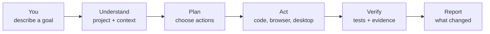
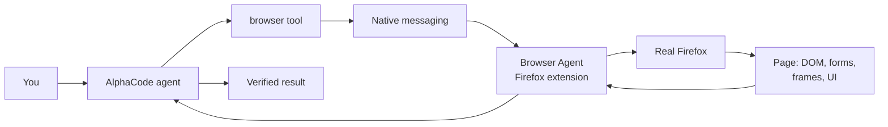
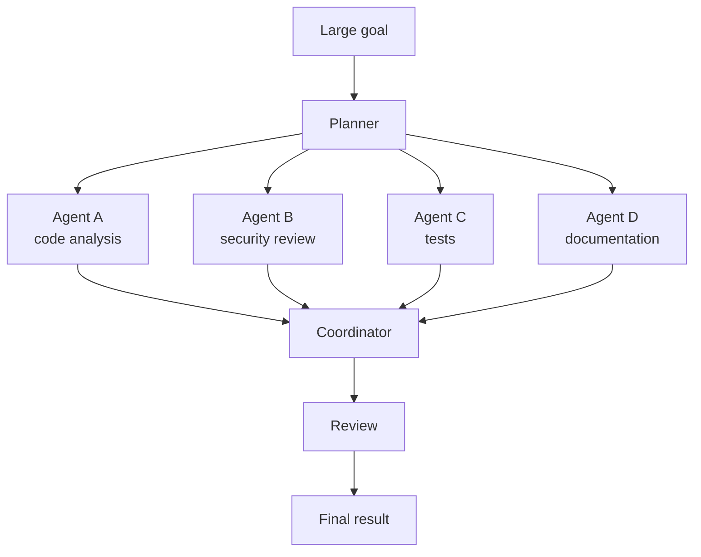

<div align="center">


# AlphaCode: the open-source AI coding agent that builds, browses, automates and verifies

**A free, Rust-native AI coding agent for your terminal. It reads your codebase, edits files, runs commands and tests, drives a real Firefox browser, controls desktop apps, and verifies its own work.**

<br>

<video src="https://github.com/dragonked2/alphacode/alphacode-demo.mp4" controls muted playsinline width="860">
  Your viewer can't play embedded video.
  <a href="alphacode-demo.mp4">Watch or download the AlphaCode demo (MP4)</a>.
</video>

<sub>Install and first task, start to finish. Video not playing? <a href="alphacode-demo.mp4">Open the MP4 directly</a>.</sub>

<br>

[](https://github.com/dragonked2/alphacode/stargazers)
[](https://github.com/dragonked2/alphacode/releases)
[](LICENSE)
[](https://github.com/dragonked2/alphacode/issues)


[](#quick-start)
&nbsp;
[](https://addons.mozilla.org/en-US/firefox/addon/alphacode-browser-agent/)

[Official website](https://alphacli.github.io/) · [Documentation](docs/) · [Releases](https://github.com/dragonked2/alphacode/releases)

[What is AlphaCode?](#what-is-alphacode) ·
[Quick Start](#quick-start) ·
[Features](#features) ·
[Browser Agent](#browser-agent) ·
[Desktop Control](#desktop-control) ·
[Swarm Mode](#swarm-mode) ·
[Providers](#bring-your-own-model) ·
[Benchmarks](#benchmarks) ·
[Uninstall](#uninstall) ·
[FAQ](#faq)

</div>

---

## What is AlphaCode?

AlphaCode is an **open-source AI coding agent** that works inside your development environment instead of just chatting about it. Describe a goal in plain English and it investigates, plans, edits files, runs commands, uses the web, operates a real browser, interacts with desktop apps, runs your tests, and reports back with evidence.


```mermaid
flowchart LR
    A["You<br/>describe a goal"] --> B["Understand<br/>project + context"]
    B --> C["Plan<br/>choose actions"]
    C --> D["Act<br/>code, browser, desktop"]
    D --> E["Verify<br/>tests + evidence"]
    E --> F["Report<br/>what changed"]
```

Most AI assistants stop at `You → AI → text`. AlphaCode is built around a loop: **understand → plan → execute → observe → verify**.

Example tasks:

```text
Find why the app crashes when users upload a PDF.
Fix the root cause, add a regression test, run the test suite, and review the final diff.
```

```text
Open the site in Firefox, log in with my existing session,
find the account settings page, check that the new feature is visible,
and send me a screenshot.
```

```text
Audit this project for security problems. Trace untrusted input to sensitive operations,
validate the realistic findings, and tell me which ones are actually reproducible.
```

**Who it is for:** beginners can use plain English, developers can give precise technical instructions, and power users can orchestrate multiple agents, skills and MCP servers.

---

## Quick Start

> Prefer to watch first? The [demo video](#alphacode-the-open-source-ai-coding-agent-that-builds-browses-automates-and-verifies) at the top of this page covers install and a first task.

### 1. Install

**macOS / Linux**

```bash
curl -fsSL https://raw.githubusercontent.com/dragonked2/alphacode/main/scripts/install.sh | bash
```

**Windows (PowerShell)**

```powershell
irm https://raw.githubusercontent.com/dragonked2/alphacode/main/scripts/install.ps1 | iex
```

Prefer to read a script before running it? Download it first, inspect it, then run it. See [Installation](#installation) for pinned versions, PATH options, and building from source.

### 2. Check your setup, then run

```bash
alphacode doctor    # checks providers, terminal and paths, and tells you what's missing
alphacode           # launch the terminal UI
```

No API key is required to start. The built-in free AI lane works out of the box. To use your own provider, run `alphacode login` (see [Bring your own model](#bring-your-own-model)). The first launch shows a short onboarding wizard (telemetry choice, model defaults, key bindings), and every step can be skipped with `Esc`.

### 3. Give it a task

```text
Explain this project and identify the main entry points.
```

```text
Find the biggest bugs, fix the highest-impact one, and run the tests.
```

Or run a single task non-interactively:

```bash
alphacode run "fix the failing test"
```

### 4. (Optional) Connect Firefox

Install the [AlphaCode Browser Agent](https://addons.mozilla.org/en-US/firefox/addon/alphacode-browser-agent/) extension, then:

```bash
alphacode browser setup
alphacode browser status
```

A healthy setup reports that the browser bridge is available and responding.

---

## Features

| Capability | Details |
| --- | --- |
| **Autonomous coding agent** | Natural-language tasks, multi-step planning, self-verification |
| **File and code tools** | Read, write, targeted edits, multi-edit, patches, code-aware search |
| **Terminal** | Shell execution with safety controls, background jobs, batching |
| **Web** | Search, fetch, scraping, HTTP flow analysis |
| **Real Firefox automation** | DOM, forms, tabs, frames, screenshots, downloads, existing sessions |
| **Desktop automation** | Windows UI Automation, macOS Accessibility API, Linux AT-SPI2 |
| **Swarm Mode** | Multiple cooperating agents for decomposable work |
| **Persistent sessions and memory** | Resume long-running work across terminal restarts |
| **MCP support** | Connect external tools and services |
| **Skills** | Reusable, specialized workflows |
| **Multi-provider** | Anthropic, OpenAI, Gemini, Copilot, OpenRouter, Bedrock, Azure, self-hosted, and more |
| **Free AI lane** | Start without an API key |
| **Cross-platform** | Windows, macOS, Linux |

### Work with your code

Read and create files, apply targeted edits and patches, search repositories, trace code paths, run builds and tests, review diffs, and diagnose errors.

### Work with the web

Combine web search and fetching with real browser automation: inspect dynamic pages, interact with web apps, handle forms and browser state, capture screenshots, and assist with QA and security testing.

---

## Browser Agent

The **[AlphaCode Browser Agent](https://addons.mozilla.org/en-US/firefox/addon/alphacode-browser-agent/)** is a Firefox extension that connects AlphaCode to a real Firefox session through native messaging. AlphaCode stays the reasoning and orchestration layer, while Firefox becomes an execution environment.


```mermaid
flowchart LR
    U["You"] --> A["AlphaCode agent"]
    A --> B["browser tool"]
    B --> C["Native messaging"]
    C --> D["Browser Agent<br/>Firefox extension"]
    D --> F["Real Firefox"]
    F --> G["Page: DOM, forms,<br/>frames, UI"]
    G --> D
    D --> A
    A --> R["Verified result"]
```

A plain HTTP client fetches HTML. A browser agent **experiences the page the way a user does**, which matters for:

* JavaScript-heavy sites and dynamic interfaces
* DOM inspection, forms, inputs and interactive controls
* Multiple tabs, frames and embedded content
* Existing authenticated browser sessions
* Scrolling, navigation, screenshots and downloads
* Browser-based testing, QA and web-app debugging
* Authorized security testing and repetitive browser workflows

Instead of pasting HTML into a chat and asking "what should I click?", you can say:

```text
Open the application, check the login flow, go to the dashboard,
test the form validation, and report anything suspicious.
```

> **Privacy note:** the agent can act inside your real browser session. Review what it is asked to do, and treat page content as untrusted input.

---

## Desktop Control

AlphaCode drives native applications through **accessibility APIs** rather than relying only on screen coordinates.

| Platform | Backend |
| --- | --- |
| Windows | UI Automation |
| macOS | Accessibility API |
| Linux | AT-SPI2 |

Supported actions include `list_windows`, `snapshot`, `find`, `click`, `type`, `press`, `scroll`, `focus`, `screenshot`, `toggle`, `expand` and `collapse`.

```text
Open Calculator, calculate 123 × 456, and read the result.
```

AlphaCode finds the app, inspects its accessibility tree, locates the controls, enters the expression, reads the result, and reports `56088`.

---

## Swarm Mode

Large goals can be split across multiple agents working in parallel.


```mermaid
flowchart TD
    G["Large goal"] --> P["Planner"]
    P --> A["Agent A<br/>code analysis"]
    P --> B["Agent B<br/>security review"]
    P --> C["Agent C<br/>tests"]
    P --> D["Agent D<br/>documentation"]
    A --> M["Coordinator"]
    B --> M
    C --> M
    D --> M
    M --> R["Review"]
    R --> F["Final result"]
```

```text
/swarm "Analyze this application from architecture, security, testing, and performance perspectives."
```

Swarm Mode works best on tasks that decompose into independent or semi-independent parts.

---

## Sessions and Memory

Long-running work should survive a closed terminal.

```bash
alphacode sessions list        # list saved sessions
alphacode --resume             # resume the latest session
alphacode --resume <id>        # resume a specific session
```

Useful for large codebases, security assessments, long debugging sessions, multi-stage development, research, browser workflows and big refactors.

---

## Bring Your Own Model

AlphaCode is model-agnostic. Start with the free AI lane, then connect providers when you want to.

| Provider | Auth | Notes |
| --- | --- | --- |
| Anthropic (Claude) | OAuth or API key | First-class support |
| OpenAI (GPT, o-series) | OAuth, API key, ChatGPT browser sign-in | Reasoning, vision and tools |
| Google Gemini | OAuth or API key | |
| GitHub Copilot | OAuth | Uses your existing subscription |
| Cursor | OAuth | Reuses Cursor's session |
| AWS Bedrock | AWS credentials | Build with `--features bedrock` |
| Azure | Azure AD or API key | Build with `--features azure-auth` |
| OpenRouter | API key | Aggregator with a free tier |
| Any OpenAI-compatible API | API key | `alphacode provider add <name>` |
| Free AI lane | Built-in | Works out of the box, no key needed |

```bash
alphacode login                    # interactive provider picker
alphacode login --provider openai  # sign in to a specific provider
alphacode provider list            # list providers
alphacode provider add <name>      # add a custom OpenAI-compatible endpoint
alphacode provider current         # show the active provider and model
alphacode model list               # list models
alphacode model use <model>        # switch model
```

In the TUI, press `Ctrl+T` to open the model/provider selector.

For direct local OpenAI-compatible servers such as LM Studio or Ollama, AlphaCode uses the server's reported context window when available. On local models up to 32K context, it also uses a shorter task prompt and sends only a bounded set of relevant tool schemas; greetings need no tool schemas. This reduces avoidable prompt overhead but does not increase the context configured in the model server. Set the context length in the server when loading the model and leave room for the response.

### Signing in with a provider

Most providers work from an environment variable such as `ANTHROPIC_API_KEY` or `OPENAI_API_KEY`. Run `alphacode login` from your shell, or `/login` inside AlphaCode, for interactive flows.

**OpenAI (Codex OAuth)** needs a local callback listener. AlphaCode serves the redirect on `http://localhost:1455/auth/callback` while you sign in, so make sure port `1455` is free first. If login times out, something else is bound to that port: stop it and run `/login` again.

See the [docs](docs/) for provider flows and troubleshooting.

---

## Built-in Tools

AlphaCode ships with 40+ tools. The core ones:

| Category | Tools |
| --- | --- |
| **Files** | `read`, `write`, `edit`, `multiedit`, `patch`, `apply_patch`, `ls` |
| **Search** | `agentgrep` (code-aware search), `session_search`, `conversation_search` |
| **Execution** | `bash`, `batch`, `bg` (background jobs) |
| **Web and browser** | `browser`, `webfetch`, `websearch`, `scrapling`, `httpflow`, `open` |
| **Desktop** | `desktop` (cross-platform), `macos_computer_use` |
| **Agent intelligence** | `memory`, `initiative`, `todo`, `plan`, `swarm` |
| **Utilities** | `doctor`, `self_improve`, `selfdev`, `cron`, `schedule`, `jwt`, `clipboard`, `side_panel`, `discover_tools` |

### Skills and MCP

Skills specialize AlphaCode for different workflows without changing the core agent. Browse them with `/skills`. Examples: `/bugbounty`, `/meme-coin-audit`, `/frontend-design`.

MCP support lets you connect external tools, services and custom integrations, extending the agent beyond its built-in toolset.

---

## Security Testing and Bug Bounty Workflows

Code analysis, HTTP/web tools, browser automation, terminal execution, memory and multi-agent workflows combine into repeatable security-testing pipelines:

```text
Review the API for insecure direct object references.
```

```text
Trace this parameter through the application and determine whether it reaches a dangerous sink.
```

```text
Open the authorized test environment in Firefox, test the input validation,
and document reproducible findings.
```

> **Only test systems you own or are explicitly authorized to test.**

---

## Safety by Design

An agent that can act needs guardrails. AlphaCode includes:

* Blocking of destructive filesystem and device targets
* Explicit permission prompts for risky actions
* Safety controls on all shell execution
* SSRF and credential-leak heuristics for network operations
* Tracking of interrupted sessions instead of silent loss
* Action timeouts and emergency-stop handling for desktop automation
* Input-state cleanup when operations fail
* Browser and desktop data treated as potentially untrusted

**AI agents make mistakes.** Review important changes before deploying them. Use `/diff` to inspect everything the agent changed.

---

## Reliability and Quality

**Resilient sessions.** Every conversation is resumable and crash-safe. Panics, signals and dropped SSH connections mark a session as `Crashed` instead of corrupting it, and AlphaCode prints the command to resume it. The transcript is persisted to disk rather than held in memory, so week-long sessions don't bloat the process.

**Coding-quality contract.** On every code-changing turn the agent is instructed to follow four guardrails:

1. **Smallest change.** Never bundle unrelated edits, and report deeper issues separately instead of silently fixing them.
2. **Anti-regression.** Previously passing tests must still pass, and new warnings count as failures.
3. **Self-critique.** A short checklist runs before a task is reported complete: objective covered, evidence-backed, no regressions, scoped diff, edge cases considered.
4. **Structured output.** Every state-changing turn ends with *what changed*, *what was verified*, and *what remains*.

---

## Benchmarks

AlphaCode is written in Rust and designed to keep its runtime footprint small.

> These are **historical snapshots** kept for reproducibility. They are not a guarantee of current performance on every machine, OS, workload or version, and not a universal ranking.

**Memory, one active session**

| Tool | RAM | vs. AlphaCode |
| --- | ---: | ---: |
| **AlphaCode** | **27.8 MB** | **1.0×** |
| Codex CLI | 140.0 MB | 5.0× |
| pi | 144.4 MB | 5.2× |
| Cursor Agent | 214.9 MB | 7.7× |
| Antigravity CLI | 243.7 MB | 8.8× |
| GitHub Copilot CLI | 333.3 MB | 12.0× |
| OpenCode | 371.5 MB | 13.4× |
| Claude Code | 386.6 MB | 13.9× |

**Memory, ten concurrent sessions**

| Tool | RAM | vs. AlphaCode |
| --- | ---: | ---: |
| **AlphaCode** | **117.0 MB** | **1.0×** |
| Codex CLI | 334.8 MB | 2.9× |
| pi | 833.0 MB | 7.1× |
| Antigravity CLI | 1,021.2 MB | 8.7× |
| Cursor Agent | 1,632.4 MB | 14.0× |
| GitHub Copilot CLI | 1,756.5 MB | 15.0× |
| Claude Code | 2,300.6 MB | 19.7× |
| OpenCode | 3,237.2 MB | 27.7× |

**Reproducing the results.** Record: AlphaCode version or commit, OS, CPU and RAM, build profile, enabled features, number of active sessions, measurement method, warm vs. cold state, and the exact workload.

---

## Installation

### Windows

```powershell
irm https://raw.githubusercontent.com/dragonked2/alphacode/main/scripts/install.ps1 | iex
```

The installer detects your CPU architecture, downloads the latest release, verifies the SHA-256 checksum, installs `alphacode.exe` to `%LOCALAPPDATA%\Programs\alphacode\bin\`, adds that folder to your **user** `Path`, and activates it in the current window. No administrator rights are required.

AlphaCode is a terminal interface. Open Windows Terminal or PowerShell and run `alphacode` there; do not double-click `alphacode.exe`, because its temporary console closes when the process exits. Commands run by AlphaCode are captured and displayed in the interface.

PATH is configured automatically, so `alphacode` runs as soon as the installer finishes. The persisted change stays deliberately conservative: it writes only `HKCU\Environment\Path` (never the machine-wide PATH), appends rather than prepends, is a no-op on re-run, and broadcasts `WM_SETTINGCHANGE` so new terminals pick it up too. The running shell is only *prepended to* in-process, never rebuilt from the registry, so no session-only PATH entry is lost. `%USERPROFILE%`-style entries keep working because the value is read and written unexpanded.

Options are script parameters. A piped `iex` cannot accept them, so invoke the script as a script block:

```powershell
# Pin a version
& ([scriptblock]::Create((irm https://raw.githubusercontent.com/dragonked2/alphacode/main/scripts/install.ps1))) -Version vX.Y.Z

# Build from source instead of downloading a release
& ([scriptblock]::Create((irm https://raw.githubusercontent.com/dragonked2/alphacode/main/scripts/install.ps1))) -FromSource

# Preview the PATH change without writing anything
& ([scriptblock]::Create((irm https://raw.githubusercontent.com/dragonked2/alphacode/main/scripts/install.ps1))) -PathDryRun

# Do not touch PATH at all
& ([scriptblock]::Create((irm https://raw.githubusercontent.com/dragonked2/alphacode/main/scripts/install.ps1))) -NoPath

# Install somewhere else (e.g. a portable, no-PATH setup)
& ([scriptblock]::Create((irm https://raw.githubusercontent.com/dragonked2/alphacode/main/scripts/install.ps1))) -Prefix "$env:LOCALAPPDATA\Programs\alphacode"
```

### macOS / Linux

```bash
curl -fsSL https://raw.githubusercontent.com/dragonked2/alphacode/main/scripts/install.sh | bash
```

The script downloads the latest release, verifies its checksum, puts the `alphacode` binary in `~/.local/bin`, adds that directory to your shell profile, and activates it in the current shell so `alphacode` runs immediately.

```bash
# Pin a release
curl -fsSL https://raw.githubusercontent.com/dragonked2/alphacode/main/scripts/install.sh | bash -s -- --version vX.Y.Z

# Do not touch PATH at all
curl -fsSL https://raw.githubusercontent.com/dragonked2/alphacode/main/scripts/install.sh | bash -s -- --no-path

# Symlink into /usr/local/bin instead, so no PATH change is needed at all
curl -fsSL https://raw.githubusercontent.com/dragonked2/alphacode/main/scripts/install.sh | bash -s -- --link

# Install somewhere else
curl -fsSL https://raw.githubusercontent.com/dragonked2/alphacode/main/scripts/install.sh | bash -s -- --prefix ~/.local
```

The profile edit detects bash, zsh, fish, nushell, csh and ksh, and is idempotent across re-runs, so running the installer twice will not append a second copy.

Verify the install:

```bash
which alphacode        # Windows: Get-Command alphacode
alphacode --version
alphacode doctor
```

### Build from source

```bash
git clone https://github.com/dragonked2/alphacode.git
cd alphacode
cargo build --release
./target/release/alphacode --version
```

The Rust version (edition 2024) is pinned in [`rust-toolchain.toml`](rust-toolchain.toml), and you need a C toolchain for your platform. The default build skips the heavy optional stacks (Bedrock, embeddings, PDF, Mermaid rendering) to keep cold builds fast. Opt in when you need them:

```bash
cargo build --release --features bedrock,embeddings,pdf,renderer
```

### Update

```bash
alphacode update
```

---

## Uninstall

Removing AlphaCode takes one command. Close any running AlphaCode sessions first (on Windows a running `alphacode.exe` can't be deleted).

### Option 1: uninstall script (recommended)

**macOS / Linux**

```bash
curl -fsSL https://raw.githubusercontent.com/dragonked2/alphacode/main/scripts/uninstall.sh | bash
```

**Windows (PowerShell)**

```powershell
irm https://raw.githubusercontent.com/dragonked2/alphacode/main/scripts/uninstall.ps1 | iex
```

By default this removes the installed binary and leaves your settings and saved sessions in place, so a later reinstall picks up where you left off.

### Option 2: uninstall and delete all data (`--purge`)

```bash
# macOS / Linux
curl -fsSL https://raw.githubusercontent.com/dragonked2/alphacode/main/scripts/uninstall.sh | bash -s -- --purge

# or, equivalently, with an environment variable
curl -fsSL https://raw.githubusercontent.com/dragonked2/alphacode/main/scripts/uninstall.sh | ALPHACODE_PURGE=1 bash
```

```powershell
# Windows: -Purge is a script parameter, so invoke it as a script block
& ([scriptblock]::Create((irm https://raw.githubusercontent.com/dragonked2/alphacode/main/scripts/uninstall.ps1))) -Purge
```

> **Purge is permanent.** It deletes your configuration, saved sessions and logs, which can include locally stored sign-in data. Back up anything you want to keep first, for example `cp -r ~/.config/alphacode ~/alphacode-backup`.

Want to read the script before running it? Open [`uninstall.sh`](scripts/uninstall.sh) or [`uninstall.ps1`](scripts/uninstall.ps1) in the repo first, or download the file and run it locally.

### Option 3: manual uninstall

| What | Linux | macOS | Windows |
| --- | --- | --- | --- |
| Binary | `~/.local/bin/alphacode` | `~/.local/bin/alphacode` | `%LOCALAPPDATA%\Programs\alphacode\` |
| Config | `~/.config/alphacode/` | `~/Library/Application Support/alphacode/` | `%APPDATA%\alphacode\` |
| Sessions | `~/.local/share/alphacode/sessions/` | `~/Library/Application Support/alphacode/` | `%LOCALAPPDATA%\alphacode\sessions\` |
| Logs | `~/.local/share/alphacode/logs/` | `~/Library/Application Support/alphacode/` | `%LOCALAPPDATA%\alphacode\logs\` |

```bash
# Linux
rm -f ~/.local/bin/alphacode
rm -rf ~/.config/alphacode ~/.local/share/alphacode      # data: skip this line to keep it

# macOS
rm -f ~/.local/bin/alphacode
rm -rf ~/Library/Application\ Support/alphacode           # data: skip this line to keep it
```

```powershell
# Windows
Remove-Item -Recurse -Force "$env:LOCALAPPDATA\Programs\alphacode"
Remove-Item -Recurse -Force "$env:APPDATA\alphacode", "$env:LOCALAPPDATA\alphacode"   # data: skip to keep it
```

Built from source? Delete the cloned repository. If you installed with `cargo install --path .`, run `cargo uninstall alphacode`.

### Clean up what the uninstaller doesn't touch

* **PATH entry.** macOS / Linux: delete the `export PATH=...` line that the installer (or you) added to your shell profile (`~/.bashrc`, `~/.zshrc`, fish config, and so on). Windows: open *Settings → System → About → Advanced system settings → Environment Variables*, edit your **user** `Path`, and remove the AlphaCode entry. Use the GUI rather than a script, because scripts can expand `%USERPROFILE%`-style entries into hard-coded paths.
* **Firefox Browser Agent.** In Firefox, open `about:addons`, find *AlphaCode Browser Agent*, and choose **Remove**.
* **Native messaging registration.** If you ran `alphacode browser setup`, delete the AlphaCode entry from Firefox's native messaging locations (check the exact name): Linux `~/.mozilla/native-messaging-hosts/`, macOS `~/Library/Application Support/Mozilla/NativeMessagingHosts/`, Windows registry `HKCU\Software\Mozilla\NativeMessagingHosts`.
* **Credentials.** Remove any `*_API_KEY` variables you exported for AlphaCode, and revoke API keys or OAuth grants in your provider accounts (Anthropic, OpenAI, Google, GitHub) if you no longer want AlphaCode to have access.
* **Scheduled tasks.** If you created recurring jobs with the `cron` or `schedule` tools, remove them before uninstalling (`crontab -l` on macOS / Linux, Task Scheduler on Windows).

### Verify it's gone

```bash
which alphacode                                    # should print nothing
```

```powershell
Get-Command alphacode -ErrorAction SilentlyContinue   # should print nothing
```

If your shell still finds it, open a new terminal or run `hash -r` (bash/zsh).

### Uninstall troubleshooting

| Problem | Fix |
| --- | --- |
| `Access denied` or "file in use" on Windows | Close AlphaCode and its terminals, then `Stop-Process -Name alphacode -Force` and retry |
| `alphacode: command not found` after uninstall | That's expected. Open a new terminal to refresh the command cache |
| Config folders still exist | Normal without `--purge`. Delete them manually (table above) or re-run with `--purge` |
| Script can't be downloaded | Check your network or proxy, or use the manual steps above |

### Reinstall or change versions

Re-run the [installer](#installation). To keep your settings and sessions, don't use `--purge` when removing. To move to a specific release, use the pinned-version commands in [Installation](#installation). To stay current, run `alphacode update`.

---

## Commands and Shortcuts

**Essential commands**

| Command | Purpose |
| --- | --- |
| `alphacode` | Start AlphaCode |
| `alphacode doctor` | Check providers, terminal and paths |
| `alphacode login` | Authenticate a provider |
| `alphacode run "<task>"` | Run a task directly (non-interactive) |
| `alphacode repl` | Simple REPL, no TUI |
| `alphacode provider add <name>` | Add a custom OpenAI-compatible endpoint |
| `alphacode browser setup` | Set up the browser bridge |
| `alphacode browser status` | Check browser connectivity |
| `alphacode sessions list` | List saved sessions |
| `alphacode --resume` | Resume previous work |
| `alphacode provider list` | List AI providers |
| `alphacode model list` | List available models |
| `alphacode update` | Update AlphaCode |

**Slash commands**

| Command | Purpose |
| --- | --- |
| `/help` | Help |
| `/agents` | Agent management |
| `/compact` | Compact context |
| `/memory` | Project memory |
| `/skills` | Skills |
| `/diff` | Review changes |
| `/poke` | Auto-follow-up |
| `/screenshot-mode` | Screenshot capture |
| `/exit` | Exit and preserve the session |

**Keyboard shortcuts**

| Shortcut | Action |
| --- | --- |
| `F1` | Shortcut reference |
| `Ctrl+T` | Model/provider selector |
| `Ctrl+Y` | Agent activity |
| `Ctrl+C` | Pause active response |
| `Esc` | Close dialog / go back |

---

## Configuration

Configuration and sessions are stored outside your project:

| OS | Config | Sessions | Logs |
| --- | --- | --- | --- |
| Linux | `~/.config/alphacode/` | `~/.local/share/alphacode/sessions/` | `~/.local/share/alphacode/logs/` |
| macOS | `~/Library/Application Support/alphacode/` | same folder | same folder |
| Windows | `%APPDATA%\alphacode\` | `%LOCALAPPDATA%\alphacode\sessions\` | `%LOCALAPPDATA%\alphacode\logs\` |

A health monitor also records memory use, slow operations, error rates and per-subsystem liveness in `health.json`.

| Section | Purpose |
| --- | --- |
| `[provider]` | Provider and model |
| `[features]` | Feature flags |
| `[display]` | UI preferences |
| `[websearch]` | Search configuration |
| `[agents]` | Agent and swarm configuration |
| `[hooks]` | Lifecycle hooks |
| `[safety]` | Notifications and safety |
| `[compaction]` | Context management |
| `[power]` | Power-management behavior |
| `[gateway]` | Remote gateway |

Full reference: [docs/configuration.md](docs/configuration.md).

---

## Troubleshooting

<details>
<summary><strong><code>alphacode</code>: command not found</strong></summary>

Open a new terminal first; the installer updates your PATH for new sessions. If it still isn't found:

**macOS / Linux (bash):**

```bash
echo 'export PATH="$HOME/.local/bin:$PATH"' >> ~/.bashrc
source ~/.bashrc
```

**zsh:**

```bash
echo 'export PATH="$HOME/.local/bin:$PATH"' >> ~/.zshrc
source ~/.zshrc
```

**Windows:** re-run the [installer](#installation) (PATH setup is automatic unless you passed `-NoPath`), or add `%LOCALAPPDATA%\Programs\alphacode\bin` to your user PATH, then open a new PowerShell window.

</details>

<details>
<summary><strong>Browser Agent is not responding</strong></summary>

```bash
alphacode browser status
alphacode browser setup
```

Then confirm the [AlphaCode Browser Agent](https://addons.mozilla.org/en-US/firefox/addon/alphacode-browser-agent/) is installed and enabled in Firefox.

</details>

<details>
<summary><strong>Desktop automation is unavailable</strong></summary>

* **macOS:** grant Accessibility and Screen Recording permission under *System Settings → Privacy & Security*.
* **Linux:** make sure AT-SPI2 is available.
* **Windows:** most apps work without extra permissions; elevated apps may require running AlphaCode elevated.

</details>

<details>
<summary><strong>OpenAI login times out</strong></summary>

Port `1455` on localhost is probably in use. Stop whatever is listening on it and run `/login` again. See the [docs](docs/) for more.

</details>

<details>
<summary><strong>The demo video doesn't play</strong></summary>

Some viewers (mobile apps, package registries, mirrors) don't render embedded video. [Open `alphacode-demo.mp4`](alphacode-demo.mp4) directly, or download it from the repository.

</details>

Still stuck? Run `alphacode doctor` or [open an issue](https://github.com/dragonked2/alphacode/issues).

---

## FAQ

<details>
<summary><strong>What is AlphaCode?</strong></summary>

AlphaCode is an open-source AI coding agent that works with code, terminals, websites, real browsers, desktop applications, tools and multiple AI providers.

</details>

<details>
<summary><strong>Is AlphaCode free?</strong></summary>

Yes. It is open source under the MIT License and includes a built-in free AI lane so you can start without configuring an API key. Third-party providers you connect may have their own costs.

</details>

<details>
<summary><strong>Do I need an API key?</strong></summary>

Not to get started. Additional providers may require their own authentication or credentials.

</details>

<details>
<summary><strong>What is the AlphaCode Browser Agent?</strong></summary>

It is the Firefox extension that connects AlphaCode to a real Firefox session for navigation, DOM and form interaction, tabs, frames, screenshots, downloads and other browser workflows.

</details>

<details>
<summary><strong>Can AlphaCode automate websites?</strong></summary>

Yes. Its browser integration performs real browser automation through Firefox, including JavaScript-heavy sites and existing logged-in sessions.

</details>

<details>
<summary><strong>Can AlphaCode control desktop applications?</strong></summary>

Yes, on Windows, macOS and Linux, using native accessibility APIs.

</details>

<details>
<summary><strong>Can I use Claude, GPT, Gemini or other models?</strong></summary>

Yes. AlphaCode is model-agnostic. Switch providers and models without changing your workflow. See [Bring your own model](#bring-your-own-model).

</details>

<details>
<summary><strong>Is it only for experienced developers?</strong></summary>

No. Plain-English requests work fine. Always review important code and actions before deploying.

</details>

<details>
<summary><strong>Can it be used for security testing?</strong></summary>

Yes, for authorized research and testing only. See [Security Testing](#security-testing-and-bug-bounty-workflows).

</details>

<details>
<summary><strong>Does it remember previous work?</strong></summary>

Yes. Persistent sessions and project memory let longer workflows continue across sessions.

</details>

<details>
<summary><strong>How do I update it?</strong></summary>

Run `alphacode update`.

</details>

---

## Use Cases

| Area | Examples |
| --- | --- |
| **Software development** | Debugging, refactoring, features, test generation, code review, repo exploration, docs, build troubleshooting |
| **Web development** | Frontend and backend work, API testing, browser testing, UI validation |
| **Security research** | Authorized pentesting, bug bounty, application security review, code auditing, HTTP analysis |
| **QA and testing** | Regression and form testing, UI verification, reproducibility checks |
| **Automation** | Desktop apps, browser workflows, repetitive tasks, data collection |

---

## Vision

> **AI should not stop at generating instructions. It should understand the environment, use the right tools, do the work, observe the result, and verify what happened.**

AlphaCode brings code, terminal, web, Firefox, desktop, memory, skills, MCP, multiple models and multiple agents into one cohesive agent.

---

## Documentation

* [Docs index](docs/)
* [Configuration](docs/configuration.md)
* [Changelog](CHANGELOG.md)
* [Contributing](CONTRIBUTING.md)
* [Code of conduct](CODE_OF_CONDUCT.md)
* [Security policy](SECURITY.md)

## Security

Report vulnerabilities privately as described in [SECURITY.md](SECURITY.md). For issues with the Firefox extension, you can also use Mozilla's add-on reporting tools.

## Contributing

```bash
git clone https://github.com/dragonked2/alphacode.git
cd alphacode
cargo build --release
cargo test --lib
cargo clippy --lib -- -D warnings
```

Before opening a pull request:

- [ ] Release build passes
- [ ] Relevant tests pass
- [ ] New behavior has tests
- [ ] Clippy is clean
- [ ] Public APIs are documented
- [ ] New dependencies are justified
- [ ] User-visible changes are documented

See [CONTRIBUTING.md](CONTRIBUTING.md).

## Support AlphaCode

Star the repo, report reproducible bugs, suggest improvements, improve the docs, contribute code, test new releases, and tell other developers.

<div align="center">

[](https://github.com/dragonked2/alphacode)
&nbsp;
[](https://addons.mozilla.org/en-US/firefox/addon/alphacode-browser-agent/)
&nbsp;
[](https://www.buymeacoffee.com/dragonked2)

<sub>Built with Rust by <a href="https://github.com/dragonked2">Ali Essam</a> · MIT Licensed · Open Source</sub>

</div>
