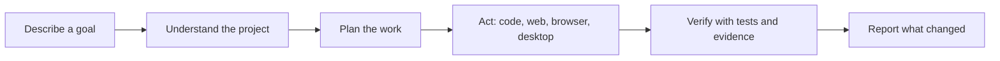
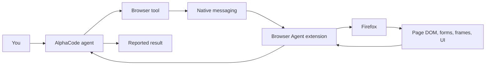
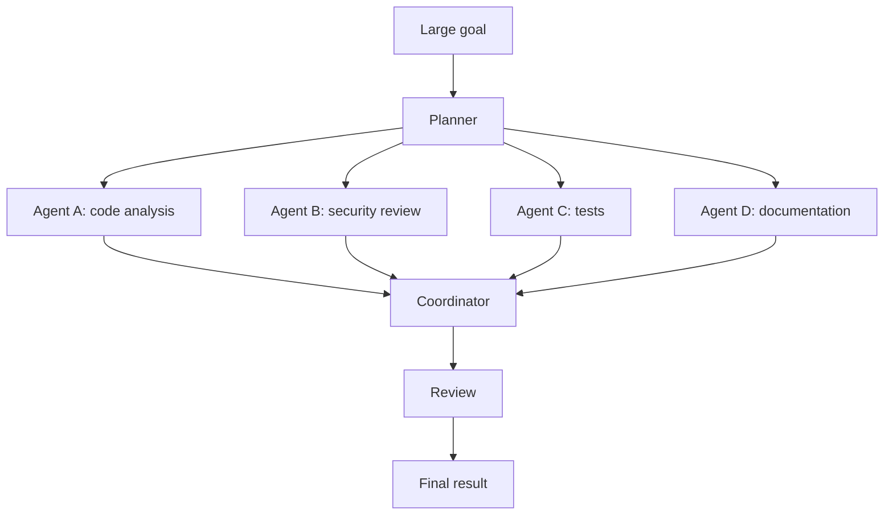

<div align="center">


# AlphaCode — Open-Source Rust AI Coding Agent

**A terminal-first AI coding agent that can understand a codebase, edit files, run commands and tests, automate Firefox, control desktop applications, and verify its work.**

[](https://github.com/dragonked2/alphacode/stargazers)
[](https://github.com/dragonked2/alphacode/releases)
[](LICENSE)
[](https://github.com/dragonked2/alphacode/issues)


[**Get started**](#quick-start) · [Documentation](docs/) · [Releases](https://github.com/dragonked2/alphacode/releases) · [Report a bug](https://github.com/dragonked2/alphacode/issues) · [Firefox Browser Agent](https://addons.mozilla.org/en-US/firefox/addon/alphacode-browser-agent/)

</div>

## Demo

Preview AlphaCode in action, from installation to a first task. Click the image to open the original SVG at full size.

<p align="center">
  <a href="./alphacode-demo.svg" title="Open the AlphaCode SVG demo at full size">
    
  </a>
</p>

<p align="center"><sub>The image links to the original SVG. If it does not render in a third-party viewer, <a href="./alphacode-demo.svg">open the SVG directly</a>.</sub></p>

## Contents

- [What is AlphaCode?](#what-is-alphacode)
- [Quick start](#quick-start)
- [Features](#features)
- [Firefox browser automation](#firefox-browser-automation)
- [Desktop automation](#desktop-automation)
- [Swarm mode](#swarm-mode)
- [Models and providers](#models-and-providers)
- [Built-in tools, skills, and MCP](#built-in-tools-skills-and-mcp)
- [Safety and reliability](#safety-and-reliability)
- [Benchmarks](#benchmarks)
- [Installation options](#installation-options)
- [Configuration](#configuration)
- [Commands and shortcuts](#commands-and-shortcuts)
- [Troubleshooting](#troubleshooting)
- [Uninstall](#uninstall)
- [FAQ](#faq)
- [Contributing](#contributing)

---

## What is AlphaCode?

AlphaCode is an **open-source AI coding agent built in Rust**. Instead of only suggesting code in a chat, it can work in your development environment: inspect a repository, plan a task, edit files, run commands and tests, use web tools, operate a real Firefox session, interact with desktop applications, and report what it verified.


```mermaid
flowchart LR
    A["Describe a goal"] --> B["Understand the project"]
    B --> C["Plan the work"]
    C --> D["Act: code, web, browser, desktop"]
    D --> E["Verify with tests and evidence"]
    E --> F["Report what changed"]
```

The workflow is designed around **understand → plan → execute → observe → verify**, with a final report of what changed, what was checked, and what remains.

### Example tasks

**Debug and fix a regression**

```text
Find why the app crashes when users upload a PDF.
Fix the root cause, add a regression test, run the relevant tests, and review the final diff.
```

**Test a web application**

```text
Open the application in Firefox, go to the account settings page,
check that the new feature is visible, and capture a screenshot.
```

**Investigate a security issue**

```text
Trace untrusted input to sensitive operations, validate likely findings,
and report which issues are reproducible in this authorized test environment.
```

AlphaCode can be used with plain-English instructions or precise technical tasks. Advanced workflows can combine multiple agents, reusable skills, and MCP-connected tools.

## Quick start

### 1. Install AlphaCode

**macOS / Linux**

```bash
curl -fsSL https://raw.githubusercontent.com/dragonked2/alphacode/main/scripts/install.sh | bash
```

**Windows (PowerShell)**

```powershell
irm https://raw.githubusercontent.com/dragonked2/alphacode/main/scripts/install.ps1 | iex
```

For security-conscious environments, download and inspect the installer before running it. See [Installation options](#installation-options) for version pinning, PATH options, and source builds.

### 2. Check your setup and launch

```bash
alphacode doctor
alphacode
```

`alphacode doctor` checks the environment and reports common setup issues. The built-in free AI lane lets you get started without configuring an API key; connected providers may require their own credentials and may incur charges.

The first launch includes a short onboarding flow for preferences such as telemetry, model defaults, and key bindings. Each step can be skipped with `Esc`.

### 3. Give AlphaCode a task

For example, enter a request such as:

```text
Explain this project and identify its main entry points.
```

Or ask it to investigate and repair a failing test:

```text
Find the highest-impact bug, fix it with the smallest reasonable change, and run the relevant tests.
```

Run a task directly without opening the interactive terminal UI:

```bash
alphacode run "fix the failing test"
```

### 4. Optional: connect Firefox

Install the [AlphaCode Browser Agent extension](https://addons.mozilla.org/en-US/firefox/addon/alphacode-browser-agent/), then run:

```bash
alphacode browser setup
alphacode browser status
```

The status command should report whether the browser bridge is available and responding.

## Features

| Capability | What it does |
| --- | --- |
| **AI coding agent** | Understands natural-language tasks, plans multi-step work, edits code, and checks results |
| **Code and file tools** | Reads and writes files, applies targeted edits and patches, and searches code |
| **Terminal execution** | Runs commands, batches operations, and supports background jobs with safety controls |
| **Web tools** | Searches, fetches, and analyzes web content and HTTP flows |
| **Firefox automation** | Works with pages, DOM, forms, tabs, frames, screenshots, downloads, and existing sessions |
| **Desktop automation** | Uses platform accessibility APIs to interact with native applications |
| **Swarm mode** | Coordinates multiple agents on work that can be split into independent tasks |
| **Persistent sessions** | Resumes work across terminal restarts |
| **Project memory** | Supports continuity during longer workflows |
| **Skills and MCP** | Adds reusable workflows and connections to external tools and services |
| **Model choice** | Supports multiple hosted providers and OpenAI-compatible endpoints |
| **Cross-platform** | Supports Windows, macOS, and Linux |

### Coding and repository work

Use AlphaCode to explore an unfamiliar codebase, trace a bug, refactor a module, add a feature, run a build, create regression tests, review a diff, or investigate a failure.

### Web workflows and quality assurance

Combine web tools with a real browser to inspect dynamic pages, interact with forms, validate user flows, capture screenshots, and support web application QA. Browser automation is particularly useful when a page depends on JavaScript or an existing authenticated session.

## Firefox browser automation

The [AlphaCode Browser Agent](https://addons.mozilla.org/en-US/firefox/addon/alphacode-browser-agent/) is a Firefox extension that connects AlphaCode to a real Firefox session through native messaging. AlphaCode handles reasoning and orchestration; Firefox provides the live browser environment.


```mermaid
flowchart LR
    U["You"] --> A["AlphaCode agent"]
    A --> B["Browser tool"]
    B --> C["Native messaging"]
    C --> D["Browser Agent extension"]
    D --> F["Firefox"]
    F --> G["Page DOM, forms, frames, UI"]
    G --> D
    D --> A
    A --> R["Reported result"]
```

Browser automation can help with:

- JavaScript-heavy sites and dynamic interfaces
- DOM inspection, form entry, and interactive controls
- Tabs, frames, and embedded content
- Existing authenticated sessions
- Scrolling, navigation, screenshots, and downloads
- Browser-based testing, QA, and web application debugging
- Security testing of systems you own or are explicitly authorized to assess

Example instruction:

```text
Open the application, test the login flow, navigate to the dashboard,
check the form validation, and report reproducible problems.
```

> **Privacy note:** Browser automation can act inside a real browser session. Review requested actions carefully, and treat page content as untrusted input.

## Desktop automation

AlphaCode interacts with native applications through platform accessibility APIs rather than relying only on fixed screen coordinates.

| Platform | Accessibility backend |
| --- | --- |
| Windows | UI Automation |
| macOS | Accessibility API |
| Linux | AT-SPI2 |

Supported actions include `list_windows`, `snapshot`, `find`, `click`, `type`, `press`, `scroll`, `focus`, `screenshot`, `toggle`, `expand`, and `collapse`.

Example:

```text
Open Calculator, calculate 123 × 456, and read the result.
```

The expected arithmetic result is `56088`; actual desktop interaction depends on a working accessibility backend and the target application being available.

## Swarm mode

Swarm mode can split a large goal into parallel or semi-independent tasks and coordinate the results.


```mermaid
flowchart TD
    G["Large goal"] --> P["Planner"]
    P --> A["Agent A: code analysis"]
    P --> B["Agent B: security review"]
    P --> C["Agent C: tests"]
    P --> D["Agent D: documentation"]
    A --> M["Coordinator"]
    B --> M
    C --> M
    D --> M
    M --> R["Review"]
    R --> F["Final result"]
```

Example command inside AlphaCode:

```text
/swarm "Analyze this application from architecture, security, testing, and performance perspectives."
```

Swarm mode is most useful when a task can be divided into work that does not require every agent to modify the same files at the same time.

## Sessions and memory

Persistent sessions help preserve context across terminal restarts and support longer debugging, research, security-review, and refactoring workflows.

```bash
alphacode sessions list
alphacode --resume
alphacode --resume <id>
```

`alphacode --resume` resumes the latest session; pass a session ID to resume a specific one.

## Models and providers

AlphaCode is model-agnostic. Start with the built-in free AI lane, or connect a provider using the authentication method supported by that provider.

| Provider | Authentication or requirement | Notes |
| --- | --- | --- |
| Anthropic (Claude) | OAuth or API key | Provider support is integrated into AlphaCode |
| OpenAI (GPT and o-series) | OAuth, API key, or supported sign-in flow | Reasoning, vision, and tools depend on the selected model and flow |
| Google Gemini | OAuth or API key | |
| GitHub Copilot | OAuth | Requires an eligible account/subscription |
| Cursor | OAuth | Reuses a Cursor session where supported |
| AWS Bedrock | AWS credentials | Build with `--features bedrock` when required |
| Azure | Azure AD or API key | Build with `--features azure-auth` when required |
| OpenRouter | API key | Provider offers access to a range of models |
| OpenAI-compatible endpoint | Endpoint-specific API key or configuration | Add with `alphacode provider add <name>` |
| Built-in free AI lane | Built in | Designed to work without an API key to get started |

### Provider and model commands

```bash
alphacode login                    # Open the provider sign-in flow
alphacode login --provider openai  # Sign in with a specific provider
alphacode provider list            # List configured providers
alphacode provider add <name>      # Add an OpenAI-compatible endpoint
alphacode provider current         # Show the active provider and model
alphacode model list               # List available models
alphacode model use <model>        # Select a model
```

In the terminal UI, press `Ctrl+T` to open the model/provider selector.

### Local OpenAI-compatible models

For local servers such as LM Studio or Ollama, AlphaCode can use the context window reported by the server when available. For local models with up to 32K context, it uses a shorter task prompt and a bounded set of relevant tool schemas; simple greetings may not need tool schemas. This reduces prompt overhead but does not increase the model server's configured context window. Configure context length in the server and leave enough room for output.

### Authentication notes

Many providers use environment variables such as `ANTHROPIC_API_KEY` or `OPENAI_API_KEY`. You can also run `alphacode login` from your shell or `/login` inside AlphaCode.

**OpenAI Codex OAuth:** AlphaCode uses a local callback at `http://localhost:1455/auth/callback` during sign-in. Ensure port `1455` is available; if the login flow times out, check whether another process is listening on that port and retry `/login`.

See the [documentation](docs/) for provider-specific setup and troubleshooting.

## Built-in tools, skills, and MCP

AlphaCode includes **40+ tools** across the following categories. Names and availability can vary with the build and enabled features.

| Category | Examples |
| --- | --- |
| **Files** | `read`, `write`, `edit`, `multiedit`, `patch`, `apply_patch`, `ls` |
| **Search** | `agentgrep`, `session_search`, `conversation_search` |
| **Execution** | `bash`, `batch`, `bg` |
| **Web and browser** | `browser`, `webfetch`, `websearch`, `scrapling`, `httpflow`, `open` |
| **Desktop** | `desktop`, `macos_computer_use` |
| **Agent workflow** | `memory`, `initiative`, `todo`, `plan`, `swarm` |
| **Utilities** | `doctor`, `self_improve`, `selfdev`, `cron`, `schedule`, `jwt`, `clipboard`, `side_panel`, `discover_tools` |

### Skills

Skills provide reusable, specialized workflows without changing the core agent. Browse available skills with `/skills`. Examples from the project include `/bugbounty`, `/meme-coin-audit`, and `/frontend-design`.

### Model Context Protocol (MCP)

MCP support lets you connect external tools, services, and custom integrations. See the project documentation for the configuration required by each server.

## Security testing and bug bounty workflows

Code analysis, HTTP tools, browser automation, terminal execution, memory, and multi-agent workflows can support repeatable application-security reviews.

Example tasks:

```text
Review this API for insecure direct object references and provide reproducible evidence.
```

```text
Trace this parameter through the application and determine whether it reaches a dangerous sink.
```

```text
Use the authorized test environment in Firefox to test input validation and document reproducible findings.
```

> **Authorization required:** Test only systems you own or are explicitly authorized to assess.

## Safety and reliability

An agent that can change files, execute commands, and operate applications needs careful oversight. The project describes safeguards including:

- Blocking certain destructive filesystem and device targets
- Permission prompts for risky actions
- Safety controls for shell execution
- SSRF and credential-leak heuristics for network operations
- Tracking interrupted sessions rather than silently losing them
- Timeouts and emergency-stop handling for desktop automation
- Input-state cleanup when operations fail
- Treating browser and desktop content as potentially untrusted

These safeguards reduce risk; they do not guarantee that every action is safe or correct. **Review important diffs before merging or deploying.** Use `/diff` to inspect changes.

### Session resilience

Sessions are resumable and designed to recover from interruptions. Crashes, signals, or dropped SSH connections can mark a session as `Crashed` and provide a resume command. Session transcripts are persisted to disk rather than kept entirely in process memory.

### Coding-quality contract

For code-changing tasks, AlphaCode is instructed to follow these guardrails:

1. **Small changes:** avoid bundling unrelated edits; report adjacent issues separately.
2. **Regression awareness:** rerun relevant tests and investigate new warnings or failures.
3. **Self-review:** check that the objective is covered, evidence is available, regressions are considered, the diff is scoped, and edge cases are reviewed.
4. **Structured reporting:** state what changed, what was verified, and what remains.

The agent's instructions are not a substitute for independently reviewing the implementation and test results.

## Benchmarks

AlphaCode is written in Rust and is designed to keep runtime overhead modest. The values below are **historical measurements**, not a current independent benchmark or a guarantee of performance on every machine or workload.

### Memory usage: one active session

| Tool | RAM | Relative to AlphaCode |
| --- | ---: | ---: |
| **AlphaCode** | **27.8 MB** | **1.0×** |
| Codex CLI | 140.0 MB | 5.0× |
| pi | 144.4 MB | 5.2× |
| Cursor Agent | 214.9 MB | 7.7× |
| Antigravity CLI | 243.7 MB | 8.8× |
| GitHub Copilot CLI | 333.3 MB | 12.0× |
| OpenCode | 371.5 MB | 13.4× |
| Claude Code | 386.6 MB | 13.9× |

### Memory usage: ten concurrent sessions

| Tool | RAM | Relative to AlphaCode |
| --- | ---: | ---: |
| **AlphaCode** | **117.0 MB** | **1.0×** |
| Codex CLI | 334.8 MB | 2.9× |
| pi | 833.0 MB | 7.1× |
| Antigravity CLI | 1,021.2 MB | 8.7× |
| Cursor Agent | 1,632.4 MB | 14.0× |
| GitHub Copilot CLI | 1,756.5 MB | 15.0× |
| Claude Code | 2,300.6 MB | 19.7× |
| OpenCode | 3,237.2 MB | 27.7× |

For reproducible comparisons, record the AlphaCode version or commit, OS, CPU, RAM, build profile, enabled features, concurrent session count, measurement method, warm/cold state, and exact workload. Compare tools under the same conditions.

## Installation options

The quick-start commands use the latest installer. This section documents optional installation flags and source builds. Inspect remote scripts before execution when your environment requires manual review.

### Windows

```powershell
irm https://raw.githubusercontent.com/dragonked2/alphacode/main/scripts/install.ps1 | iex
```

The installer detects CPU architecture, downloads a release, verifies its SHA-256 checksum, installs `alphacode.exe` under `%LOCALAPPDATA%\Programs\alphacode\bin\`, adds the folder to the current user's `Path`, and activates it in the current shell. Administrator rights are not required for the user-level install.

Run AlphaCode from Windows Terminal or PowerShell. Do not double-click `alphacode.exe`; the temporary console may close when the process exits.

The installer writes the user-level `HKCU\Environment\Path` rather than the machine-wide path, appends the entry, avoids adding duplicate entries on re-run, and broadcasts `WM_SETTINGCHANGE` so new terminals can pick up the change. Existing shell-only PATH entries are preserved.

To pass installer parameters, invoke the downloaded script as a script block rather than piping directly to `iex`:

```powershell
# Pin a release version
& ([scriptblock]::Create((irm https://raw.githubusercontent.com/dragonked2/alphacode/main/scripts/install.ps1))) -Version vX.Y.Z

# Build from source instead of downloading a release
& ([scriptblock]::Create((irm https://raw.githubusercontent.com/dragonked2/alphacode/main/scripts/install.ps1))) -FromSource

# Preview the PATH change without writing it
& ([scriptblock]::Create((irm https://raw.githubusercontent.com/dragonked2/alphacode/main/scripts/install.ps1))) -PathDryRun

# Do not modify PATH
& ([scriptblock]::Create((irm https://raw.githubusercontent.com/dragonked2/alphacode/main/scripts/install.ps1))) -NoPath

# Choose a custom installation prefix
& ([scriptblock]::Create((irm https://raw.githubusercontent.com/dragonked2/alphacode/main/scripts/install.ps1))) -Prefix "$env:LOCALAPPDATA\Programs\alphacode"
```

### macOS and Linux

```bash
curl -fsSL https://raw.githubusercontent.com/dragonked2/alphacode/main/scripts/install.sh | bash
```

The installer downloads a release, verifies its checksum, installs `alphacode` under `~/.local/bin`, and updates a supported shell profile so the command is available.

Optional arguments:

```bash
# Pin a release version
curl -fsSL https://raw.githubusercontent.com/dragonked2/alphacode/main/scripts/install.sh | bash -s -- --version vX.Y.Z

# Do not modify PATH
curl -fsSL https://raw.githubusercontent.com/dragonked2/alphacode/main/scripts/install.sh | bash -s -- --no-path

# Link into /usr/local/bin
curl -fsSL https://raw.githubusercontent.com/dragonked2/alphacode/main/scripts/install.sh | bash -s -- --link

# Choose a custom installation prefix
curl -fsSL https://raw.githubusercontent.com/dragonked2/alphacode/main/scripts/install.sh | bash -s -- --prefix ~/.local
```

The installer is documented as supporting bash, zsh, fish, nushell, csh, and ksh, and as safe to re-run without duplicating its profile entry.

### Verify installation

```bash
alphacode --version
alphacode doctor
```

On Windows, you can check command resolution with:

```powershell
Get-Command alphacode
```

### Build from source

```bash
git clone https://github.com/dragonked2/alphacode.git
cd alphacode
cargo build --release
./target/release/alphacode --version
```

The project pins Rust edition 2024 in [`rust-toolchain.toml`](rust-toolchain.toml). A C toolchain is also required for the relevant platform. The default build omits some heavier optional stacks; enable them when needed:

```bash
cargo build --release --features bedrock,embeddings,pdf,renderer
```

### Update

```bash
alphacode update
```

## Configuration

AlphaCode stores its configuration, sessions, and logs outside the project directory.

| OS | Configuration | Sessions | Logs |
| --- | --- | --- | --- |
| Linux | `~/.config/alphacode/` | `~/.local/share/alphacode/sessions/` | `~/.local/share/alphacode/logs/` |
| macOS | `~/Library/Application Support/alphacode/` | `~/Library/Application Support/alphacode/` | `~/Library/Application Support/alphacode/` |
| Windows | `%APPDATA%\alphacode\` | `%LOCALAPPDATA%\alphacode\sessions\` | `%LOCALAPPDATA%\alphacode\logs\` |

A health monitor records memory use, slow operations, error rates, and subsystem liveness in `health.json`.

| Configuration section | Purpose |
| --- | --- |
| `[provider]` | Provider and model selection |
| `[features]` | Feature flags |
| `[display]` | UI preferences |
| `[websearch]` | Search settings |
| `[agents]` | Agent and swarm settings |
| `[hooks]` | Lifecycle hooks |
| `[safety]` | Notifications and safety controls |
| `[compaction]` | Context management |
| `[power]` | Power-management behavior |
| `[gateway]` | Remote gateway settings |

See [`docs/configuration.md`](docs/configuration.md) for the full reference.

## Commands and shortcuts

### CLI commands

| Command | Purpose |
| --- | --- |
| `alphacode` | Launch the interactive terminal UI |
| `alphacode doctor` | Check setup and common environment issues |
| `alphacode login` | Authenticate with a provider |
| `alphacode run "<task>"` | Run a task non-interactively |
| `alphacode repl` | Start the simple REPL without the TUI |
| `alphacode provider add <name>` | Add an OpenAI-compatible endpoint |
| `alphacode browser setup` | Configure the browser bridge |
| `alphacode browser status` | Check browser connectivity |
| `alphacode sessions list` | List saved sessions |
| `alphacode --resume` | Resume the latest session |
| `alphacode provider list` | List configured providers |
| `alphacode model list` | List available models |
| `alphacode update` | Update AlphaCode |

### Slash commands

| Command | Purpose |
| --- | --- |
| `/help` | Show help |
| `/agents` | Manage agents |
| `/compact` | Compact context |
| `/memory` | Manage or inspect project memory |
| `/skills` | Browse skills |
| `/diff` | Review changes |
| `/poke` | Trigger an automatic follow-up |
| `/screenshot-mode` | Configure screenshot capture |
| `/exit` | Exit while preserving the session |

### Keyboard shortcuts

| Shortcut | Action |
| --- | --- |
| `F1` | Show shortcut reference |
| `Ctrl+T` | Open the model/provider selector |
| `Ctrl+Y` | Open agent activity |
| `Ctrl+C` | Pause the active response |
| `Esc` | Close a dialog or go back |

## Troubleshooting

<details>
<summary><strong><code>alphacode</code> is not found</strong></summary>

Open a new terminal first so it can read the updated PATH. If AlphaCode is still not found, confirm the install location and PATH settings.

**macOS / Linux (bash):**

```bash
echo 'export PATH="$HOME/.local/bin:$PATH"' >> ~/.bashrc
source ~/.bashrc
```

**zsh:**

```bash
echo 'export PATH="$HOME/.local/bin:$PATH"' >> ~/.zshrc
source ~/.zshrc
```

**Windows:** re-run the installer unless you used `-NoPath`, or add `%LOCALAPPDATA%\Programs\alphacode\bin` to your user PATH and open a new PowerShell window.

</details>

<details>
<summary><strong>The Firefox Browser Agent is not responding</strong></summary>

```bash
alphacode browser status
alphacode browser setup
```

Then confirm that the [AlphaCode Browser Agent extension](https://addons.mozilla.org/en-US/firefox/addon/alphacode-browser-agent/) is installed and enabled in Firefox.

</details>

<details>
<summary><strong>Desktop automation is unavailable</strong></summary>

- **macOS:** grant Accessibility and Screen Recording permissions under *System Settings → Privacy & Security*.
- **Linux:** check that AT-SPI2 is available.
- **Windows:** elevated applications may require AlphaCode to run with appropriate privileges.

</details>

<details>
<summary><strong>OpenAI login times out</strong></summary>

Port `1455` on localhost may already be in use. Check for another process listening on that port, stop it if appropriate, and retry `/login`. See the [documentation](docs/) for provider-specific steps.

</details>

<details>
<summary><strong>The SVG demo does not display</strong></summary>

The demo asset is `alphacode-demo.svg`, not an MP4 video. Confirm that the SVG is committed at the repository root and that its filename capitalization matches the link. You can also [open the SVG directly](./alphacode-demo.svg).

</details>

Still stuck? Run `alphacode doctor` and [open an issue](https://github.com/dragonked2/alphacode/issues) with reproducible steps and relevant logs. Remove secrets and tokens before sharing diagnostic output.

## Uninstall

Close active AlphaCode sessions first. On Windows, a running `alphacode.exe` cannot be removed until its process exits.

### Recommended: use the uninstall script

**macOS / Linux**

```bash
curl -fsSL https://raw.githubusercontent.com/dragonked2/alphacode/main/scripts/uninstall.sh | bash
```

**Windows (PowerShell)**

```powershell
irm https://raw.githubusercontent.com/dragonked2/alphacode/main/scripts/uninstall.ps1 | iex
```

By default, the uninstall scripts remove the installed executable while leaving configuration and saved sessions in place.

### Remove all local data

> **Warning:** Purging is permanent. It may delete configuration, saved sessions, logs, and locally stored sign-in data. Back up anything you need before proceeding.

**macOS / Linux**

```bash
curl -fsSL https://raw.githubusercontent.com/dragonked2/alphacode/main/scripts/uninstall.sh | bash -s -- --purge
```

Equivalent environment-variable form:

```bash
curl -fsSL https://raw.githubusercontent.com/dragonked2/alphacode/main/scripts/uninstall.sh | ALPHACODE_PURGE=1 bash
```

**Windows (PowerShell)**

```powershell
& ([scriptblock]::Create((irm https://raw.githubusercontent.com/dragonked2/alphacode/main/scripts/uninstall.ps1))) -Purge
```

### Manual uninstall

| Item | Linux | macOS | Windows |
| --- | --- | --- | --- |
| Binary | `~/.local/bin/alphacode` | `~/.local/bin/alphacode` | `%LOCALAPPDATA%\Programs\alphacode\` |
| Config | `~/.config/alphacode/` | `~/Library/Application Support/alphacode/` | `%APPDATA%\alphacode\` |
| Sessions | `~/.local/share/alphacode/sessions/` | Application Support directory | `%LOCALAPPDATA%\alphacode\sessions\` |
| Logs | `~/.local/share/alphacode/logs/` | Application Support directory | `%LOCALAPPDATA%\alphacode\logs\` |

Remove only the binary to keep settings and sessions. Delete the data directories only if you intend to remove local state as well.

**Linux**

```bash
rm -f ~/.local/bin/alphacode
# Optional: remove configuration, sessions, and logs
rm -rf ~/.config/alphacode ~/.local/share/alphacode
```

**macOS**

```bash
rm -f ~/.local/bin/alphacode
# Optional: remove configuration and local data
rm -rf "$HOME/Library/Application Support/alphacode"
```

**Windows (PowerShell)**

```powershell
Remove-Item -Recurse -Force "$env:LOCALAPPDATA\Programs\alphacode"
# Optional: remove configuration and local data
Remove-Item -Recurse -Force "$env:APPDATA\alphacode", "$env:LOCALAPPDATA\alphacode"
```

If AlphaCode was installed with `cargo install --path .`, uninstall it with `cargo uninstall alphacode`. If you built from a clone, remove the cloned repository separately.

### Additional cleanup

- **PATH entry:** remove the AlphaCode entry from your shell profile or user PATH if you no longer need it. On Windows, use Environment Variables to avoid expanding `%USERPROFILE%`-style entries unintentionally.
- **Firefox extension:** open `about:addons` in Firefox, select *AlphaCode Browser Agent*, and choose **Remove**.
- **Native messaging registration:** if you ran `alphacode browser setup`, remove the AlphaCode registration from the relevant Firefox native messaging location (Linux: `~/.mozilla/native-messaging-hosts/`; macOS: `~/Library/Application Support/Mozilla/NativeMessagingHosts/`; Windows: `HKCU\Software\Mozilla\NativeMessagingHosts`). Check the exact registration name first.
- **Credentials:** remove exported `*_API_KEY` variables and revoke provider API keys or OAuth grants you no longer need.
- **Scheduled jobs:** remove any recurring tasks you created with `cron` or `schedule` before deleting local application data.

### Verify removal

```bash
command -v alphacode
```

On Windows:

```powershell
Get-Command alphacode -ErrorAction SilentlyContinue
```

If the shell still finds the command, open a new terminal or refresh the shell's command cache.

## FAQ

<details>
<summary><strong>Is AlphaCode free?</strong></summary>

AlphaCode is open source under the MIT License and includes a built-in free AI lane for getting started without an API key. Third-party model providers may impose their own usage limits, terms, or charges.

</details>

<details>
<summary><strong>Do I need an API key?</strong></summary>

Not to get started with the built-in free AI lane. Other providers may require sign-in, API keys, or additional configuration.

</details>

<details>
<summary><strong>Which operating systems are supported?</strong></summary>

The project targets Windows, macOS, and Linux. Individual features and desktop automation backends may vary by operating system and build configuration.

</details>

<details>
<summary><strong>Can AlphaCode automate websites?</strong></summary>

Yes. The Firefox integration supports real-browser workflows such as navigation, DOM and form interaction, tabs, frames, screenshots, and downloads. Availability depends on a correctly configured browser bridge and extension.

</details>

<details>
<summary><strong>Can AlphaCode control desktop applications?</strong></summary>

It can use platform accessibility APIs on Windows, macOS, and Linux. Required permissions and the level of support depend on the operating system and target application.

</details>

<details>
<summary><strong>Can I use Claude, GPT, Gemini, or local models?</strong></summary>

AlphaCode supports multiple providers and OpenAI-compatible endpoints. The authentication method and model capabilities depend on your selected provider and model.

</details>

<details>
<summary><strong>Is AlphaCode suitable for beginners?</strong></summary>

You can start with plain-English instructions. Review code changes and actions carefully, particularly before deploying software or running sensitive operations.

</details>

<details>
<summary><strong>Can I use AlphaCode for security testing?</strong></summary>

Yes, for authorized security research and testing. Only assess systems you own or have explicit permission to test. See [Security testing and bug bounty workflows](#security-testing-and-bug-bounty-workflows).

</details>

<details>
<summary><strong>Does AlphaCode remember previous work?</strong></summary>

Persistent sessions and project memory support longer workflows across terminal restarts. Use `alphacode sessions list` and `alphacode --resume` to continue saved work.

</details>

<details>
<summary><strong>How do I update AlphaCode?</strong></summary>

Run `alphacode update`.

</details>

## Use cases

| Area | Examples |
| --- | --- |
| **Software development** | Debugging, refactoring, feature work, test generation, code review, repository exploration, documentation, build troubleshooting |
| **Web development** | Frontend and backend changes, API testing, browser-based testing, UI validation |
| **Application security** | Authorized penetration testing, bug bounty work, code audits, HTTP analysis, reproducible vulnerability reports |
| **QA and testing** | Regression testing, form validation, UI verification, reproducibility checks |
| **Automation** | Browser workflows, desktop applications, repetitive tasks, and supported data-collection workflows |

## Documentation and project links

- [Documentation index](docs/)
- [Configuration reference](docs/configuration.md)
- [Changelog](CHANGELOG.md)
- [Contributing guide](CONTRIBUTING.md)
- [Code of conduct](CODE_OF_CONDUCT.md)
- [Security policy](SECURITY.md)
- [Official website](https://alphacli.github.io/)
- [GitHub releases](https://github.com/dragonked2/alphacode/releases)
- [Firefox Browser Agent](https://addons.mozilla.org/en-US/firefox/addon/alphacode-browser-agent/)

## Security reporting

Report vulnerabilities privately using the instructions in [`SECURITY.md`](SECURITY.md). For issues specific to the Firefox extension, Mozilla's add-on reporting tools may also be appropriate.

## Contributing

Issues, reproducible bug reports, documentation updates, and pull requests are welcome.

```bash
git clone https://github.com/dragonked2/alphacode.git
cd alphacode
cargo build --release
cargo test --lib
cargo clippy --lib -- -D warnings
```

Before opening a pull request, check the relevant items:

- [ ] Release build succeeds
- [ ] Relevant tests pass
- [ ] New behavior includes tests where appropriate
- [ ] Clippy passes
- [ ] Public APIs are documented
- [ ] New dependencies are justified
- [ ] User-visible changes are documented

Read [`CONTRIBUTING.md`](CONTRIBUTING.md) before submitting a change.

## Support AlphaCode

Star the repository, report reproducible bugs, suggest improvements, improve the documentation, test releases, or contribute code.

<div align="center">

[](https://github.com/dragonked2/alphacode)
[](https://addons.mozilla.org/en-US/firefox/addon/alphacode-browser-agent/)
[](https://www.buymeacoffee.com/dragonked2)

<sub>Built with Rust by <a href="https://github.com/dragonked2">Ali Essam</a> · MIT licensed · Open source</sub>

</div>
